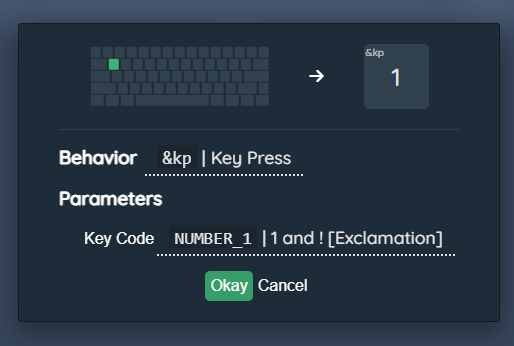

# BakenekoGO User Guide
In this guide we will go over how to use the keymap, battery information, and how to connect via BT.

## BT Connectivity
Pairing varies from system to system, but you should be able to connect BakenekoGO to any standard device such as a computer or phone that uses BT.

### Battery
We covered this in the build guide, but if you're installing a battery, it is important that the red positive ("POS") wire is connected to the middle pin. The included battery only has two wires, however the PCB uses a connector with 3 pins on the PCB incase you need to replace it down the line, or want to use your own battery.

### The Battery Switch
Below your capslock switch is a battery switch. This physical switch allows you to turn battery usage on or off. If you're using your BakenekoGO plugged in, turn the battery switch to the OFF position. If you wish to pair or use your BakenekoGO in BT mode, unplug your BakenekoGO from the computer and put the battery switch to the ON position.

### First Time Setup
When you first get your BakenekoGO it won't be paired to anything. Before starting the pairing process make sure your BakenekoGO is unplugged from any devices, the battery is properly installed, and the battery switch is set to ON. Open the BT menu on your device. Start the pairing process on your computer/phone/device so it begins to look for BT devices. Next, initiate BT pairing on your BakenekoGO by using one of the below keycodes.

 - BT1 - Hold `FN+Right CTRL` and tap `TAB`
 - BT2 - Hold `FN+Right CTRL` and tap `CAPSLOCK`
 - BT3 - Hold `FN+Right CTRL` and tap `LEFT SHIFT`
 - BT4 - Hold `FN+Right CTRL` and tap `LEFT CTRL`

After pressing one of the key combinations above, your BakenekoGO should pop up on your device as Bakeneko60.

**Shortened Version**

 1. Open the BT menu on the device you want to use BakenekoGO with so it starts to look for devices.
 2. Make sure your BakenekoGO is not plugged into any device and the battery has been installed.
 3. Put the battery switch to the on position.
 4. Press the key combination that correlates to the BT profile you want the device to be set to. Key combinations can be found above.
 5. The BakenekoGO should pop up in your devices BT pairing interface as Bakeneko60.

### Understanding How Devices Work
BakenekoGO can store 4 devices onboard, meaning once paired you can cycle through 4 devices on the fly. These are called BT1, BT2, BT3, and BT4 on the keymap. Once a device is paired to a specific BT profile, it can be swapped to by hitting the same key combination you used to originally pair it.

If you want to remove a device from a BT profile, you have to clear the device list, and re-pair your keyboard. There is not currently a way to only remove a single BT profile. The key combination to clear your BT profiles is:

 - Hold `FN+Right CTRL` and tap `ESC`

## Keymap
The BakenekoGO runs on ZMK, which uses layers to allow different inputs. 

The base layer you use for general typing is Layer 0, and by holding the FN key you gain access to Layer 1 where you can control the RGB on your keyboard. Layer 1 on the BakenekoGO is also called the RGB Layer. 

If you hold the FN key, and the right control key at the same time, you access Layer 2, also called the BT layer. This is where you adjust what device you're connected to, and initiate BT pairing.

### Rebinding Key Basics
When rebinding keys, there are two variables that need to be set per key:
1. The behavior - What type of action
2. Parameter - What the key will register

As an example, if you want to rebind your Q key to be the 1 key, you would set the variables like this:
1. Behavior - &kp *(Key Press)*
2. Parameter - Number_1 *(1 and ! [Exclamation])*

**Here are the most common types of behaviors:**
1. &kp (Key Press) - A normal key press. 
2. &mo (Momentary Layer) - While holding, the layer you choose will be active.
3. &bootloader - This is what you press to put your keyboard into flashing mode, allowing for new firmware to be flashed.
4. &bt (BT) - This gives you access to BT specific actions, such as profile switching and disconnecting.
5. &rgb_ug (RGB Underglow) - This gives you access to the RGB underglow specific actions, like hue, on/off toggle, brightness, and more.
