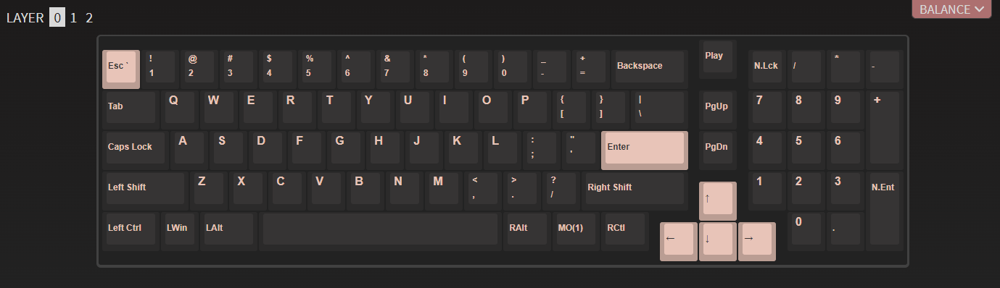
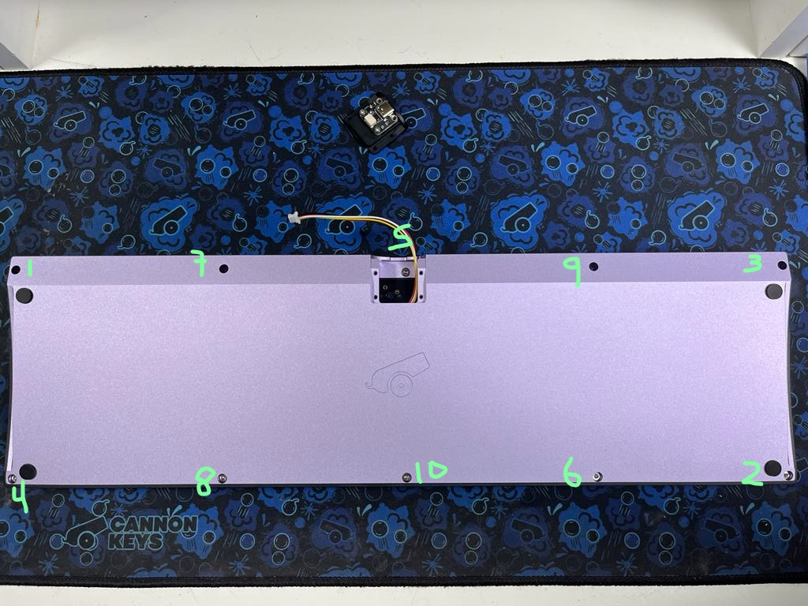

# Balance Build Guide

Thank you for purchasing a Balance keyboard from us! This guide should help you complete a successful build!

## Parts

* Balance Case
* Balance PCB and Plate (not pictured)
* Balance Knob (not pictured)
* Daughterboard
* 10cm JST Cable
* 20 Poron Strips
* 4 Bumpons (they come in a black strip)
* 2-4 Small Screws for Daughterboard
* 1.3mm, 1.5mm, and 2mm Hex Key
* Rotary Encoder

## Test the PCB

1. The first thing we have to do is to test the PCB. Use the daughterboard and JST cable and connect them together with the PCB. Be sure to put the JST cable in the right way.

1. Plug in the daughterboard and use tweezers to test each switch footprint for a keypress.

This is the default layout:

Note that MO(1) is a Function key - it will not trigger a keypress, but if you hold it and hit "1", F1 should trigger.

If you encounter any issues in this phase, please contact support immediately for troubleshooting.

## Add the Feet

1. We always recommend adding the rubber bumpon feet to your keyboard to prevent any damage.

Remove the rubber circles from the black strip and apply them to the keyboard.

## PCB/Plate Assembly

!!! Note
    We highly recommend [clipping and lubing](https://www.youtube.com/watch?v=cD5Zj-ZgMLA) your stabilizers prior to this step, for optimal feel!

1. Install your stabilizers in the PCB:
    

1. Slide your plate over the stabilizers
    

1. At this point, you may want to solder and test your stabilized keys before moving on with the rest of the build.

1. Insert your switches into the plate and PCB, and solder the switch legs into the switch holes. Be sure none of the switch pins are bent, and that the switches are seated all the way flush with the plate:
    

1. Insert the encoder and solder it. We recommend doing this after the switches because the encoder is taller than the switches. Ensure that the encoder is soldered perfectly straight. Not doing so could cause your knob to rub against the case.
    

1. Finish soldering up your PCB
    

1. Test your soldered PCB

## Case Preparation

1. Now we have to disassemble and prepare the case to add the plate and PCB assembly. Begin by removing the accent piece from the bottom of the case. You'll need the 1.3mm hex key.
    

1. Next, remove the case screws using the 2mm hex key. Be sure to remove the case screw that was covered by the accent as well!
    

## Gasket Installation
1. Next, we need to add the poron gaskets to the case. Throughout this process, please remember, the gasket placement does NOT have to be perfect!

1. Align one edge of your poron strip with the edge of the gasket indentation on the bottom case. Stick the gasket to the case, making sure you stay within the indentation. It's ok if your gasket doesn't go quite far enough, or is curved, as long as its inside the indentation.
    

1. Continue to apply gaskets to each of the gasket indentations.

1. As you can see here, the gasket application doesn't have to be perfect. They'll still dampen vibrations and give a nice typing feel.
    

## Plate/PCB Installation
1. Plug in the loose JST cable into your PCB.

1. Rest your PCB and plate assembly on the bottom case, ensuring that the JST cable goes through the hole meant for the accent piece.
    

1. This version of the Balance does not include horizonal alignment pins to align the plate - as such, we'll have to be very careful here. Adjust the alignment of the plate on the bottom case so it is centered.
    

!!! Note
    If the plate is not centered, it could cause the knob and/or keycaps to rub against the case once assembled. If this does happen, feel free to re-open and re-align the plate.

## Case Reassembly

1. Loosely align the top part of the case above the bottom, on top of the plate. Check plate alignment again, and check for centering.
    

1. Flip the board to access the screw holes on the bottom. Use a little bit of force to compress the bottom and top together - you'll have to press down to get the gaskets to compress. Start screwing in the screws little by little, following the following photo. Only do a few turns of your screwdriver at a time. This will ensure we get even compression across the gaskets.
    

## Daughterboard Installation

1. Next, we have to add the daughterboard to the accent piece. Some Balance customers received 4 flat screws with their daughterboards, and others received 4 socket-cap screws.

- If you received socket cap screws, install the daughterboard in the accent piece using the 1.5mm hex key and 2 screws:
    

- If you received flat head daughterboard screws, install the daughterboard in the accent piece using the 1.3mm hex key and 4 screws:
    

1. Connect the JST cable that is hanging out of the case to the daughterboard that is now screwed to the accent piece.

1. Re-install the accent piece to the bottom case:
    

## Knob Installation

1. Using the 1.5mm hex key, loosen the set screw in the knob
    

1. Align the set screw of the knob with the flat face of the encoder. Put the knob over the encoder maintaining this alignment.
    

1. Re-tighten the set screw
    

## Final Touches
1. We're now ready for a keycap set!
    

We hope you enjoy your Balance keyboard!

