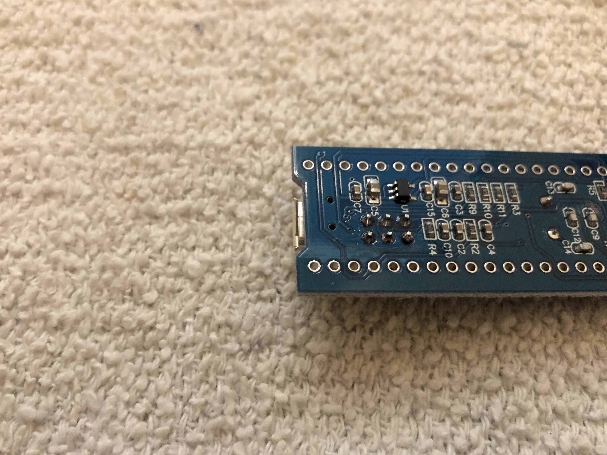
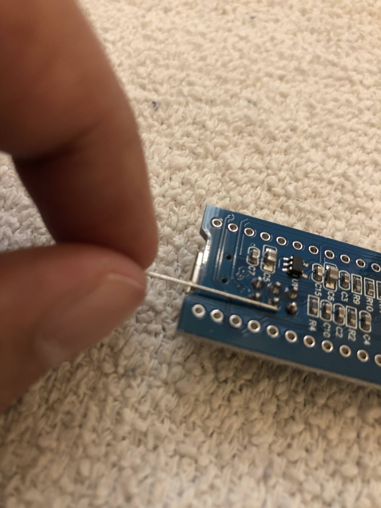
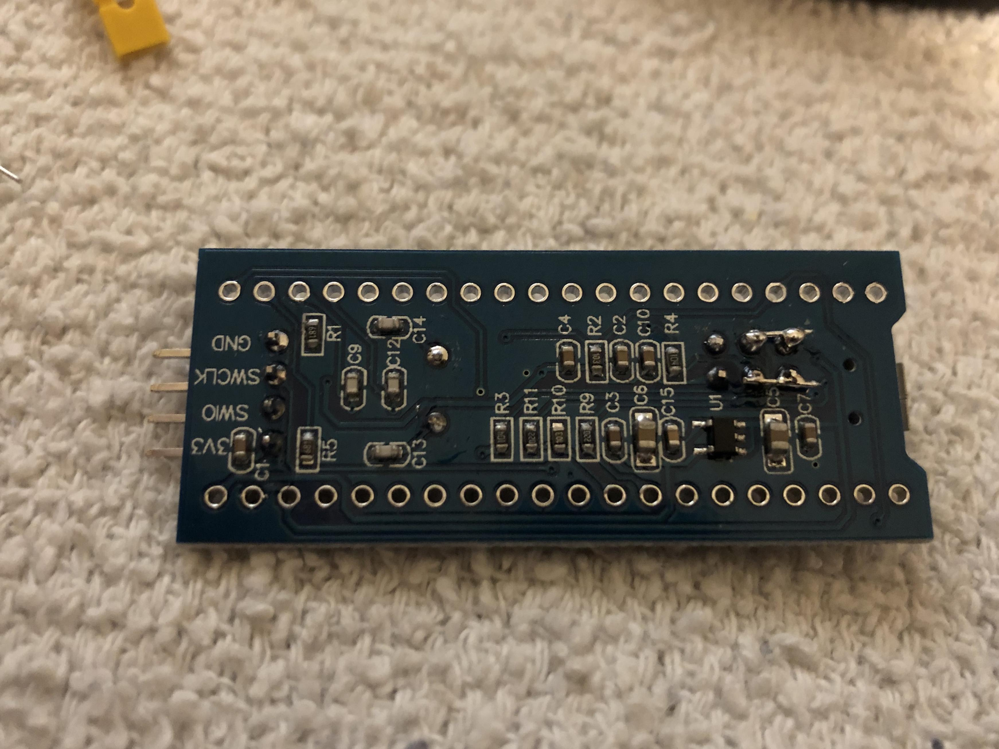
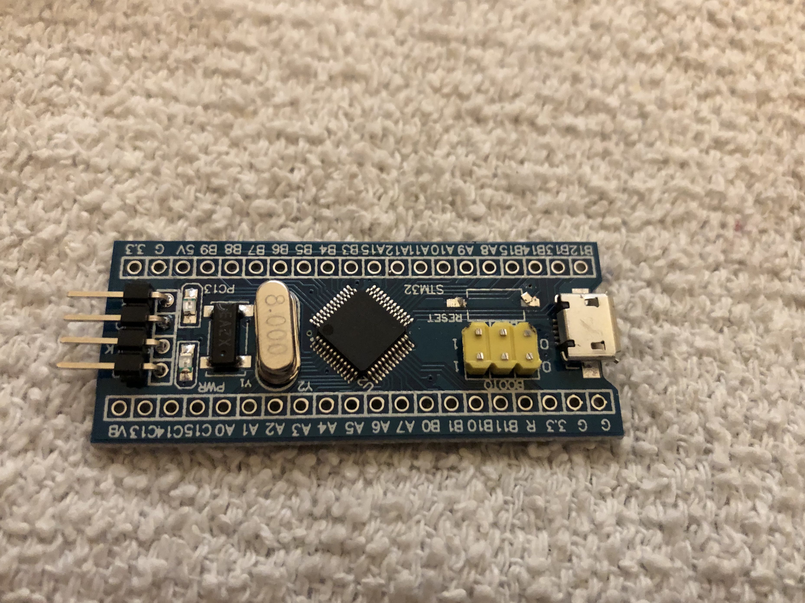
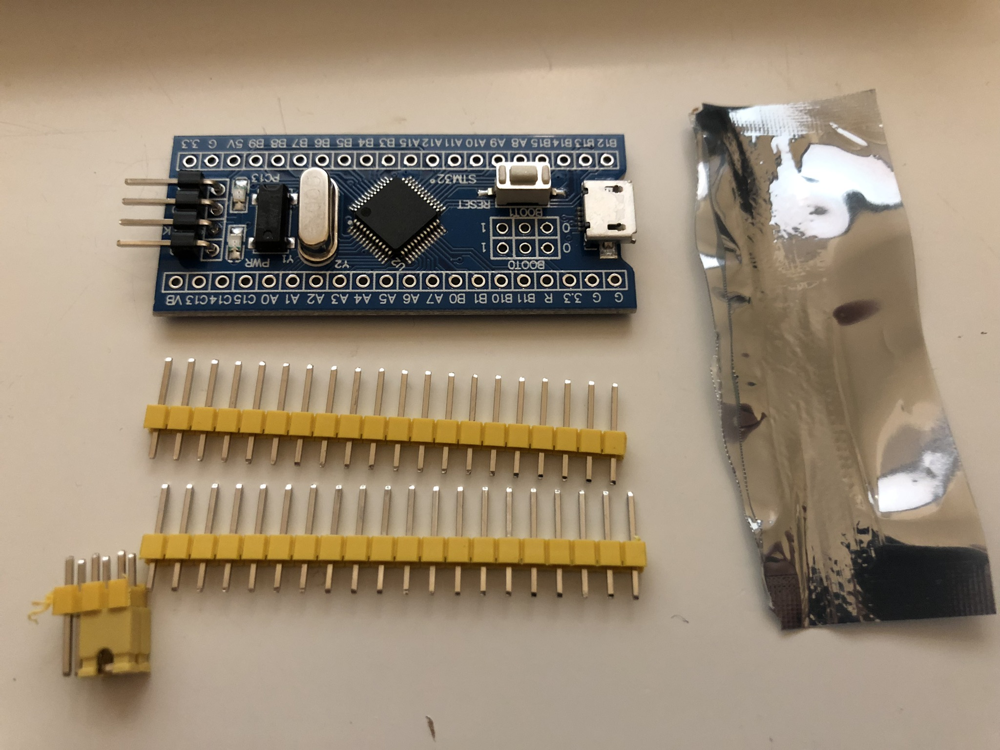
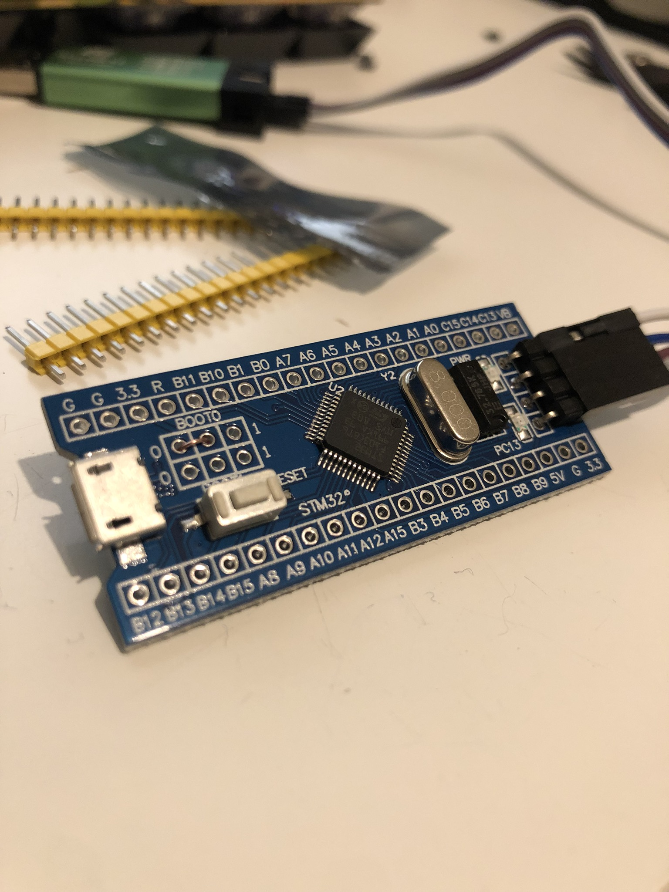
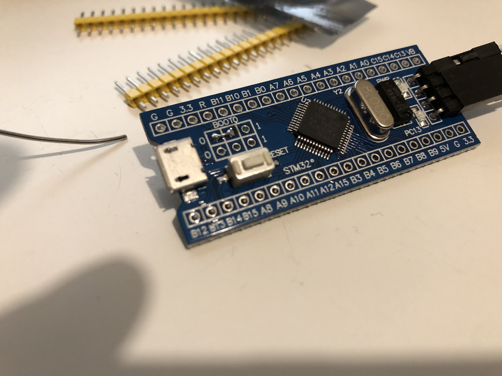
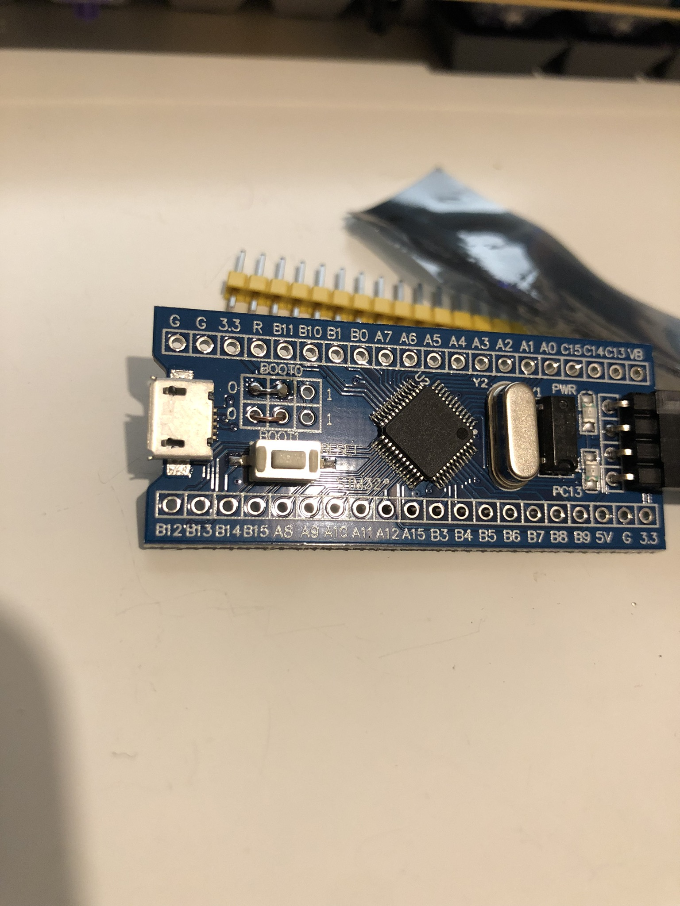
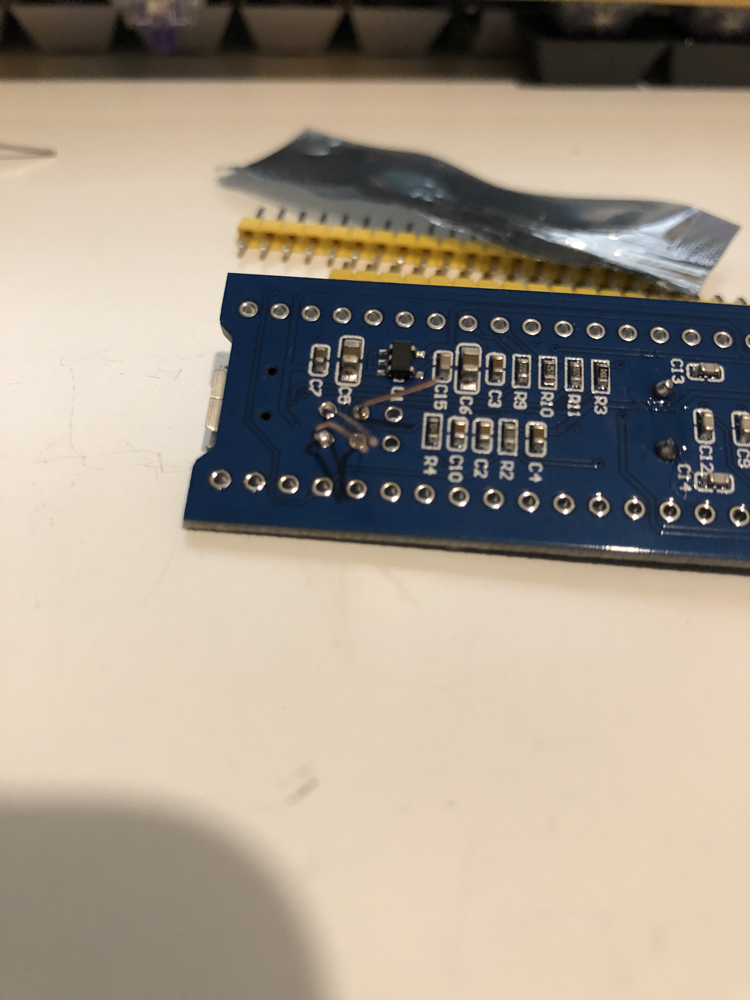

# Bluepill Modification

Stock bluepills are quite tall, and interfere with case compatibility. For that reason, we often need to modify the Bluepull to make it as thin as possible.

## With Jumpers

If your blue pill has yellow jumpers soldered on it:

1. We're going to modify our Blue Pill to make it as thin as possible. We need to add a boot jumper so we can get rid of the existing ones.

1. We want to connect the two pins shown. Use a diode leg to do it.

1. Solder it to the middle pin first, then the outer pin.

1. Repeat for the other side and cut off the excess. Your blue pill should look like this.

1. Now we can cut off all the boot jumpers. I also desoldered the reset switch since we have one on our board, but you don't have to.

## Without Jumpers

If your blue pill does not have yellow jumpers on it:

1. Since our Bluepills do not have boot jumpers, we need to add some wires to set the boot mode. 

1. Put a piece of wire or diode leg between the middle BOOT0 pin and the 0 pin.

1. Flip the Bluepill over and solder the wire into the spots.

1. Repeat for the BOOT1 pin, again connecting the middle pin to 0.

1. Cut the extra wire/diode legs off the back of your blue pill.

1. At the end of this, your Bluepill should look like this:
