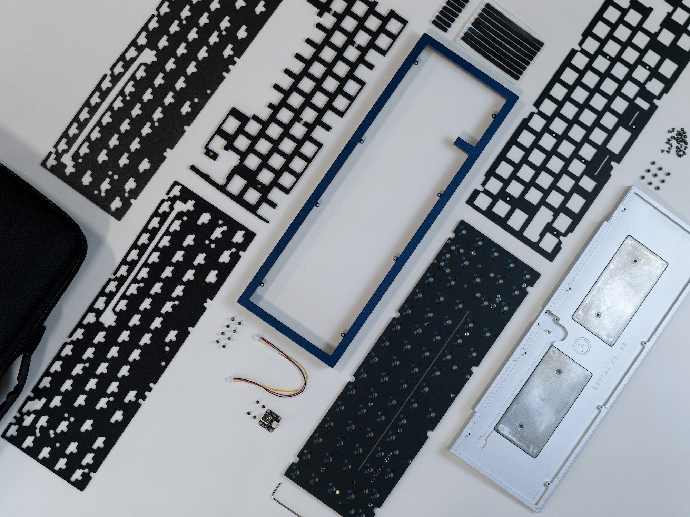
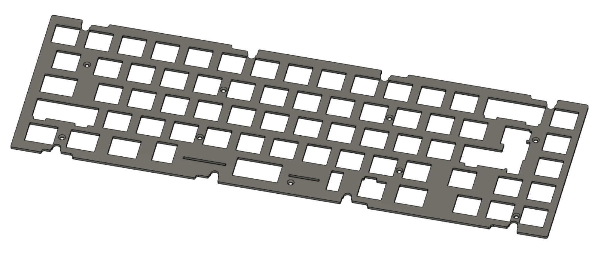
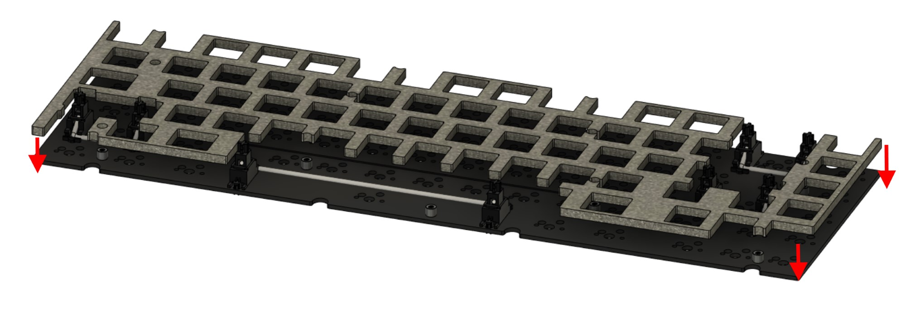
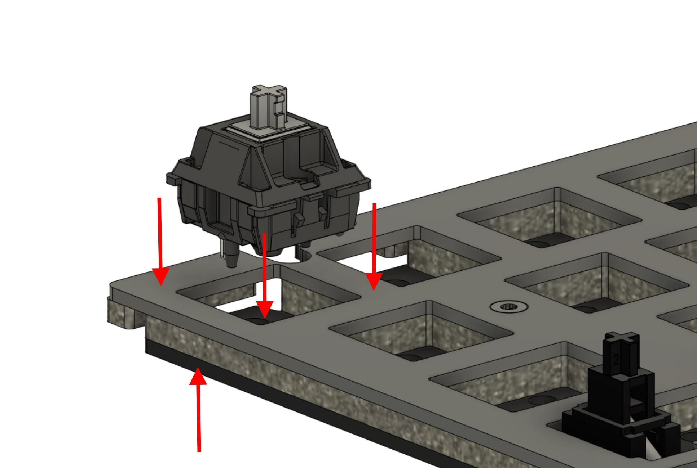

# Brutal V2 Build Guide

- [**Part 1** - Start Here](#part-1-start-here)
- [**Part 2** - Pre-Build Preparations](#part-2-pre-build-preparations)
- [**Part 3** - Preparing the Case](#part-3-preparing-the-case)
- [**Part 4** - Assembling the Internals](#part-4-assembling-the-internals)
- [**Part 5** - Putting it All Together](#part-5-final-assembly)
- [**Part 6** - Keymap Editing and Closing Words](#part-6-keymap-editing)

## Part 1 - Start Here

**Thank you for your purchase!**
Brutal V2 is the next evolution of the CannonKeys Brutalist keyboard series, carrying the brutalist inspiration at its core while blending in the latest in typing feel and acoustics.  
We’ve put hours upon hours of time and care into dialing in its aesthetics and performance for your enjoyment and everyday use.

!!! Note 
    In order to get the most out of your keyboard and have the best end result, it's important to properly assemble your keyboard by following each and every step in this guide.

**What's Included**

-  The Brutal V2 case
-  An aluminum fulle
-  The PCB and the USB Unified Daughterboard + JST Cable
-  One set of long gaskets, one set of short gaskets
-  One sheet of midfoam (between the plate and PCB)
-  Two sheets of bottom foam (below the PCB)
-  Torx keys of sizes T6 and T10
-  Screws
-  Rubber feet
-  HS Standoffs
-  Custom fitted carrying case

*If anything is missing, please contact CannonKeys customer support via the widget on the bottom of our website to have the issue resolved.*

**Parts and Tools Needed**
-   Switches
-   Stabilizers
-   Keycaps
-   USB-C cable which follows USB specifications
-   Soldering and desoldering equipment if you purchased the solderable PCB
-   Optionally tweezers to facilitate some steps

!!! Note 
    Refrain from wiping down the board with strong chemicals such as 90+% isopropyl alcohol - this can damage the board’s finish and coatings.
    
    
Both the case and USB port have extensive ESD protection circuitry; however, they are not fail-safes (e.g. it isn't ideal to set a house on fire even if it has a powerful sprinkler system). Take care to discharge any excess static buildup before use, especially during building or disassembling when the PCB circuitry is exposed and unprotected.

Do not overtighten the screws. Simply stop when the screws want to stop; overtightening risks destroying the board as well as causing unwanted acoustics such as excessive pinging.
When screwing screws, take care not to bash the Torx key against case parts to avoid causing damage. If using a third-party Torx driver, make sure that the driver is thin enough that it doesn't chip away at the inner sides of the case.

We recommend reading through the build guide once before actually carrying through with it - this will give a good idea of what’s upcoming at the next step.

## Part 2 - Pre-Build Preparations

**Pre-assembly checklist:**

1. **Check for flaws** - Check for any major external flaws that would disqualify the board as an A-stock unit or the version purchased. If you have any questionable flaws, please stop and contact us immediately. The keyboard must be unbuilt and unused in the case a replacement is required.

2. **Double check the contents** - If you haven’t done so already, please double-check to ensure all contents from Part 1 are accounted for.

3. **Test the PCB** - Check the bag and make sure there are no broken-off hotswap sockets or USB connectors rattling around in the bag. Plug in the PCB and verify that your computer detects it as a device.

!!! Note 
    If you are testing key functionality at this stage, do note that the caps lock position is bound to Fn (referred to as MO(1) in qmk) by default, and will not send a keystroke on its own. Instead, hold the caps lock position and press the numrow, and see if it sends F1-F12 rather than the number/character.

## Part 3 - Preparing the Case

!!! Note
	This build guide is written in general for all Brutal V2 series - while exact screw positions may differ between the layouts, the flow is identical. We’ll outline differences where they’re important.

1. Remove the case screws, using the smaller Torx key.

2. After unscrewing the case screws, lift and set aside the top case.

3. Prepare to install the gaskets on the plate.

4. Flip the plate over.
Carefully place the long adhesive gaskets onto the **bottom side** of the plate along the tabs. 
Tweezers can be useful for extra control.

5. Repeat the process for the short gaskets on the marked tabs, being careful not to stretch the gaskets while placing.

	
    The plate is now ready for internal assembly.
    

6. Prepare the bottom case.
Connect the USB daughterboard cable to the USB daughterboard.

7. Install the daughterboard and cable assembly into the case, then secure using four M2x4 screws.

8. Flip the bottom case half over.
Install the adhesive rubber feet into the circular grooves on the bottom of the case.

The case is now fully prepared for assembly.

## Part 4 - Assembling the Internals

1. Prepare and tune the stabilizers/switches needed for your preferred layout if not done already.

2. If you have purchased and are planning to use PCB Foam, install it onto the PCB.

3. Install the stabilizers onto the PCB.

4. **Optional step for hotswap users**
Open the pack of hotswap standoffs and screws. Install a standoff at each of the standoff screw holes on the PCB. Secure using the short cylindrical-head hotswap screws from the bottom (not the cone-shaped countersunk screws).

    **For all other users:** You may leave the standoffs unused for the softest typing feel if wanted. However, if using a hotswap PCB please note the following:
    
	- The PCB may begin to slide off after very extended use (many months or years), at which point you may need to re-seat the PCB against the switches by pushing it back into place.
	- Swapping switches will require case disassembly to firmly seat the switches against the PCB.

5. If you plan to use the foam midlayer, install it above the PCB at this stage. Installing the foam midlayer yields a more muted and slightly deeper sound.

6. Install the plate assembly from the earlier steps so that the screw holes on the plate align with the standoffs and stabilizers installed onto the PCB.

7. Secure the plate to the standoffs using the countersunk hotswap screws for any standoffs used.

8. Prepare to install switches.

    First, take the switch and flip it upside down.
    Check for any sort of bent legs, and repair them by bending them back to be straight.

    Below are two examples of switches with straight and bent pins.
    

9. After un-bending the legs with fingers, tweezers, flat pliers, or your tool of choice, carefully insert them to the PCB-plate assembly while supporting the hotswap socket from the bottom.
Hold the PCB surrounding the switch and push the switch firmly down, making sure that the switch snaps into the plate and is firmly seated against the PCB.

10. Repeat steps 8-10 for all switches.
If assembling a soldering kit, solder the switches. Make sure that the switch is seated firmly against the PCB once soldered.

11. Before we assemble the case, connect the build to a computer and to verify that all keys send a keystroke.

Now that the internals are successfully installed, it’s time for final assembly.

## Part 5 - Final Assembly

1. If you plan on using the case foam layers, place them into the bottom case half.
Installing the case foam will yield a more muted profile. Using both layers may impact typing feel.
For a livelier typing experience, we recommend using no foam, or starting with one sheet.

2. Flip the plate-PCB assembly upside-down.
Place the assembly next to the case bottom half, then connect the daughterboard cable into the connector on the main PCB.
Take care to avoid bumping the assemblies against each other - this can leave visual damage on either or.

3. Flip the plate-PCB assembly carefully so as to not tear apart the daughterboard cable, and place it centered atop the case bottom.

4. Carefully lower the top case half onto the assembly.

    The internal case screw tabs should clear through the cutouts on the plate, and the bottom case half should fit into the case top walls.

5. Install the M2x6 case screws.
As stated earlier in the build guide, avoid screwing in any further or firmer than necessary.
If you have acoustic issues after assembly, try loosening tight screws.

Install keycaps of your choice, connect to a computer and verify that everything functions as it should.

**Congratulations! You’ve fully assembled your Brutal V2 keyboard.**

## Part 6 - Keymap Editing

For keymap editing, use either of the following:

-   The online VIA configurator can be used to edit keymaps directly from a WebUSB enabled browser (Google Chrome and MS Edge) - simply visit [usevia.app](https://usevia.app).
    
-   The offline version can be downloaded from here if not using a supported browser - [Via Download Link](https://github.com/the-via/releases/releases)
    
For layer configuration and advanced functionality, please see the [QMK documentation](https://docs.qmk.fm/#/keycodes).

  
  

## Closing words  
  

Once again, thank you for your purchase, and we hope that your Brutal V2 keyboard serves as a reliable keyboard for years to come.

If you ever need support, please contact us at the following:

-   For logistical issues such as damage/loss during transit, incorrect order contents, etc., contact CannonKeys via the Contact Us widget at the bottom right of our pages on our webstore.  
      
    
-   For assembly help regarding building and similar, either contact support as per above, or ask in either [Our Discord](https://discord.com/invite/DKpykqYKAe) or [ai03’s Discord server](https://discord.gg/qA5JD9y) for live community support.

We also have a robust [PCB Troubleshooting](https://docs.cannonkeys.com/troubleshooting/) page available should you wish to attempt and self diagnose any issues with the PCB prior to contacting support.
    

## How did we do?

We will appreciate any feedback you have about the board, and we’ll take it into account for future projects.  
To submit your thoughts, please leave a review for the keyboard on our webstore by visiting the [listing for your keyboard](https://cannonkeys.com/collections/brutalist-v2) - doing so will not only help better tailor our future projects to your preferences, but will also help offer insight for other keyboard enthusiasts in the future.
