# Brutal Series Build Guide

First make sure we have all the items we'll need.
Each Brutal keyboard is slightly different, but in general we will have:

* A PCB
* Top and bottom case
* M2x10 screws (Case Screws)
* M2x6 Screws (Plate Screws)
* Polyfill
* 1.5mm Hex Key

## Building a Brutal Keyboard
1. Starting Kit:
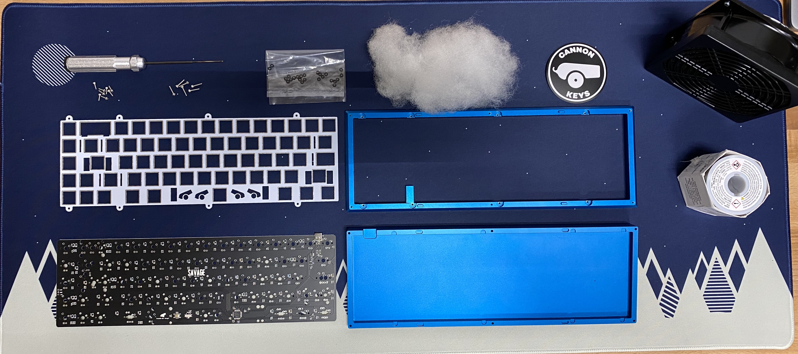

### Preparing the PCB
To begin - your PCB might have rails on it. Those will have to be removed. 
Check out [this guide](../removing_pcb_rails.md) for instructions on how to do it.

Additionally, CannonKeys PCBs have a safety feature to help our PCBs recover from bad flashes. There is a safety switch on the back that will force the PCB into a re-flashing mode. Ensure that this switch is put into keyboard mode.

Flashing mode (You don't want this):
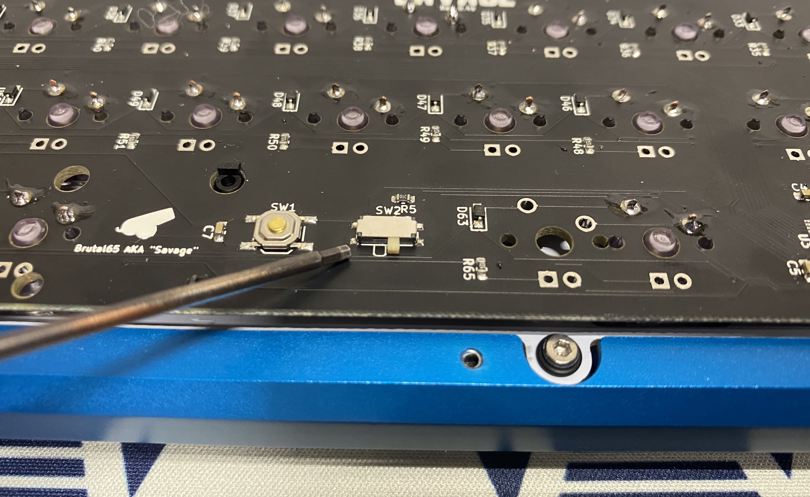

Keyboard mode (You want this):
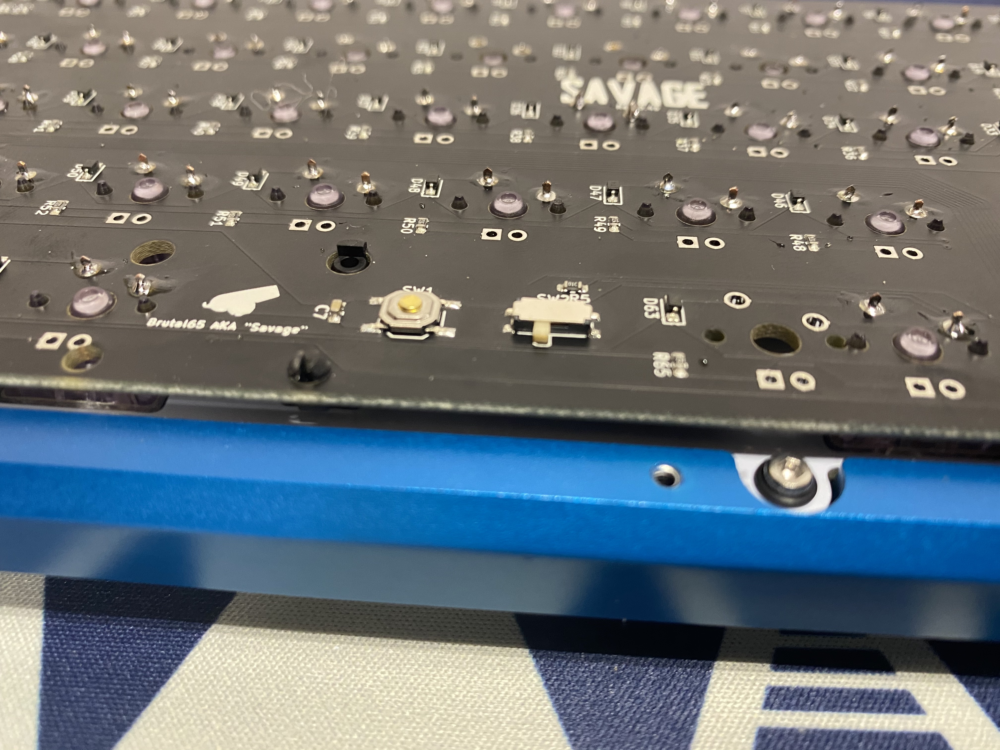

### Assembling the PCB and Plate
1. First, we have to add stabilizers to our PCB. We highly recommend lubing stabs.

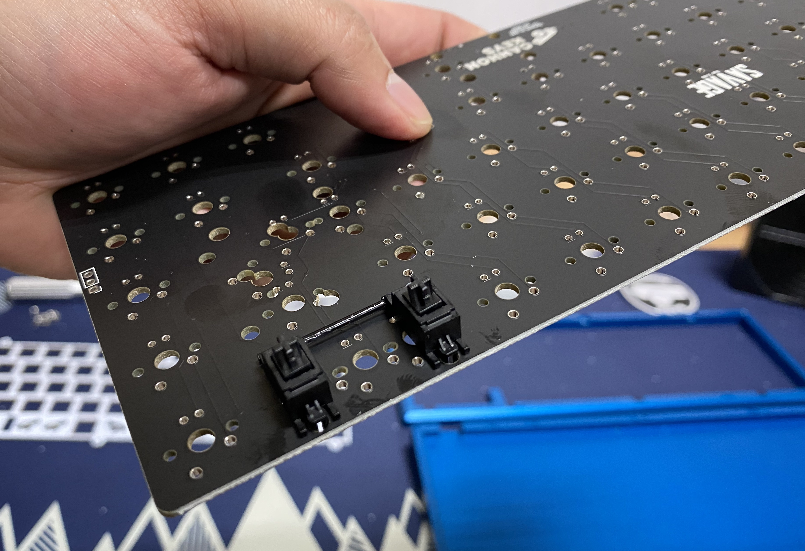
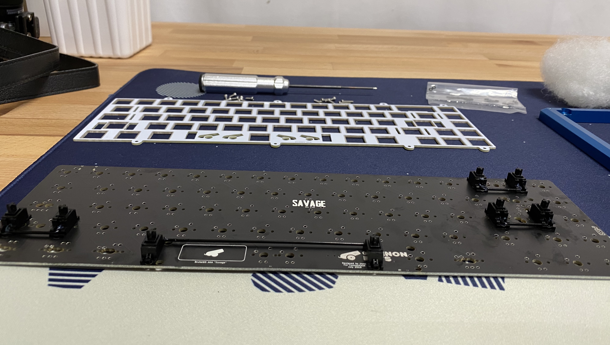

1. Put your plate on top of your PCB and start adding switches.
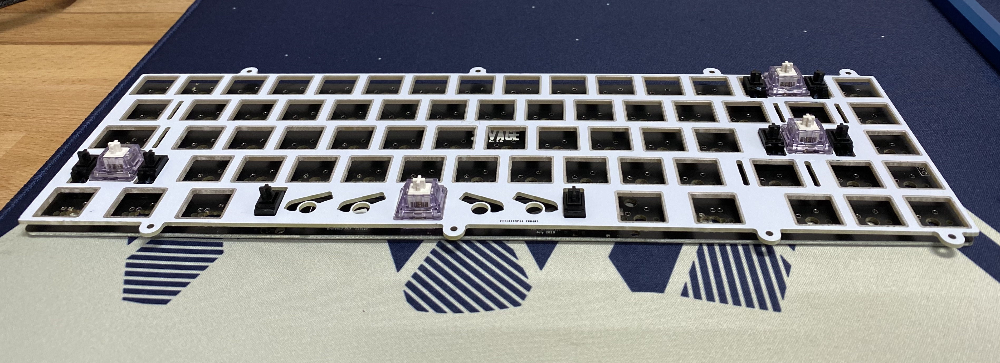
1. Finish adding all switches to the PCB and solder each pin to the PCB.
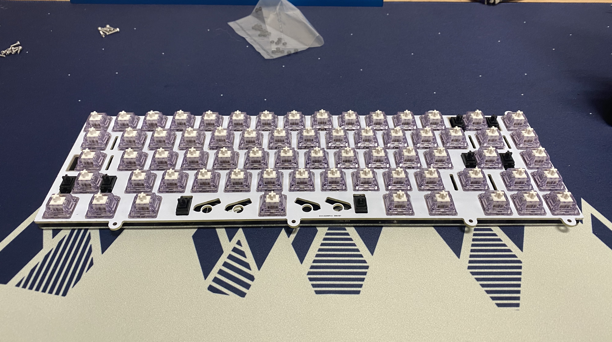
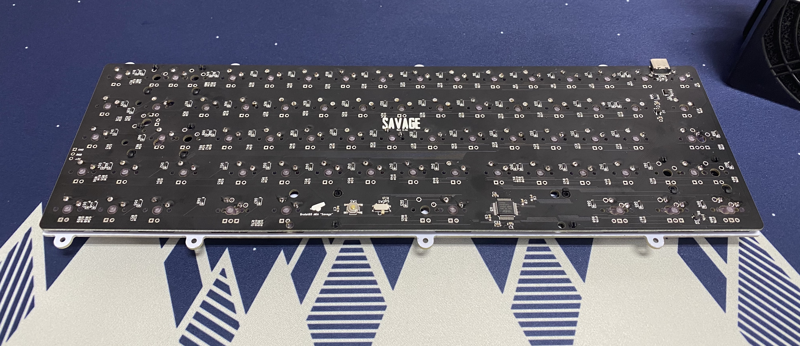

### Preparing the Burger Mount
The Brutal Series keyboards all use burger mount to help with sound and feel. They act as tiny gaskets between the plate and case. They are optional - you can build the Brutal Series keyboards as top mount - but we suggest burger mounting!

1. First, we need to add o-rings to our M2x6 screws
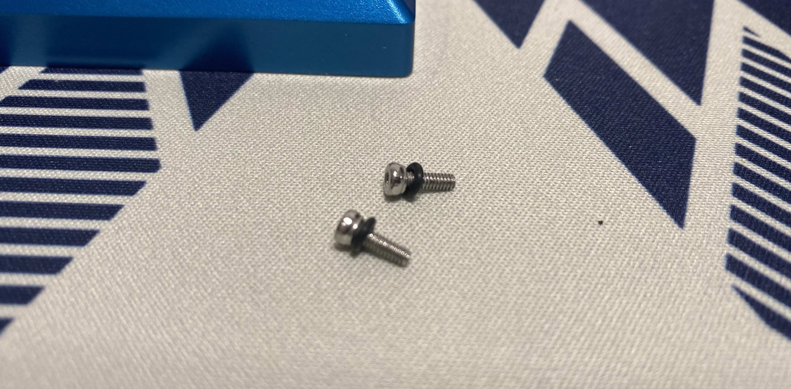
1. Next, we need to add o-rings to the top of the case. Each plate screw hole has an indentation next to it meant to hold an o-ring
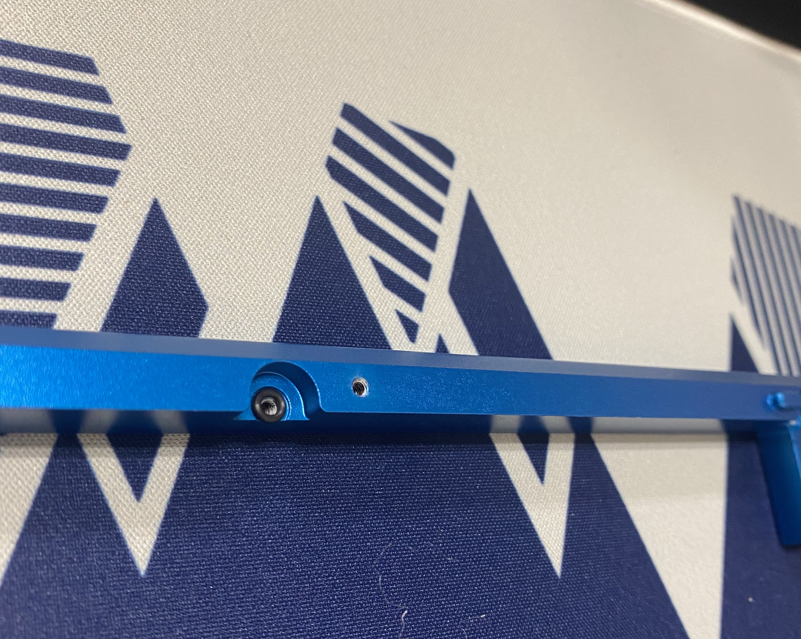

### Mounting the Plate
1. Take your PCB and Plate assembly and align it with the top part of your case
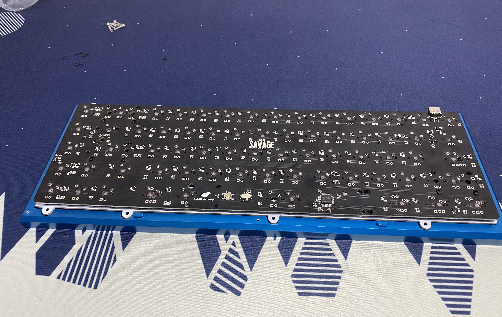
1. Start screwing in the plate using the M2x6 screws with o-rings, starting with opposite corners. Screw until you just see the o rings start to compress. You can adjust the tightness of the screws to meet your mounting preferences.
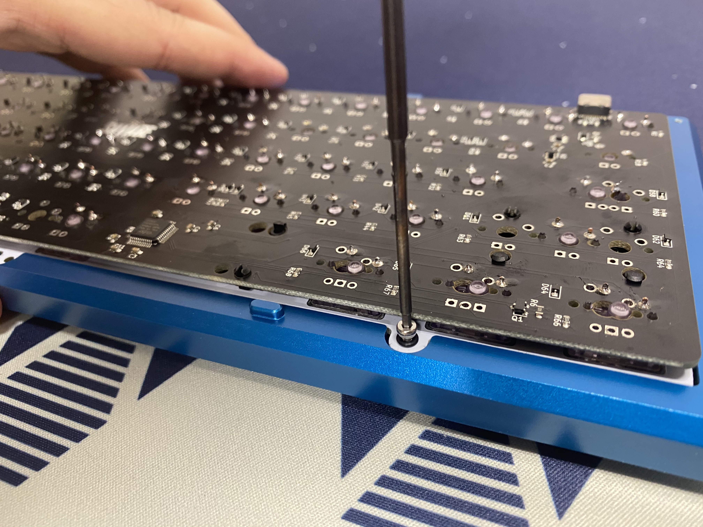
1. Finish screwing in the plate

### Assembling the Case
1. Add polyfill to the bottom of your case, to your preference.
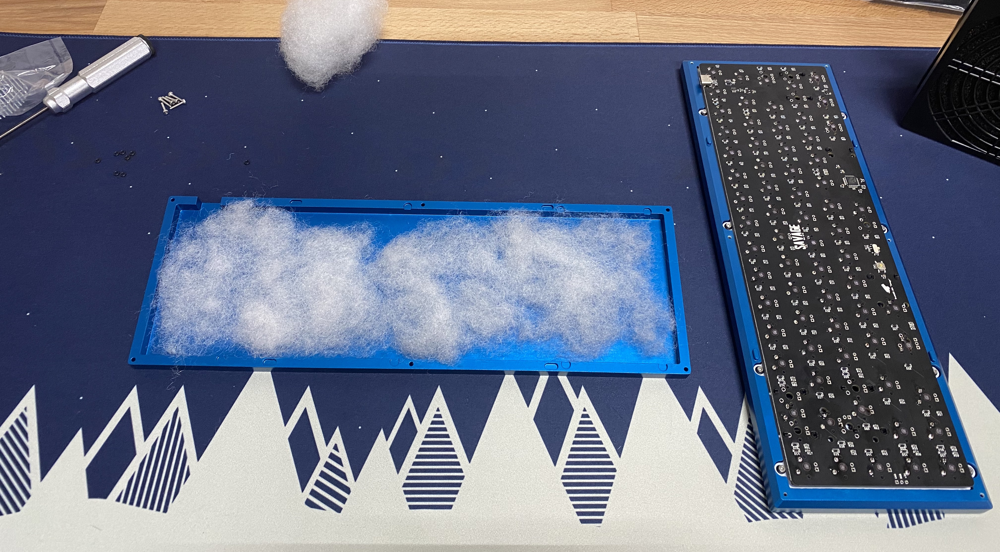
1. Align the top and bottom of your case, put them together, and flip them upside down. Then use the M2x10 screws to screw the top and bottom together.
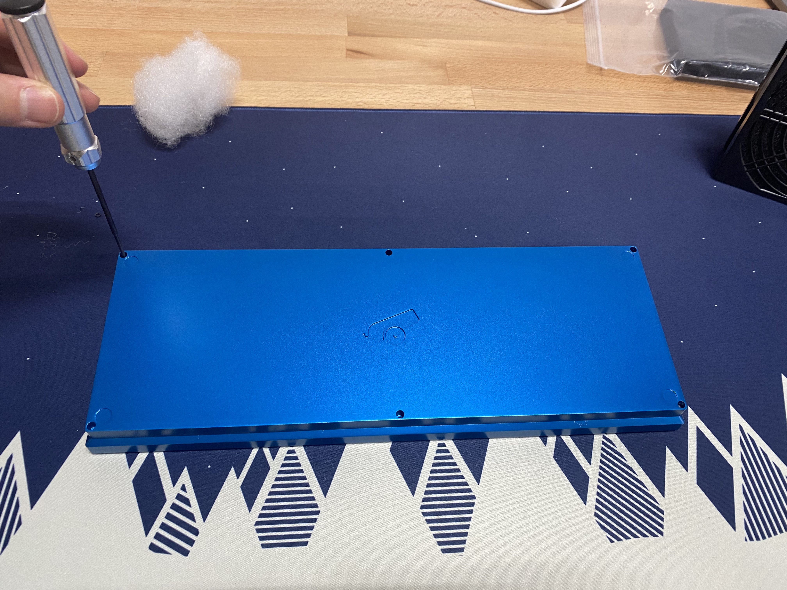

### Adding Keycaps
1. Flip your keyboard back over, and add keycaps.
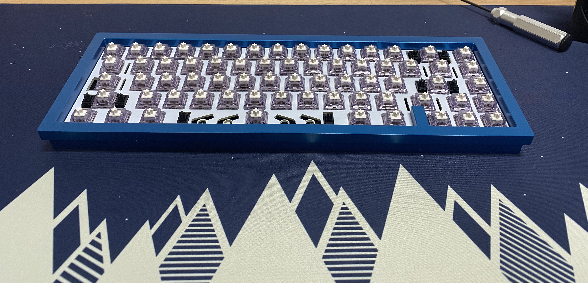

Enjoy!

## RGB Underglow
To add RGB Underglow for a Polycarbonate case build, you will need a WS2812B LED Strip. These are easily available on Amazon. 

Then follow the instructions [here](../rgb_underglow.md)