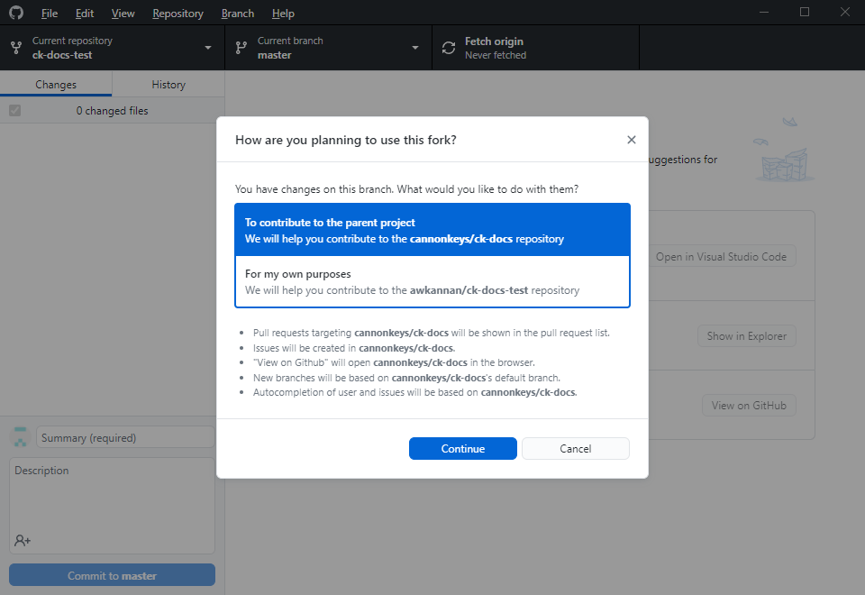

# Contributing to CannonKeys Documentation

Our docs site is fully open source, and created using a tool called MkDocs.
Each page you see on this site is defined by a markdown file that's uploaded into our github repository.

We welcome community contributions to our docs. If there is information that is missing that you think could be useful, feel free to contribute!

If you're not sure where to start, we put together this little guide.

## Prerequisites 

There are some prerequisites that you will need:
- A Github account
- The Github Desktop app
- Knowlege of how to write [Markdown](https://www.markdownguide.org/). If you don't know how to do this - it's pretty easy to pick up.
- Some way to edit markdown - we recommend VSCode[https://code.visualstudio.com/] or [Ghostwriter](https://ghostwriter.kde.org/) as they have live preview capabilities.

## Forking the Repo

1. First, we need to make our own copy of the ck-docs repository. This will allow us to make changes to our copy without modifying the live ck-docs page.
    

1. Follow the prompts and finish creating your fork.

1. Before starting any new contributions, make sure you sync your fork with the upstream ck-docs repo. This will pull any changes from the main cannonkeys/ck-docs into your forked copy.
    

## Downloading the Repo

1. Next, we need to download the repo to our computer so we can make changes. Open and login to Github Desktop. You should see a screen like the one shown below. Select "Clone a repository from the internet".
    

1. Search for your fork of ck-docs, and select it.
    

1. Hit the clone button and wait for the repository to clone.
    

1. When it's done being cloned, let Github Desktop that you'll be contributing to the parent project - cannonkeys/ck-docs
    

1. We are now ready to make changes!
    

## Making Local Changes

1. Now, we need to make our desired changes. Use your selected app to create or modify files as necessary to contribute to the Markdown docs.

1. As you change files, you'll see them show up in Github Desktop as changed files.
    

1. When you're ready to submit your changes, make sure you fill in a summary and description of your changes and hit "Commit to Master"
    

1. Your changes are now saved and committed to your local copy of the repository. Now we have to upload it to Github. Press the "Push origin" button.
    

## Submitting Changes Upstream

1. Next, we will submit our changes to ck-docs/cannonkeys. Go to Branch in the Github Desktop menu and select "Create Pull Request"
    

1. This will open up Github in your browser. You can look through this page to make sure all your changes made it into your request. When you're done reviewing, hit the "Create Pull Request" button.
    

1. Fill in a title and description for your pull request, if it's not already there. When you're done, hit the "Create Pull Request" button again.
    

1. Congratulations! You've submitted a change! Hop on Discord and let us know that you've submitted a new request!
    

