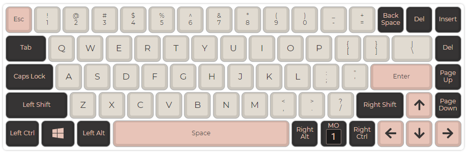
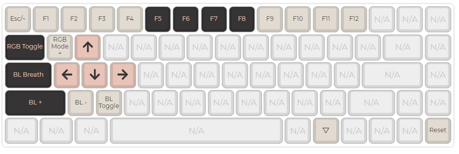

# Default Layouts

## Practice60
[Firmware link](assets/cannonkeys_practice60_default.bin)

Default Layer:


First layer:


## Practice65
[Firmware link](assets/cannonkeys_practice65_default.bin)

Default Layer:


First layer:


## Ortho60
[Firmware link](assets/cannonkeys_ortho60_default.bin)
```
/* Qwerty
 * ,-----------------------------------------------------------------------------------.
 * |   `  |   1  |   2  |   3  |   4  |   5  |   6  |   7  |   8  |   9  |   0  | Bksp |
 * |------+------+------+------+------+------+------+------+------+------+------+------|
 * | Tab  |   Q  |   W  |   E  |   R  |   T  |   Y  |   U  |   I  |   O  |   P  | Del  |
 * |------+------+------+------+------+-------------+------+------+------+------+------|
 * | Esc  |   A  |   S  |   D  |   F  |   G  |   H  |   J  |   K  |   L  |   ;  |  "   |
 * |------+------+------+------+------+------|------+------+------+------+------+------|
 * | Shift|   Z  |   X  |   C  |   V  |   B  |   N  |   M  |   ,  |   .  |   /  |Enter |
 * |------+------+------+------+------+------+------+------+------+------+------+------|
 * | Brite| Ctrl | Alt  | GUI  |Lower |    Space    |Raise | Left | Down |  Up  |Right |
 * `-----------------------------------------------------------------------------------'
 */

/* Lower
 * ,-----------------------------------------------------------------------------------.
 * |   ~  |   !  |   @  |   #  |   $  |   %  |   ^  |   &  |   *  |   (  |   )  | Bksp |
 * |------+------+------+------+------+-------------+------+------+------+------+------|
 * |   ~  |   !  |   @  |   #  |   $  |   %  |   ^  |   &  |   *  |   (  |   )  | Del  |
 * |------+------+------+------+------+-------------+------+------+------+------+------|
 * | Del  |  F1  |  F2  |  F3  |  F4  |  F5  |  F6  |   _  |   +  |   {  |   }  |  |   |
 * |------+------+------+------+------+------|------+------+------+------+------+------|
 * |      |  F7  |  F8  |  F9  |  F10 |  F11 |  F12 |ISO ~ |ISO | |      |      |      |
 * |------+------+------+------+------+------+------+------+------+------+------+------|
 * | Reset|      |      |      |      |             |      | Next | Vol- | Vol+ | Play |
 * `-----------------------------------------------------------------------------------'
 */


/* Raise
 * ,-----------------------------------------------------------------------------------.
 * |   `  |   1  |   2  |   3  |   4  |   5  |   6  |   7  |   8  |   9  |   0  | Bksp |
 * |------+------+------+------+------+------+------+------+------+------+------+------|
 * |   `  |   1  |   2  |   3  |   4  |   5  |   6  |   7  |   8  |   9  |   0  | Del  |
 * |------+------+------+------+------+-------------+------+------+------+------+------|
 * | Del  |  F1  |  F2  |  F3  |  F4  |  F5  |  F6  |   -  |   =  |   [  |   ]  |  \   |
 * |------+------+------+------+------+------|------+------+------+------+------+------|
 * |      |  F7  |  F8  |  F9  |  F10 |  F11 |  F12 |ISO # |ISO / |      |      |      |
 * |------+------+------+------+------+------+------+------+------+------+------+------|
 * |      |      |      |      |      |             |      | Next | Vol- | Vol+ | Play |
 * `-----------------------------------------------------------------------------------'
 */

```

## Ortho48
[Firmware link](assets/cannonkeys_ortho48_default.bin)
```
 * Default Layer:
 * ,-----------------------------------------------------------------------------------.
 * | Tab  |   Q  |   W  |   E  |   R  |   T  |   Y  |   U  |   I  |   O  |   P  | Bksp |
 * |------+------+------+------+------+-------------+------+------+------+------+------|
 * | Esc  |   A  |   S  |   D  |   F  |   G  |   H  |   J  |   K  |   L  |   ;  |  "   |
 * |------+------+------+------+------+------|------+------+------+------+------+------|
 * | Shift|   Z  |   X  |   C  |   V  |   B  |   N  |   M  |   ,  |   .  |   /  |Enter |
 * |------+------+------+------+------+------+------+------+------+------+------+------|
 * | Lite | Ctrl | Alt  | GUI  |Lower |    Space    |Raise | Left | Down |  Up  |Right |
 * `-----------------------------------------------------------------------------------'

 /* Lower
 * ,-----------------------------------------------------------------------------------.
 * |   ~  |   !  |   @  |   #  |   $  |   %  |   ^  |   &  |   *  |   (  |   )  | Bksp |
 * |------+------+------+------+------+-------------+------+------+------+------+------|
 * | Del  |  F1  |  F2  |  F3  |  F4  |  F5  |  F6  |   _  |   +  |   {  |   }  |  |   |
 * |------+------+------+------+------+------|------+------+------+------+------+------|
 * |      |  F7  |  F8  |  F9  |  F10 |  F11 |  F12 |ISO ~ |ISO | | Home | End  |      |
 * |------+------+------+------+------+------+------+------+------+------+------+------|
 * |      |      |      |      |      |             |      | Next | Vol- | Vol+ | Play |
 * `-----------------------------------------------------------------------------------'
 */

/* Raise
 * ,-----------------------------------------------------------------------------------.
 * |   `  |   1  |   2  |   3  |   4  |   5  |   6  |   7  |   8  |   9  |   0  | Bksp |
 * |------+------+------+------+------+-------------+------+------+------+------+------|
 * | Del  |  F1  |  F2  |  F3  |  F4  |  F5  |  F6  |   -  |   =  |   [  |   ]  |  \   |
 * |------+------+------+------+------+------|------+------+------+------+------+------|
 * |      |  F7  |  F8  |  F9  |  F10 |  F11 |  F12 |ISO # |ISO / |Pg Up |Pg Dn |      |
 * |------+------+------+------+------+------+------+------+------+------+------+------|
 * |      |      |      |      |      |             |      | Next | Vol- | Vol+ | Play |
 * `-----------------------------------------------------------------------------------'
 */

```

## Ortho75
[Firmware link](assets/cannonkeys_ortho75_default.bin)
```
/* QWERTY
 * .--------------------------------------------------------------------------------------------------------------------------------------.
 * | ESC    | 1      | 2      | 3      | 4      | 5      | -      | `      | =      | 6      | 7      | 8      | 9      | 0      | BACKSP |
 * |--------+--------+--------+--------+--------+--------+--------+--------+--------+--------+--------+--------+--------+-----------------|
 * | TAB    | Q      | W      | E      | R      | T      | [      | \      | ]      | Y      | U      | I      | O      | P      | '      |
 * |--------+--------+--------+--------+--------+--------+--------+--------+--------+--------+--------+--------+-----------------+--------|
 * | CAP LK | A      | S      | D      | F      | G      | HOME   | DEL    | PG UP  | H      | J      | K      | L      | ;      | ENTER  |
 * |--------+--------+--------+--------+--------+--------+--------+--------+--------+--------+--------+--------------------------+--------|
 * | LSHIFT | Z      | X      | C      | V      | B      | END    | UP     | PG DN  | N      | M      | ,      | .      | /      | RSHIFT |
 * |--------+--------+--------+--------+--------+-----------------+--------+--------+--------+--------+-----------------+--------+--------|
 * | LCTRL  | LGUI   | LALT   | FN     | SPACE  | SPACE  | LEFT   | DOWN   | RIGHT  | SPACE  | SPACE  | FN     | RALT   | RGUI   | RCTRL  |
 * '--------------------------------------------------------------------------------------------------------------------------------------'
 */


/* FUNCTION
 * .--------------------------------------------------------------------------------------------------------------------------------------.
 * | F1     | F2     | F3     | F4     | F5     | F6     | NUM LK | P/     | P*     | F7     | F8     | F9     | F10    | F11    | F12    |
 * |--------+--------+--------+--------+--------+--------+--------+--------+--------+--------+--------+--------+--------+--------+--------|
 * | SELECT | CALC   | MYCOMP | MAIL   | RGB HD | RGB HI | P7     | P8     | P9     | -      |        |        | PR SCR | SCR LK | PAUSE  |
 * |--------+--------+--------+--------+--------+--------+--------+--------+--------+--------+--------+--------+--------+--------+--------|
 * | PREV   | PLAY   | NEXT   | STOP   | RGB SD | RGB SI | P4     | P5     | P6     | +      |        | RESET  |        |        |        |
 * |--------+--------+--------+--------+--------+--------+--------+--------+--------+--------+--------+--------+--------+--------+--------|
 * | VOL-   | MUTE   | VOL+   | APP    | RGB VD | RGB VI | P1     | P2     | P3     | PENT   |        |        |        |        |        |
 * |--------+--------+--------+--------+--------+--------+--------+--------+--------+--------+--------+--------+--------+--------+--------|
 * |        |        | RGB TG | FN     | RGB RMD| RGB MD | P0     |        | P.     | PENT   | PENT   | FN     |        |        |        |
 * '--------------------------------------------------------------------------------------------------------------------------------------'
 */
```
