# Horizon

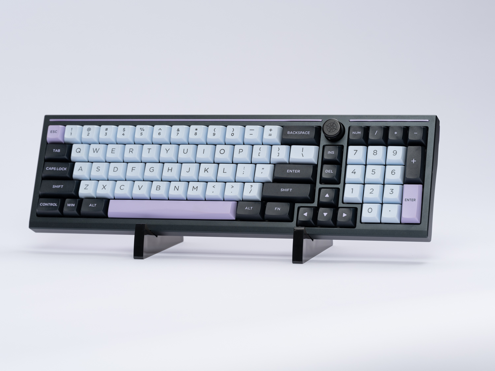

## Thank you for your purchase!

  

After nearly four years in the making as of the time of launch, Horizon is finally here to display your keyboards in their full glory.

  

To make sure that Horizon can hold your keyboards safely, it is important to assemble it correctly.

This build guide outlines the exact steps to take to get it built.

  

Warning: Damage, imperfections, etc. due to disregarding the build guide instructions cannot be accounted for. We won’t be able to refund or replace parts if you decide to build it by gut instinct and mess up somewhere.

  

## What’s in the box

  

-   Two thick acrylic panels,
    
-   Two anodized aluminum rods,
    
-   Four screws,
    
-   Four washers,
    
-   A sheet of 8 adhesive silicone pads,
    
-   And a hex key to assemble it all together.
    

  

## Assembly

  

1.  Unbox the parts and check that everything is in the box.  
    If there is anything missing or needing replacement, let us know at this point immediately - we cannot refund or replace kits after they have been assembled.  
      
    
2.  Prepare one of the acrylic panels.
    

Insert one of the screws into one of the panel holes.

  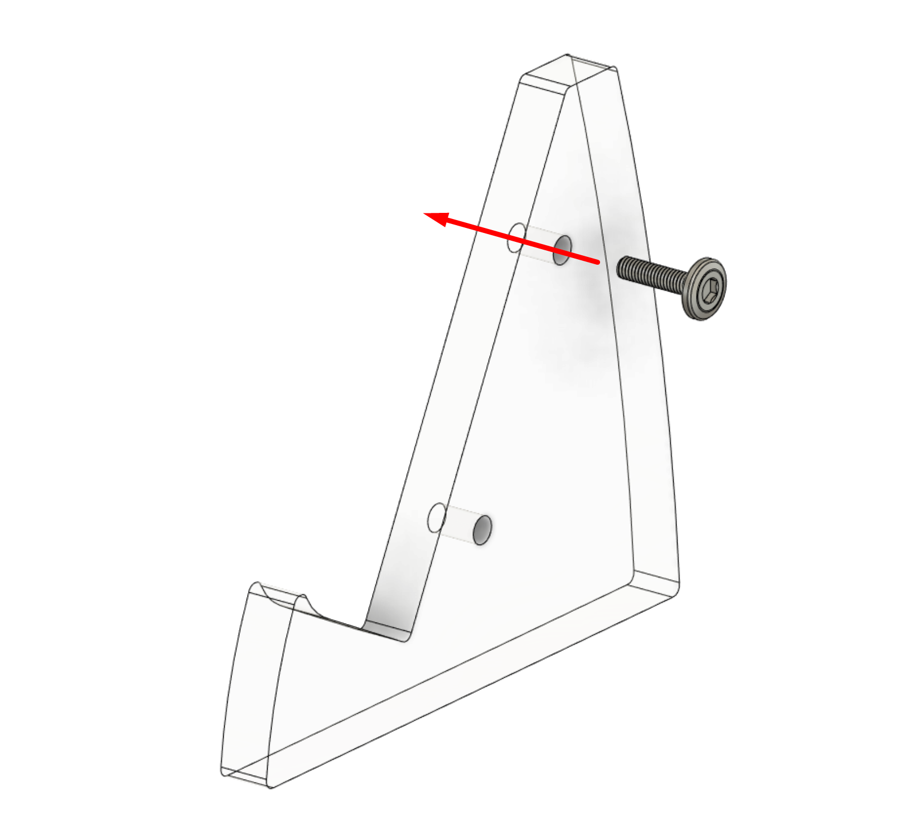
  

3.  From the other side of the panel, insert a washer into the protruding screw.  

  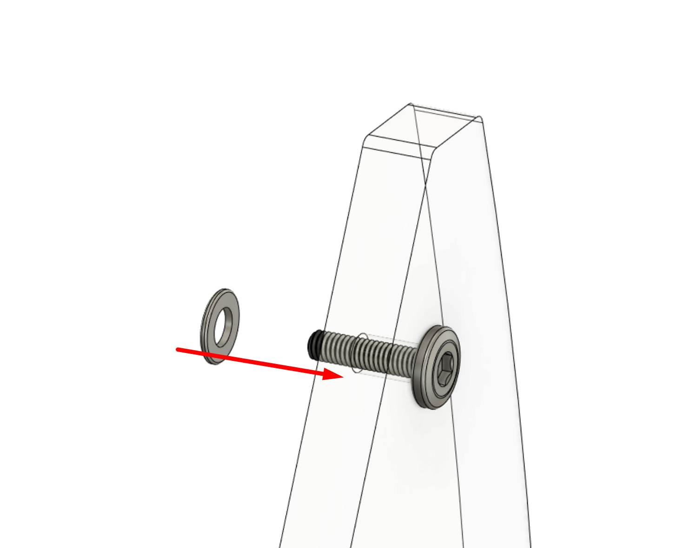
    
4.  Install an aluminum rod onto the protruding screw.
 

Hold the screw and rotate the rod to screw it partially into place.  
Do not tighten the rod or screw - the assembly should be left loose enough for the panel to wobble around. 
  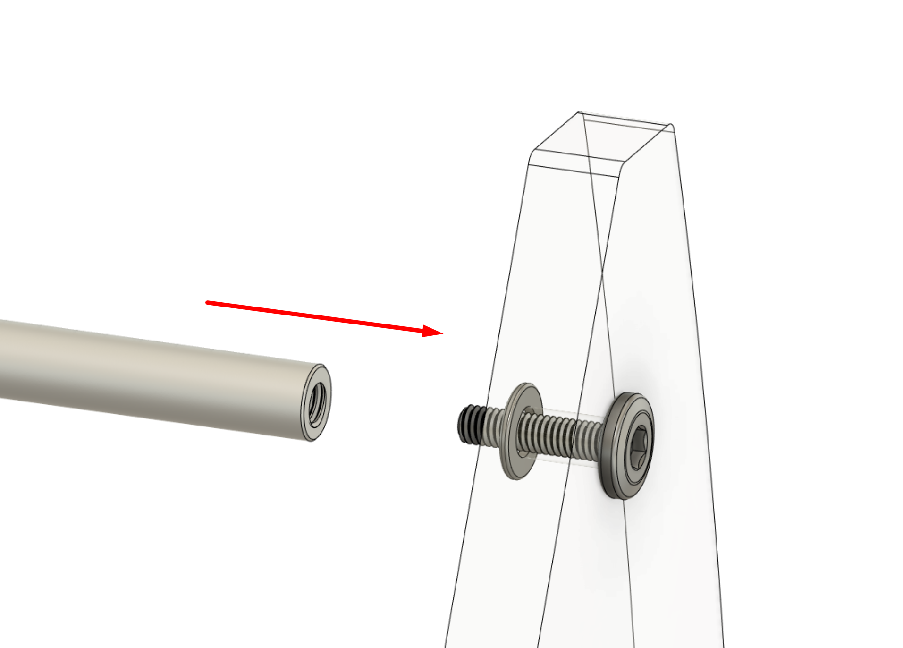

5.  Repeat steps 2 through 4 on the other screw hole of the same panel.  
    
    
6.  Prepare the other panel.  
    Insert a screw into one of the panel holes, on the opposite side of what was chosen for steps 2~5.  
    Install a washer onto the protruding screw from the other side.  
    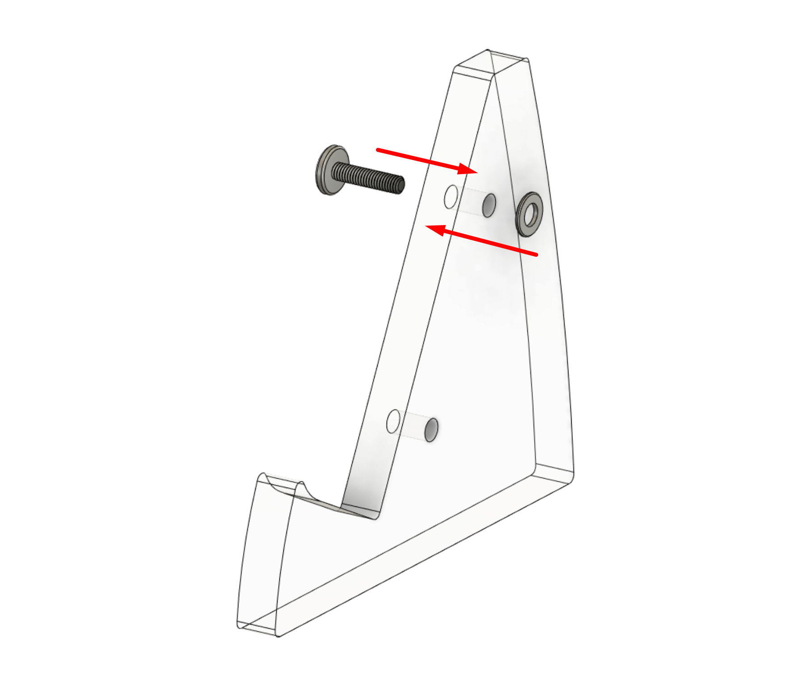
    
7.  Move the assembly from step 6 onto the assembly from step 5.  
    Rotate the screw to screw it into the corresponding aluminum rod, but as per before, only screw it in partially so the panel can move around.  
    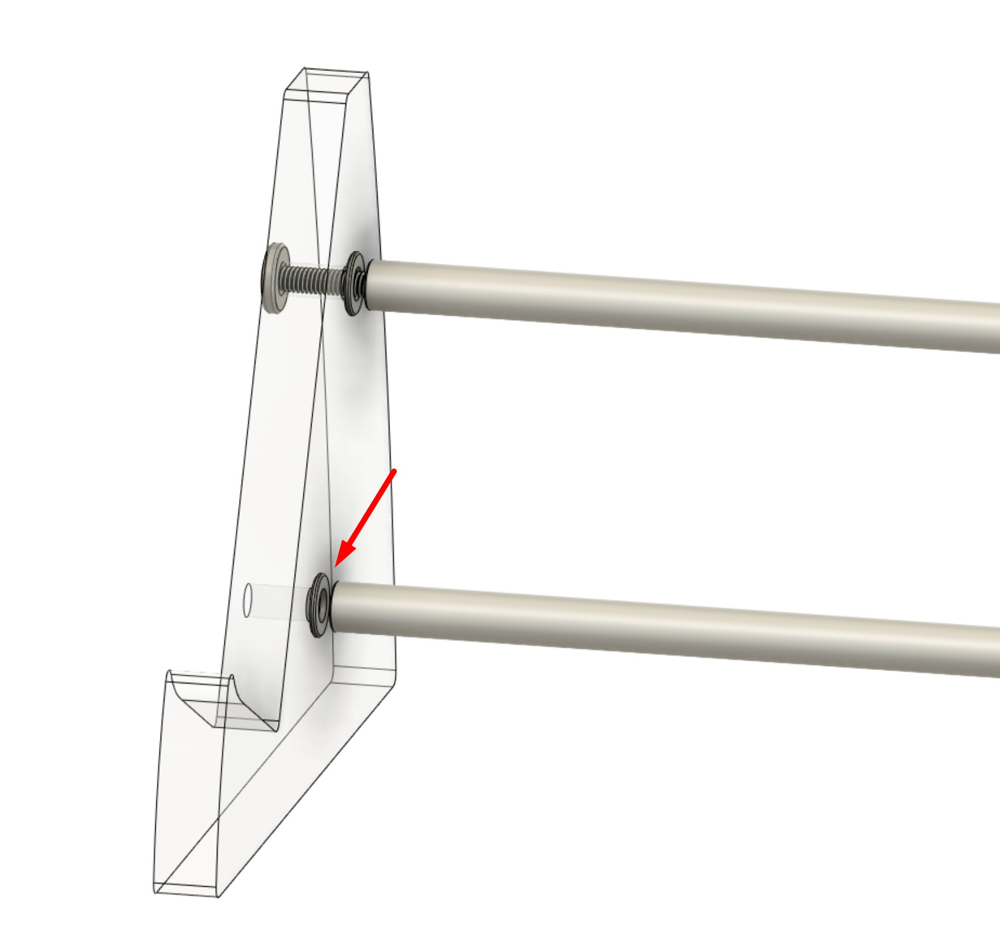
    
8.  Insert a washer between the rod and panel at the final remaining panel hole.
    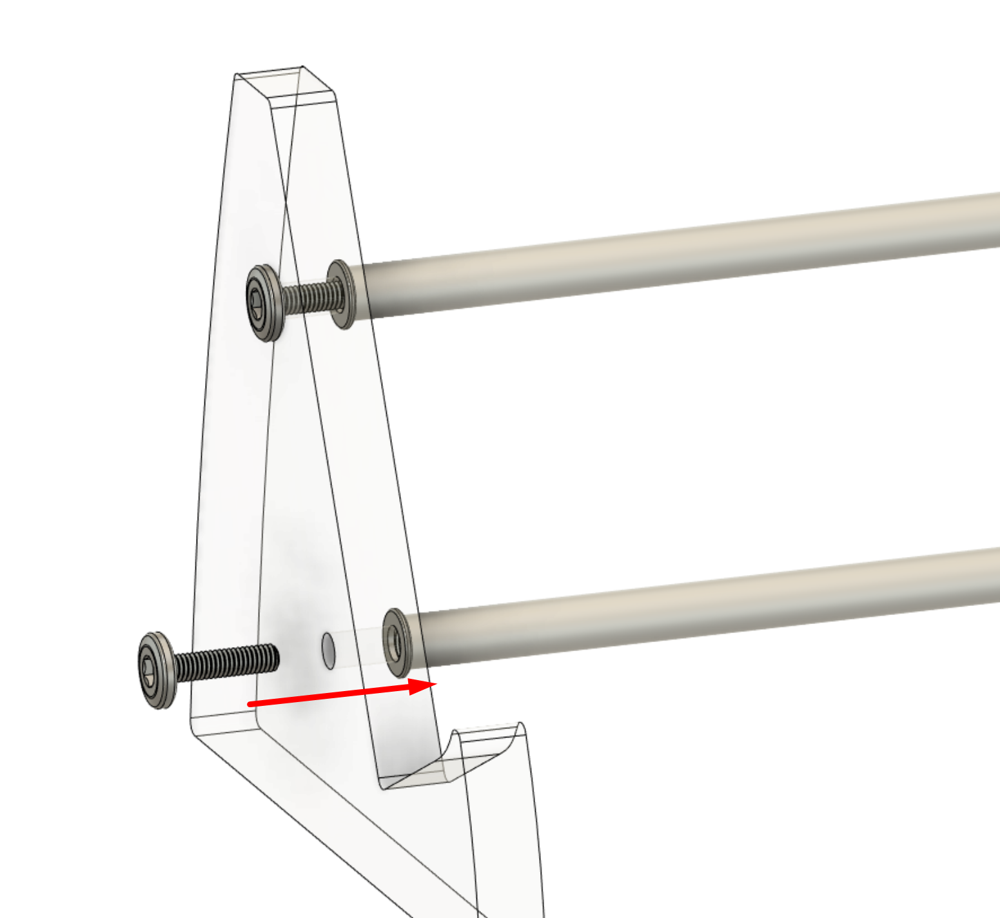
    
9.  Install the last screw through the panel and washer into the rod, leaving it loose as per before.   
    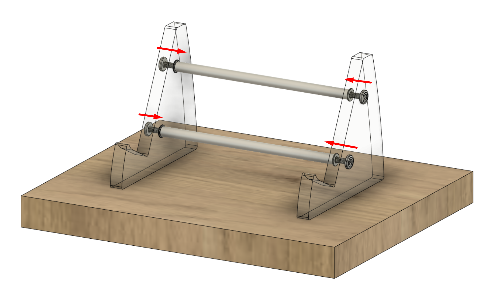
    
10.  Place the assembly on a known flat surface such as a tabletop.  
    Make sure both panels are sitting flat on the surface.    
    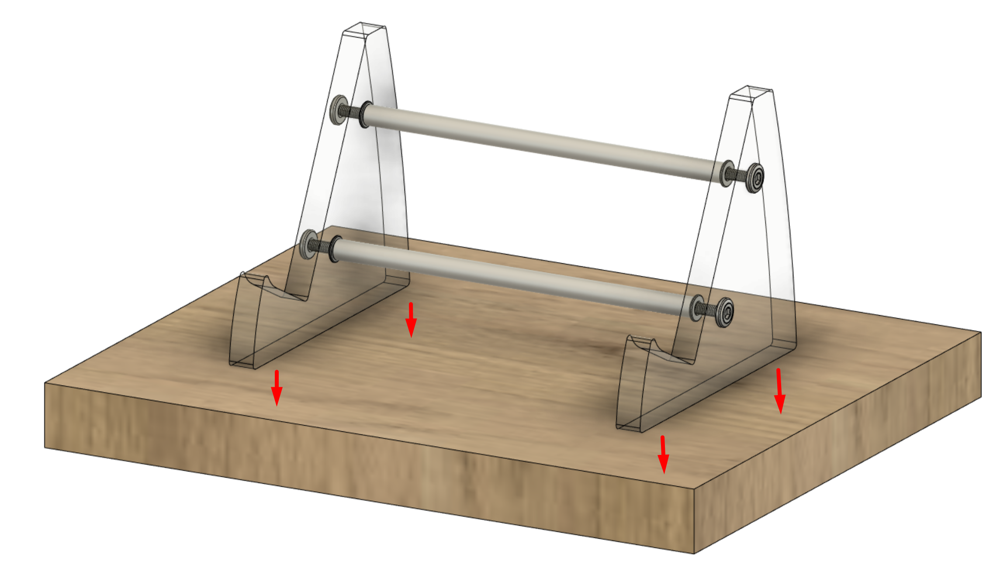 
    
11.  Screw in the four screws a small amount at a time, making sure both panels are continuing to make full contact against the surface and are not rotating out of shape.  
      
    Tighten the screws enough for the assembly to hold its shape firmly, but do not overtighten - doing so may shatter the panels.  
      
    If the panels rotate out of position and the assembly starts to wobble, loosen the screws and re-attempt.
   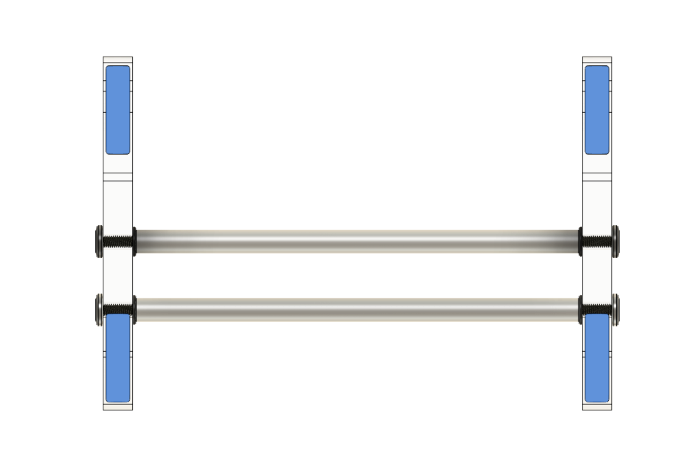 
    
12.  Install four of the adhesive silicone pads to the underside of the panels.          
    
   
13.  Install four of the adhesive silicone pads to the topside of the panels.
  
   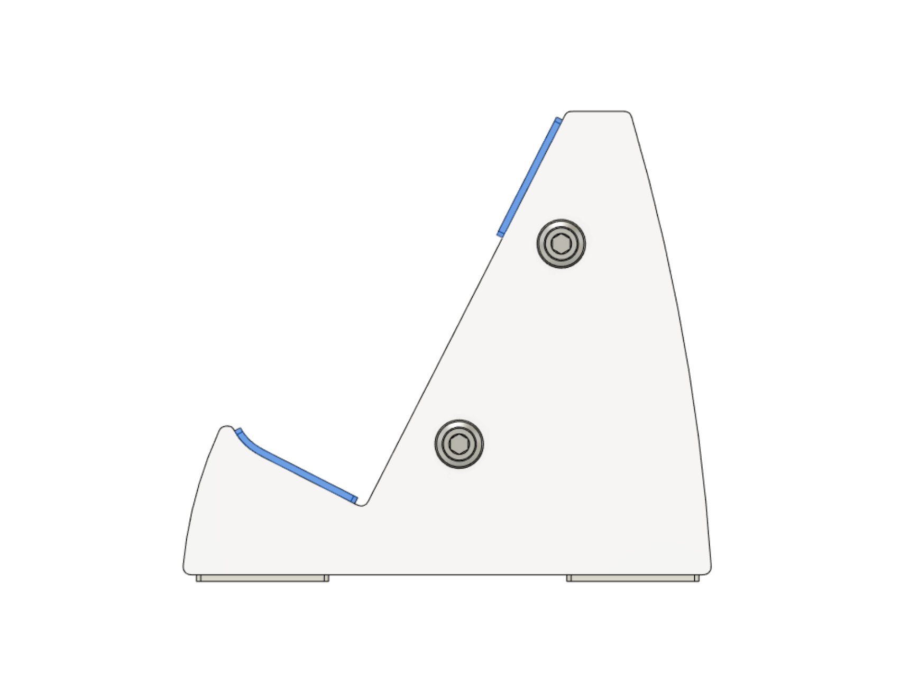
   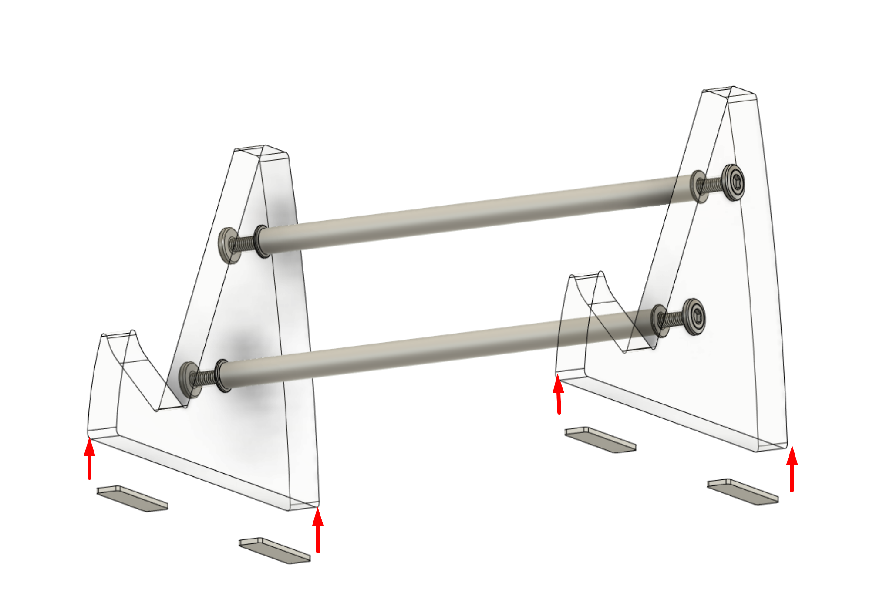 
   
Note: The upper silicone pads can be skipped if the keyboard you plan to display sits firmly and stably atop without the pads. However, it is highly, highly recommended to install them for the following scenarios:  
  
- Displaying valuable keyboards where you want the most stability and safety  
- Using the stands atop a fragile or valuable material such as a glass shelf - you don’t want the keyboard sliding off onto the shelf below.  
- Fitting Alice-likes with a protruding chin, or boards with rounded, very sharp, or organic shapes on the front ledge  
- Holding extremely heavy keyboards  
- Displaying plastic keyboards, or boards of fragile coatings or materials - if the material is soft enough to be scratched by acrylic, you may end up permanently damaging the keyboard!  
  
  

14.  Place the stand where you wish to use it, and display your favorite keyboard atop.  
    Enjoy!  
      
 

## Closing Words

  

Once again, thank you for choosing Horizon, and we hope that it serves as a reliable, loyal stand for years to come.

  

If you ever need support, please contact us at the following:

-   For logistical issues such as damage/loss during transit, incorrect order contents, etc., contact CannonKeys via the Contact Us widget at the bottom right of our pages on our webstore.
    
-   For assembly help regarding building and similar, either contact support as per above, or ask in either CannonKeys’ or ai03’s Discord servers for live community support.
    

  
  

And if you’ve read all the way to the end of this build guide, please consider leaving a review on the product page - not only will it help us better tailor future projects to your preferences, but will also help share the word to other keyboard enthusiasts in the future.
