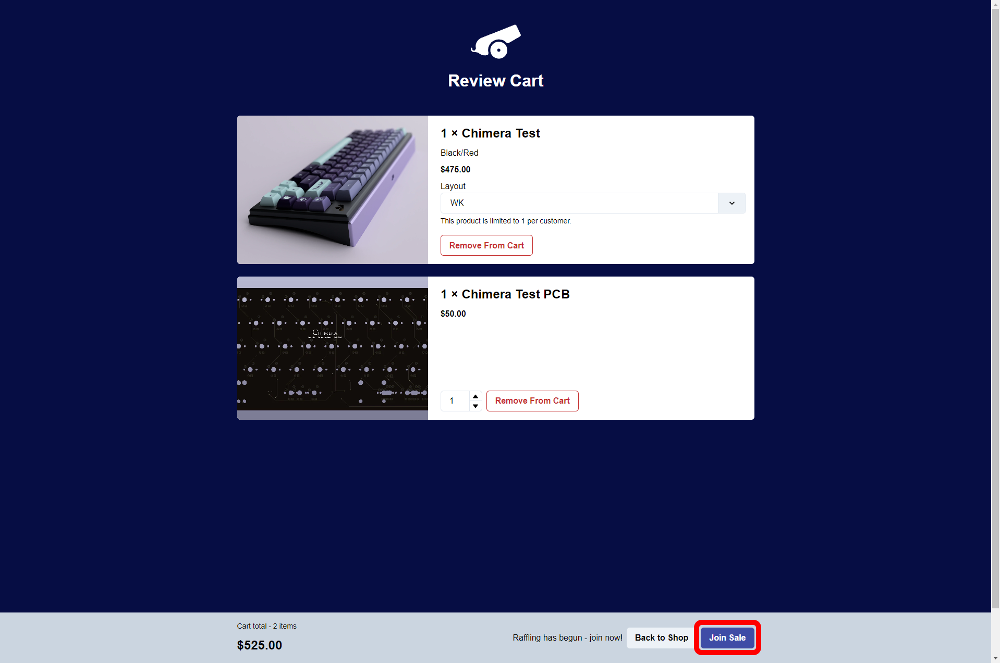
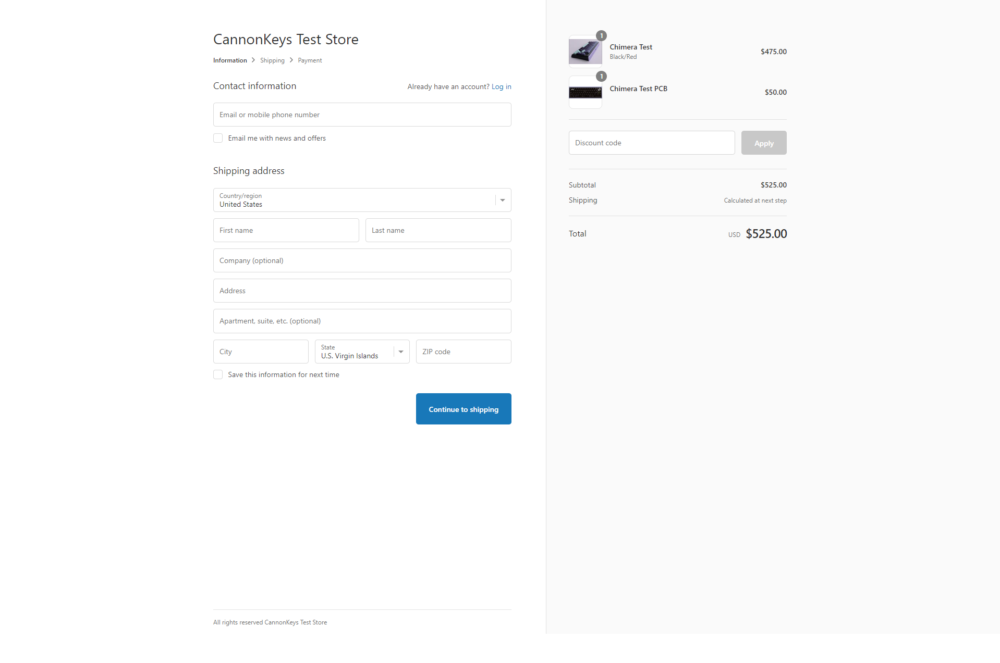

## CannonKeys Hype V2 Guide

**Link:** [https://hype.cannonkeys.com/](https://hype.cannonkeys.com/)

!!! Note Nothing is yours until checkout is complete. If an item goes out of stock between joining the queue and entering checkout it will be removed from your order. At this point, you can either continue checking out, or go back to the start and reenter.

# Quick Guide
1. Go to the website and click the shop button.
2. Create your order, then click 'Review Cart' button.
3. Review your cart, then click 'Join Sale' button whenever ready. You can do this before the sale starts.
4. Wait patiently, do not leave the page. If chosen, checkout as normal.

# Creating your order

 1. Upon loading into our Hype V2 landing page, you will see two large boxes. One for order editing, and one for order creation. In order to start the buying process, click the the **Shop** button.

 2. You are now in the order creation interface! At the bottom of the screen there will be a timer counting down the time left until the sale starts. If the Raffle has already started, then you will see "Raffling has begun - join now!" at the bottom. With this new system, we let you create your order before the raffle.

3. Using the drop down menus, choose your options and add everything to the cart that you wish. Anything sold out will be clearly marked. Once you have assembled your order, click on the **Review Cart** button at the bottom of the page.

4. You are now in the Review Cart section. This is the final step before entering the raffle queue! Review your cart, and when ready click the **Join Sale** button at the bottom of the screen. You can join the process before the sale starts if you wish- no need to wait until you see the "Raffling has begun" message!

5. If you see this screen, you're in the queue. Wait patiently while the system chooses who goes through to checkout. **DO NOT LEAVE THIS PAGE!**

6. If you wish to make sure your cart is accurate, you can click the **Show Cart Contents** button to show what is in your cart.

7. If chosen, you will be brought to the normal shopify checkout page! Fill out as you normally would. Check your order carefully to make sure nothing has sold out.

# Editing your order

!!! Note Self-service order editing can only add items to your order. If anything must be removed, please contact our customer suport team using the widget at the bottom of [our website](https://cannonkeys.com/).

1. Click the **Edit** button on the Hype V2 landing page.

2. If the order was made via the Hype V2 system (which it was if it was purchased using this guide), click on **Hype V2**. 

3. Fill out the email address with the email used to place the order. Next, using the follow up email sent post purchase from us, fill out the Order Number and Subscription ID.

!!! Note The Subscription ID will be found in a second follow up email- not the usual Shopify order confirmation email. This email can take up to **10** minutes to be sent, please be patient.

4. Using the interface, add any items you would like, and then confirm the changes.

5. You will be emailed an invoice, which will then need to be paid. Once paid, you're order edit should be all set!

