# AKB Petrichor Build Guide

Thank you for purchasing an AKB Petrichor! We have put together the following guide to help you build this keyboard, but if you have any questions please don’t hesitate to reach out to our CS team via the widget on our [Contact Us](https://cannonkeys.com/pages/contact-us) page, or chat with our community in our [Discord](https://discord.gg/Fc39rpjMAv) server.

## Getting Started

**Each Petrichor should come with the following items**

- Top case

- Bottom Case

- Internal Weight

- Plate

- PCB

- USB-A hub board + 105mm 6-pin JST to 6-pin JST cable

- USB-C daughterboard + 170mm 4-pin JST to molex EZ-mate cable

- RGB daughterboard + 100mm molex EZ-mate to molex EZ-mate cable

- 4x AKB Bumpons

- 12x long gasket

- 4x short gasket

- 6u stabilizer wire

- Screws

  - 8 Case Screws - M3x12mm

  - 9 Daughterboard Screws - M2x4mm

  - 7 Internal Weight Screws - M3x4mm countersunk

- T6 Torx Key

- T10 Torx Key

**Not included but mandatory for the build**

- Type-C USB Data/Power Cable

- Switches

- Stabilizers

- Keycaps

    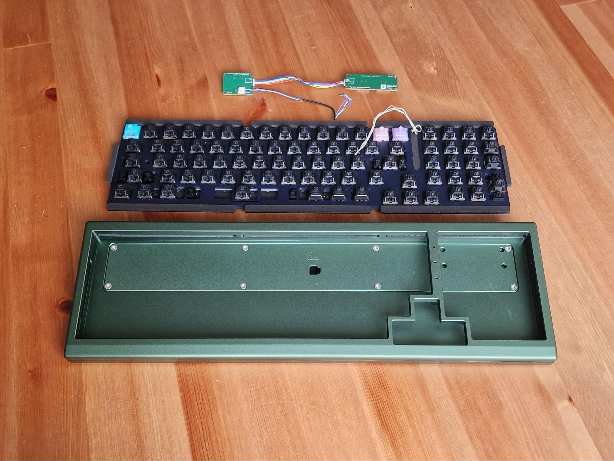

**Recommended Items for the build** 

- Deskmat or cloth mat to safely build on

- Metal tweezers

- Small tray for screws

## Testing the PCB

1. Firstly, locate the daughterboards and carefully break the daughterboards apart, hinging at the mousebites between.

    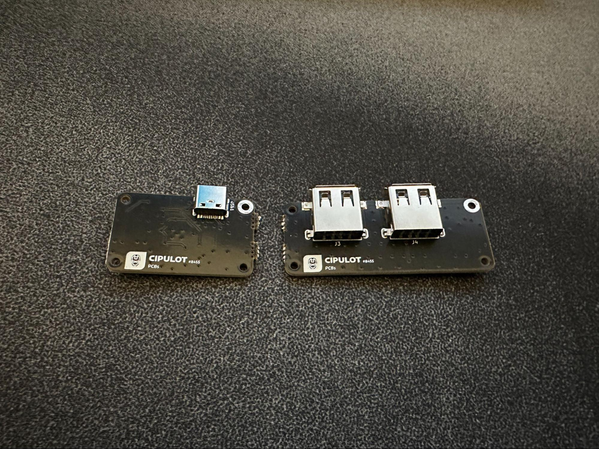

2. Connect the two daughterboards together using the 6-pin JST to 6-pin JST cable.

    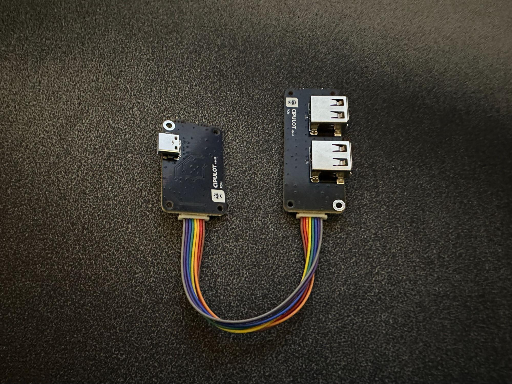

3. Locate the main PCB, and connect the hub daughterboard to the PCB using the 170mm 4-pin JST to molex EZ-mate cable.

    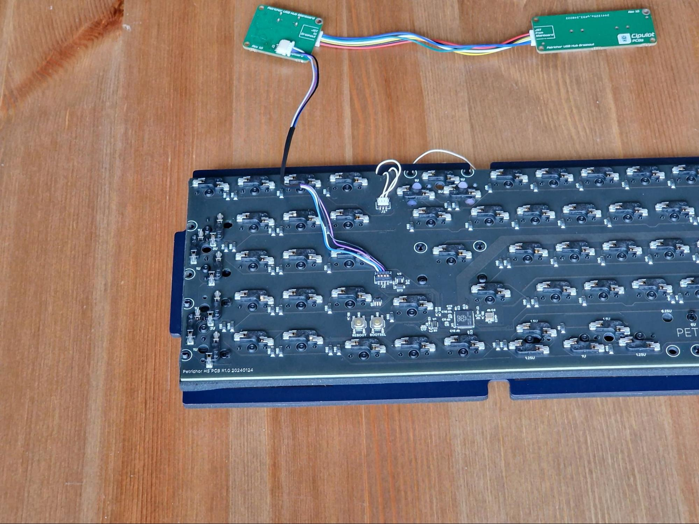

4. Plug these into your PC carefully using your own USB-C cable and load up the [online version of VIA](https://usevia.app/) in a chromium based browser like Google Chrome.

5. Using the Keytester Tab, test the keys using metal tweezers, paper clips, or any small enough metal device to short the back of the hot-swap sockets, or the traced pin holes if you’re building with a solder PCB.

    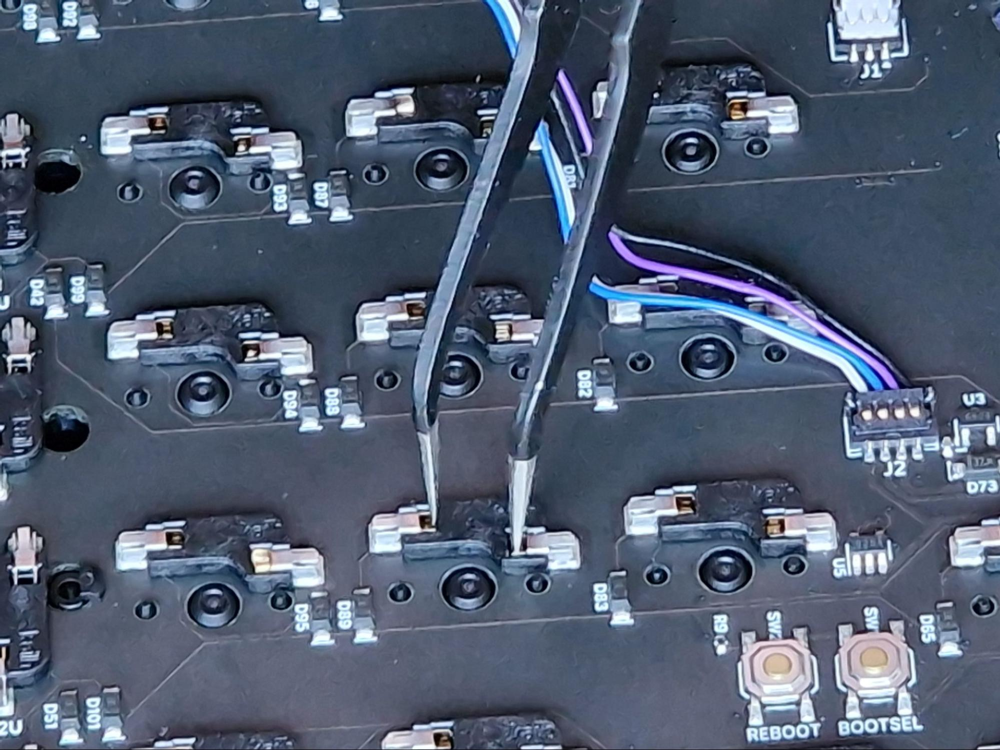

6. Please test each individual key to ensure they are working correctly. On the bottom row, the keys to the right of the spacebar may be mapped to the function key and will not show up in the key tester. You can check this by remapping that key to another key, or toggling the *Test Matrix* option.

**If you believe that your PCB is malfunctioning after testing please contact customer support before continuing with the build.**

## Starting the Build

1. Now that you have tested that the PCB is working, remove the Molex cable connector from the PCB, but keep it installed on the daughterboard. Set these aside for a moment.

2. On a soft surface, lay the case face-side down and install the rubber bumpons in the slots on the back of the case. Then remove the 8 case screws and remove the top case from the bottom. Set the top case aside, leaving you with just the bottom case for now.

3. Using the 7 daughterboard screws, install the daughterboards ensuring the USB connections are aligned with the cut-outs on the back of the case. Then make sure the 6-pin JST cable is comfortably tucked in the cavity between the daughterboards.

    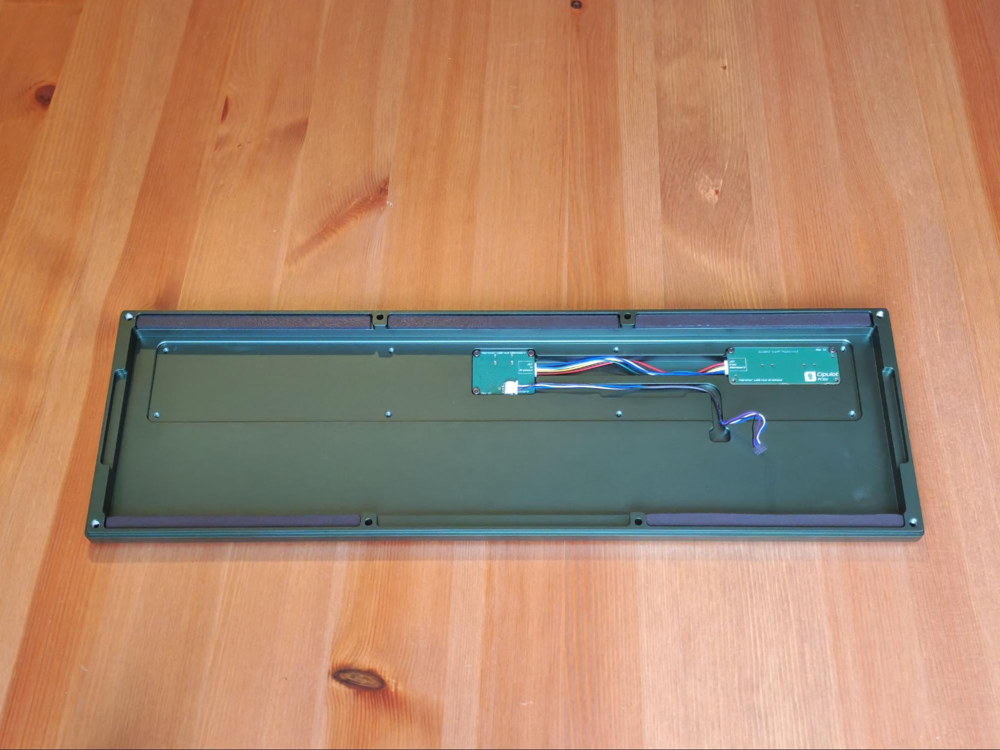

4. Now feed the cable leading from the USB-C daughterboard to the PCB through the channel, and place the internal weight on top of it to help hold it in place. Now you can screw the internal weight down using the M3 countersunk screws.

    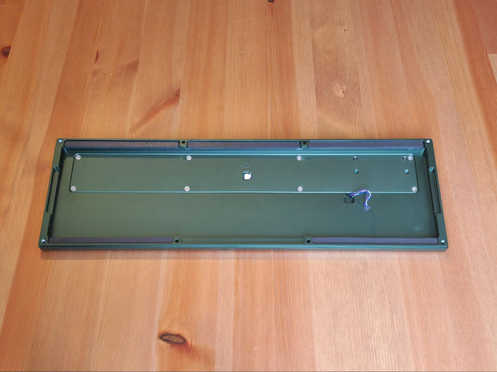
  
!!! Note
    If you run into a clearance issue with the weight and JST cable, you can trim the corners of the connector. Please use [this image](images/petrichor/petrichor-fix.png) as an example of what to cut, and contact our customer support team via the widget on our [contact us page](https://cannonkeys.com/pages/contact-us) if you have any questions.

5. Set the Bottom case aside and locate the PCB. Install your Stabilizers into the PCB. It’s recommended to test their functionality and sound before continuing with the build.

6. Once the stabilizers are functioning properly, install the switches into the PCB and Plate. Make sure that your switches are properly clipped into the plate.

    **Hotswap Users** - *To avoid damaging your sockets/PCB, lay the PCB flat on your deskmat or table while pushing in switches. Alternatively, you can support the sockets from the back of the PCB with your finger while assembling*.

7. Now it is time to install the gaskets. We have provided enough gaskets to fill every cavity in the board, however AKB recommends that you do not install a gasket underneath where the spacebar would be aligned (the front-middle slot in the bottom case) as it would lead to a harsher bottom out on the spacebar. It is also AKB’s preference that for the sides of the board, you only use the top gaskets - not the bottom. You should be able to play around with the gasket configuration to your own liking however.

9. Typically you would install the gaskets only on the case, however AKB likes to install his on the plate in this instance. The mounting tabs match the size of the gaskets exactly so it helps align the build with the case when you assemble it later. This isn’t mandatory however, so please experiment with this to see what suits you best.

10. Once the switches have all been installed (and soldered in, if using a solder PCB), it is best to carefully plug the daughterboard back into the PCB using the Molex cable and test the switches to make sure that the switches are seated properly and functioning. You can once again do this using the keytester in VIA.  

    **Note** - *If a key is not working, carefully remove the switch to ensure that the pins are not bent. If you have bent a pin you can simply straighten the pin back out with some tweezers and re-insert the switch back into the socket. If you’re using a solder PCB, make sure both pins are soldered, and the joints are good.*

11. Once you have confirmed the switches are working in the PCB, it is time to disconnect the keyboard from your computer and install the RGB daughterboard.

12. With the daughterboard still connected to the PCB, carefully set the PCB assembly down into the bottom case, and while doing so, ensure that the Molex cable for the RGB daughterboard is connected to the PCB and fed through the hole in the plate.

    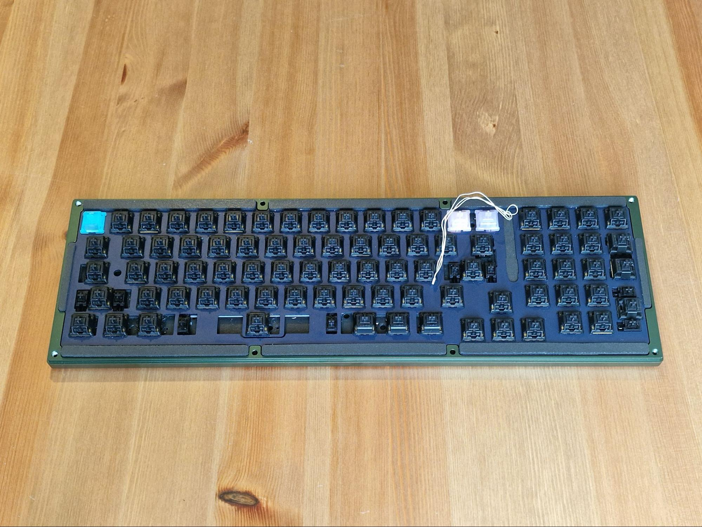

13. Screw the RGB daughterboard into the top case using the 2 remaining M2x4mm screws.

    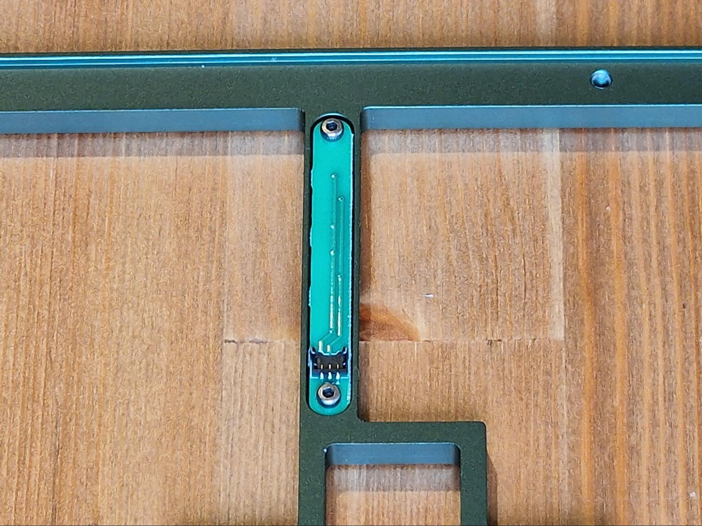

14. Then carefully connect the loose Molex connector to the RGB daughterboard.

    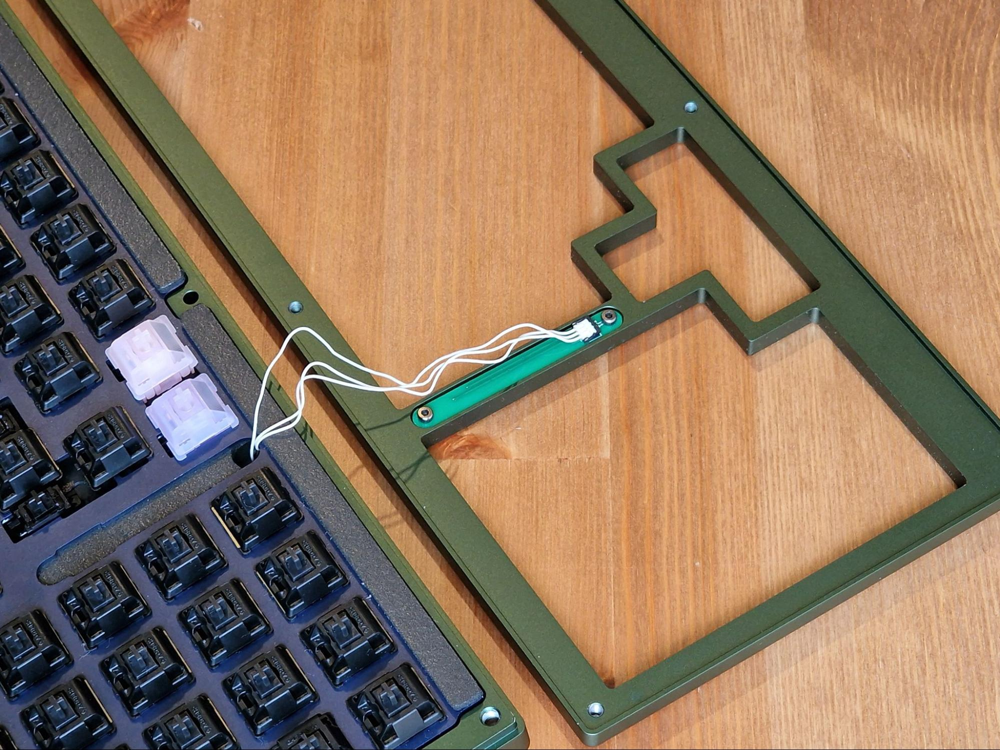

## Final Assembly

1. Place the top case on top of the bottom case, and carefully down the assembly upside down so we can fasten them together. Due to the gaskets in place, some compression may be required to close the case parts together but that is ok. Carefully align the M3x12mm screws and gradually tighten them one by one to close the case.

    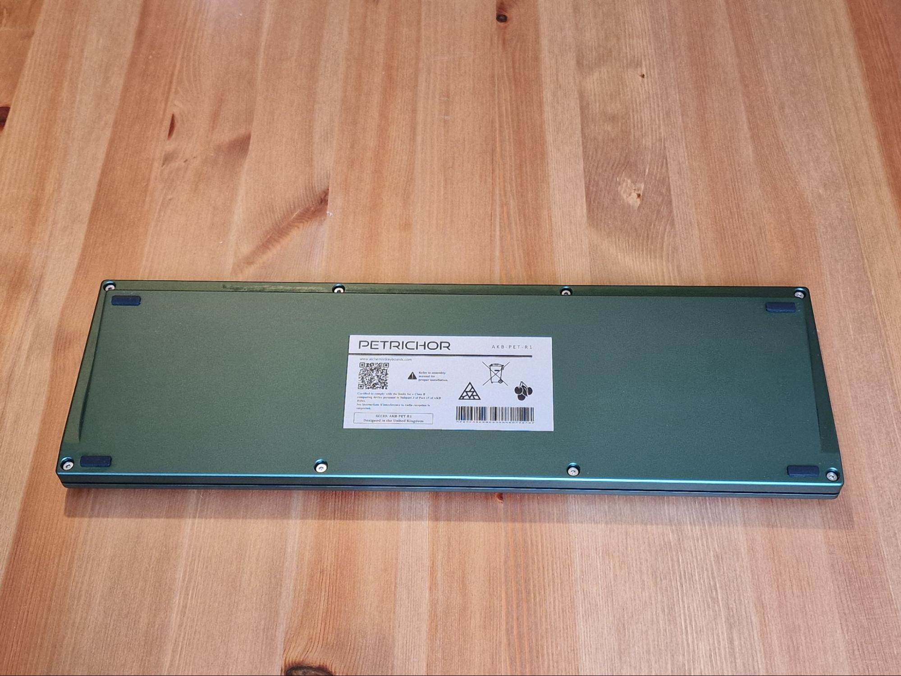

    **Important Note** - *It is vital to not overtighten the keyboard. As soon as you start to feel resistance when screwing in, it’s best to stop. Overtightening can cause the board to sound less than ideal, and can put too much stress on the keyboard.*

2. After installing the screws, Flip the board back over and you can install your keycaps. The best part!

    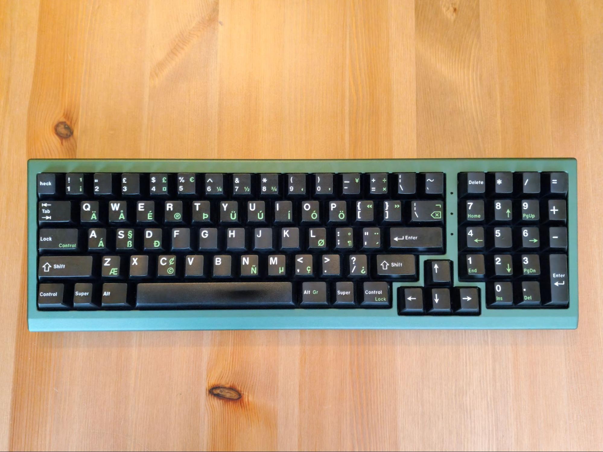

Looking good!

## Post Build

Petrichor is QMK and VIA compatible, making customizing easy. Here is the link to [VIA’s website](https://www.caniusevia.com/).

Finally, if you have any questions, please don’t hesitate to reach out to our CS team via the widget on our [Contact Us](https://cannonkeys.com/pages/contact-us) page or share your builds with our community in our [Discord](https://discord.gg/Fc39rpjMAv) server.
