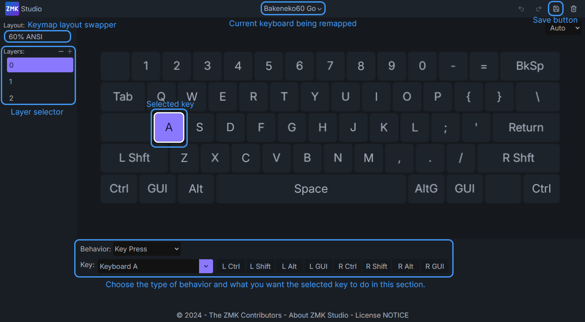
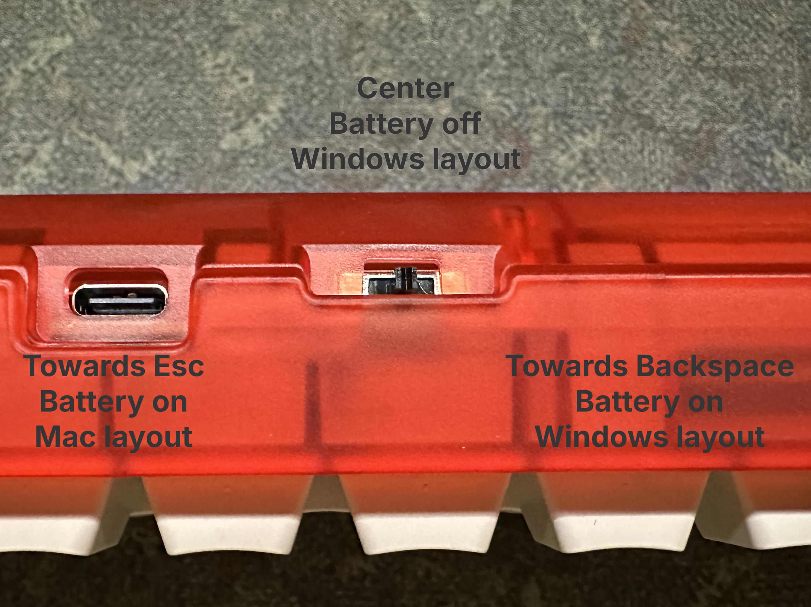
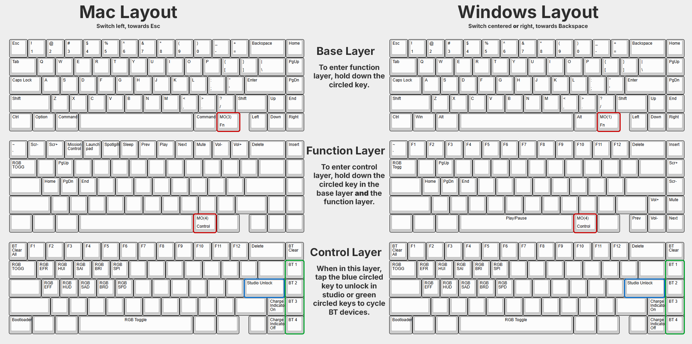

# Photon User Guide
In this guide, we will go over some details about Photon not covered in our [build guide](https://docs.cannonkeys.com/photon-build-guide)

## Remapping with ZMK Studio

ZMK Studio can be found [here], and can be used for on the fly key remapping! Simple connect your photon with the included USB cable, and input the keys shown in the [default keymap](images/photon/photon-KLE-labeled-split.png) below to unlock it.

## Back toggle switch
On the back of the keyboard there is a 3 way toggle switch that can be in the left, center, or right position. This controls which keymap is being used, and if the battery is off or on. By default, these are the positions

 - Left (towards esc key) - Battery on, Mac layout
 - Center - Battery off, Windows layout
 - Right (towards backspace) - Battery on, Windows layout

## Default keymap
Below are the default keymaps found on the Photon. By default, there are Windows and Mac layouts programmed in, but you can remap them to anything you want, and they will be toggleable with the switch on the back!

## BT connectivity
Pairing varies from system to system, but you should be able to connect Photon to any standard device such as a computer or phone that uses BT.

### First Time Setup
When you first get your Photon it won't be paired to anything. Before starting the pairing process make sure your Photon is unplugged from any devices, the battery is properly installed, and the back toggle switch is set to either the left or right. Open the BT menu on your device. Start the pairing process on your computer/phone/device so it begins to look for BT devices. Next, initiate BT pairing on your Photon by using one of the below keycodes.

 - BT1 - Hold `FN+Right Alt` and tap `PgUp`
 - BT2 - Hold `FN+Right Alt` and tap `PgDn`
 - BT3 - Hold `FN+Right Alt` and tap `End`
 - BT4 - Hold `FN+Right Alt` and tap `Right`

After pressing one of the key combinations above, your Photon should pop up on your device as CANNONKKB.

**Shortened Version**

 1. Open the BT menu on the device you want to use Photon with so it starts to look for devices.
 2. Make sure your Photon is not plugged into any device and the battery has been installed.
 3. Put the toggle switch to the left (for Mac mode) or right (for Windows mode) to turn the battery on.
 4. Press the key combination that correlates to the BT profile you want the device to be set to. Key combinations can be found above.
 5. The Photon should pop up in your devices BT pairing interface as Photon once successfully paired.

### Understanding How Devices Work
Photon can store 4 devices onboard, meaning once paired you can cycle through 4 devices on the fly. These are called BT1, BT2, BT3, and BT4 on the keymap. Once a device is paired to a specific BT profile, it can be swapped to by hitting the same key combination you used to originally pair it.

If you want to remove a device from a BT profile, you have to clear the device list, and re-pair your keyboard. There is not currently a way to only remove a single BT profile. The key combination to clear your BT profiles is:

 - Hold `FN+Right ALT` and tap `Home`
