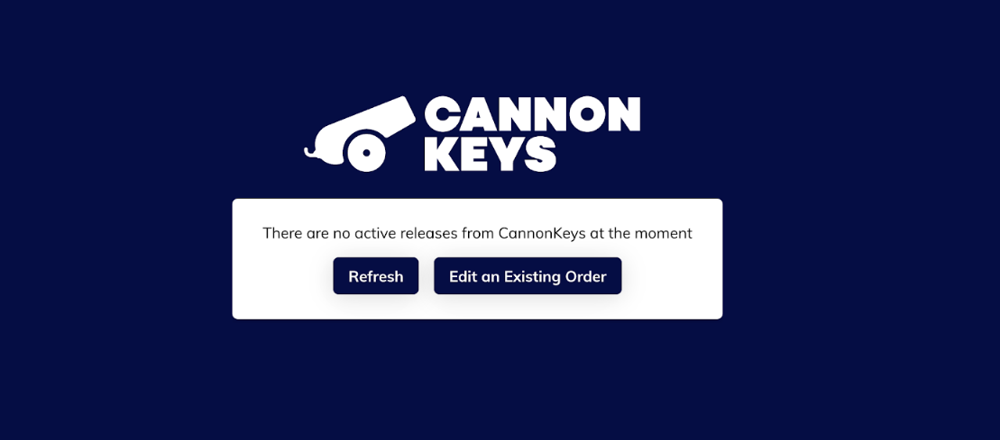
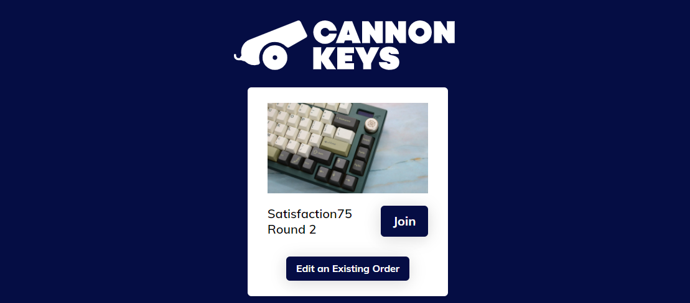
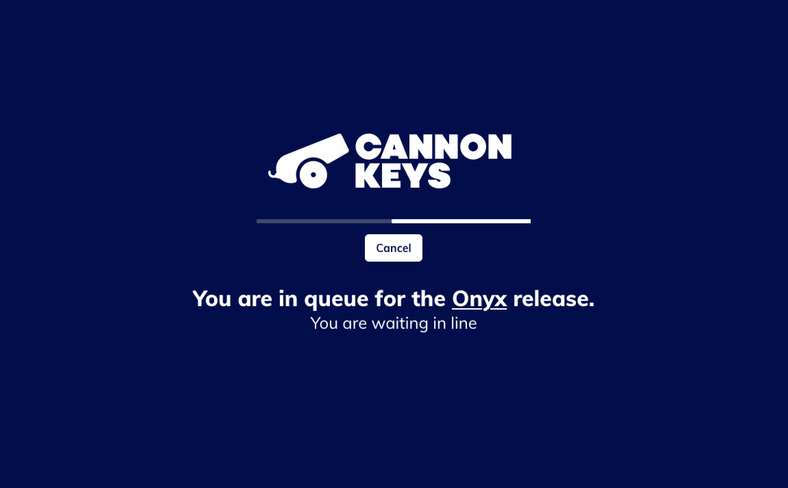
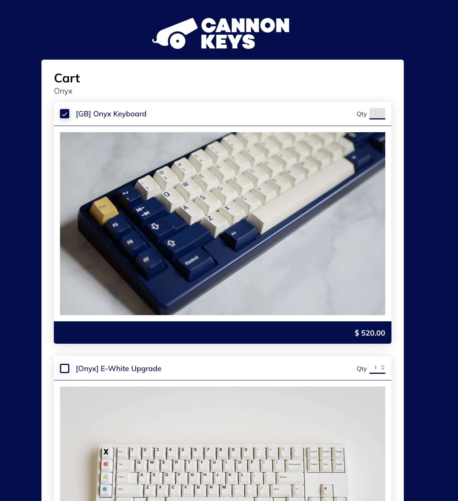
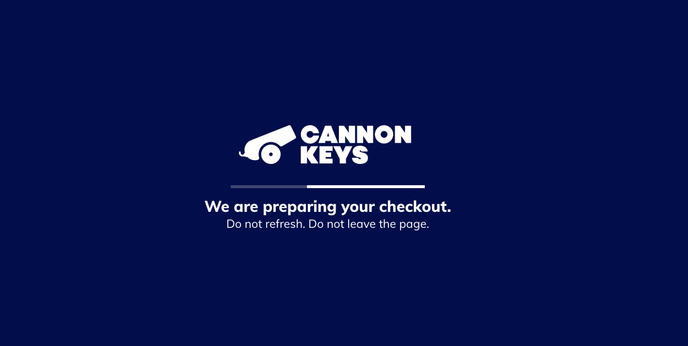
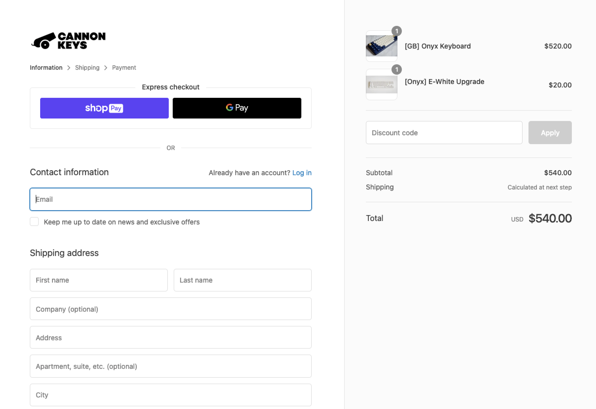

# CannonKeys Raffle Queue How-To
**Link: https://hype.cannonkeys.com/**

!!! Note
    **Please keep in mind that even if you make it past the queue, you are not guaranteed your item, make sure to choose options and checkout as fast as you can!**

## Joining The Queue
If you arrive a few minutes before the drop begins, you should see a screen like this:

At the exact time the drop starts, you can either refresh your browser or click the refresh button in the middle. Keep in mind that if you click the refresh button, you will need to wait a few seconds until you click again.

If the load went smoothly, you should see something like the picture below. If not, you may need to try refreshing again.

Click the “join” button and you should be put into queue. If you don’t see text below the loading bar, you are not in queue. Try refreshing and clicking “join” again.

## Checkout

!!! Note
    **Your main focus should be to checkout your board in this stage, you can add extras (plates, PCB's, accents) using the 'Edit an Existing Order' button on the first page. You will also be emailed a Google form to select your board options (color, layout)**

If you are lucky you may be brought into a screen to select your options!

After you select your options, you will again be put in a brief queue and finally be brought to a checkout screen!

