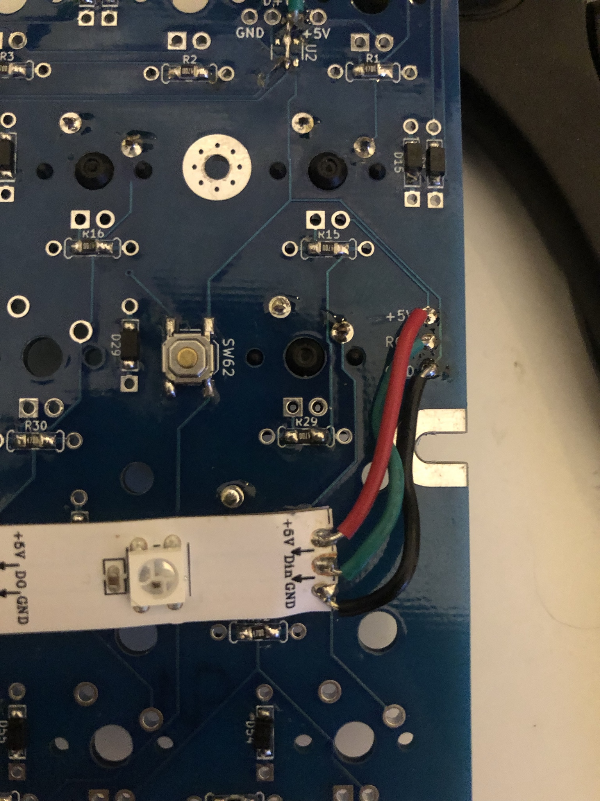

# Adding RGB Underglow

You will need:
* A WS2812B Strip
* Solid core wire, 22 AWG
* Solder

Instructions:

1. Find +5V, RGB, and GND breakouts on your PCB
1. Solder some wire to +5V, DIN, and GND on your WS2812B strip. Make sure you solder to DIN and not DOUT!
1. Connect the 5V, RGB, and GND pad on the PCB to 5V, DIN, and GND (respectively) on the WS2812b strip
