# Ripple TKL Build Guide

Thank you for joining the Ripple TKL GB! We have put together the following guide to help you build this deceptively complex keyboard. If you have any questions, please don’t hesitate to reach out to our CS team via the widget on our [Contact Us](https://cannonkeys.com/pages/contact-us) page or chat with our community in our [Discord](https://discord.gg/Fc39rpjMAv) server.

## Getting Started

  
### Each Ripple should come with the following items

-   Top case
-   Bottom Case
-   Weight
-   Badge
-   PCB
-   Daughterboard and JST Cable
-   Plate
-   O-rings
-   50A come by default
-   Gaskets
-   Top Case Mod (10pcs each)
    -   Poron
    -   Silicone
    -   PE foam
    -   EVA foam
-   Plate Mod (20pcs each)
    -   Poron
    -   4x Bumpons
-   Screws
    -   5 Weight Screws - M3x5mm
    -   4 Case Screws - M3x8mm
    -   4 Daughterboard Screws - M2x4mm
-   2 Hex Keys

### Not included but mandatory for the build

-   Type-C USB Data/Power Cable
-   Switches
-   Stabilizers
-   Keycaps
    

  
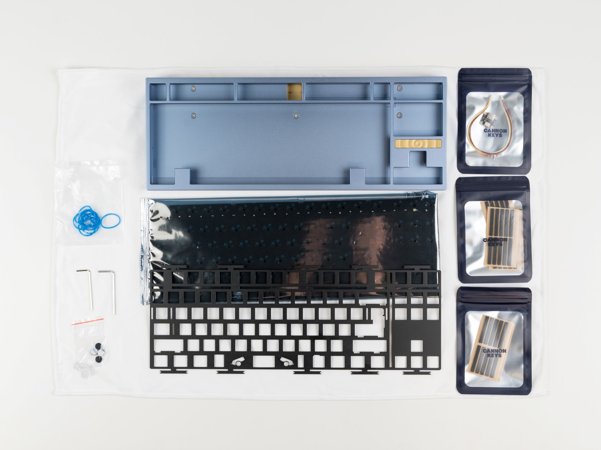  
  
  

### Recommended Items for the build

-   Deskmat or cloth mat to safely build on
-   Metal Tweezers
-   Small Tray for screws and Orings
    

  
  

## Testing the PCB  
  
Locate the PCB and daughterboard. Plug these in carefully and load up the [online version of VIA](https://usevia.app/).

  

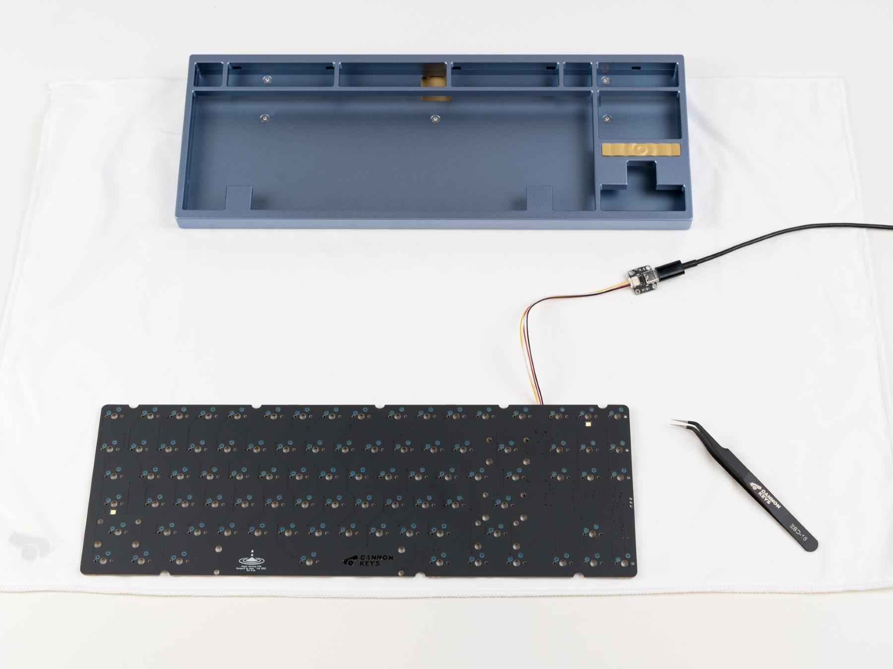  
  
Using the Keytester Tab, test the keys using metal tweezers, paper clips, or any small enough metal device to short the back of the hot-swap sockets.  
  
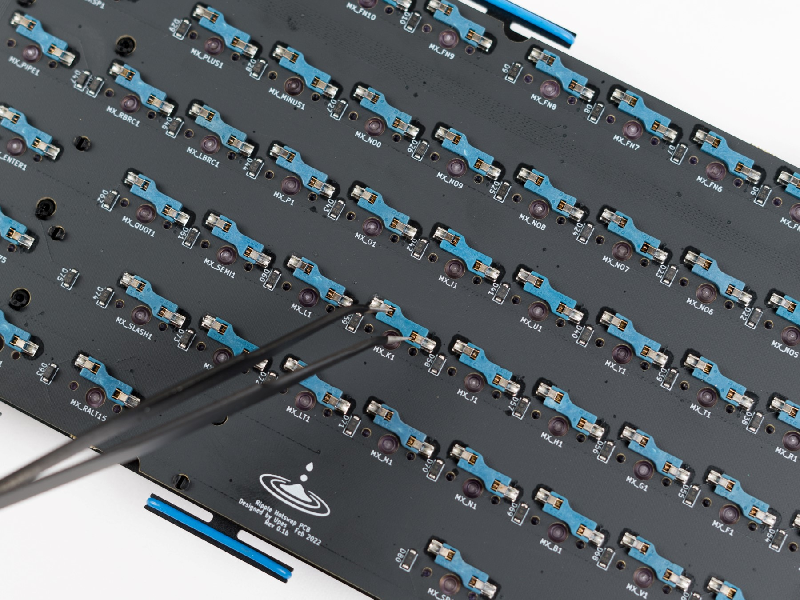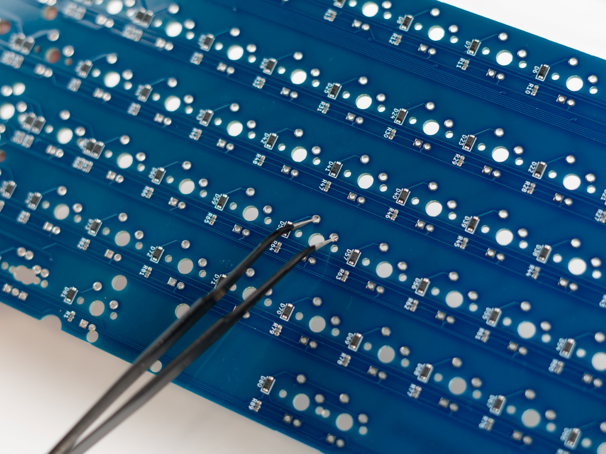

Please test each individual key to ensure they are working correctly. On the bottom row, the keys to the right of the spacebar may be mapped to the function key and will not show up in the key tester. You can check this by remapping that key to another key, or toggling the Test Matrix option.  
  
**If you believe that your PCB is malfunctioning after testing please contact customer support before continuing with the build.**
  
## Starting the Build

  

1. On a soft surface, lay the bottom case on the mat and install the rubber bumpons in the slots on the back of the case.  
  
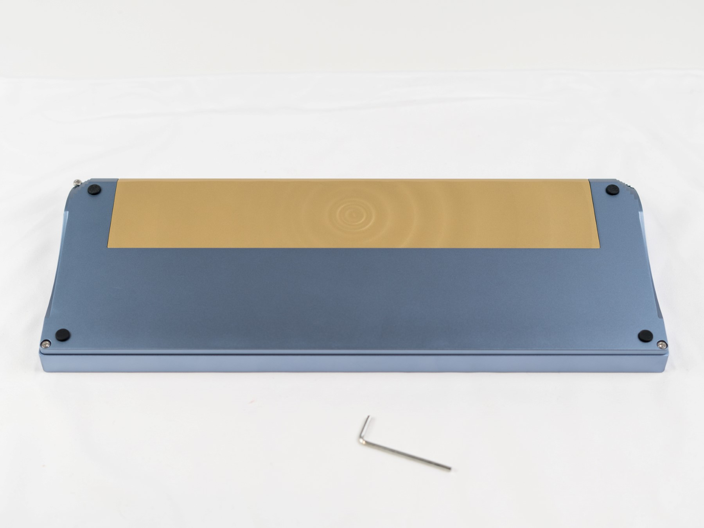

  

2. Now that you have tested that the PCB is working, remove the JST cable from the PCB, but keep it installed on the daughterboard.. Flip the bottom case over and using the 4 small daughterboard screws, install the daughterboard ensuring the USB Type-C connection is aligned with the cut-out on the back of the case.

  
!!! Note
    **Note about the Daughterboard** - *The daughterboard has four screw holes but the screws that were sent with the board have a slightly taller than intended cap height, which causes issues with assembling. Please only use the two innermost screws on the daughterboard to ensure the case assembles properly.*

  
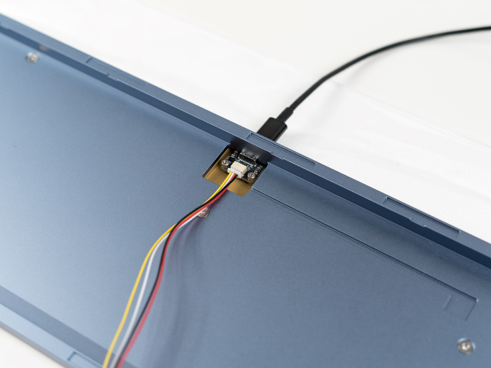  
  
3. Set the Bottom case aside and locate the PCB. Install your Stabilizers into the PCB. It’s recommended to test their functionality and sound before continuing with the build.

4. Once the stabilizers are functioning properly, install the switches into the PCB and Plate. Make sure that your switches are properly clipped into the plate.

  
!!! Note
    **Hotswap Users** - To avoid damaging your sockets/PCB, lay the PCB flat on your deskmat or table while pushing in switches. Alternatively, you can support the sockets from the back of the PCB with your finger while assembling.

  

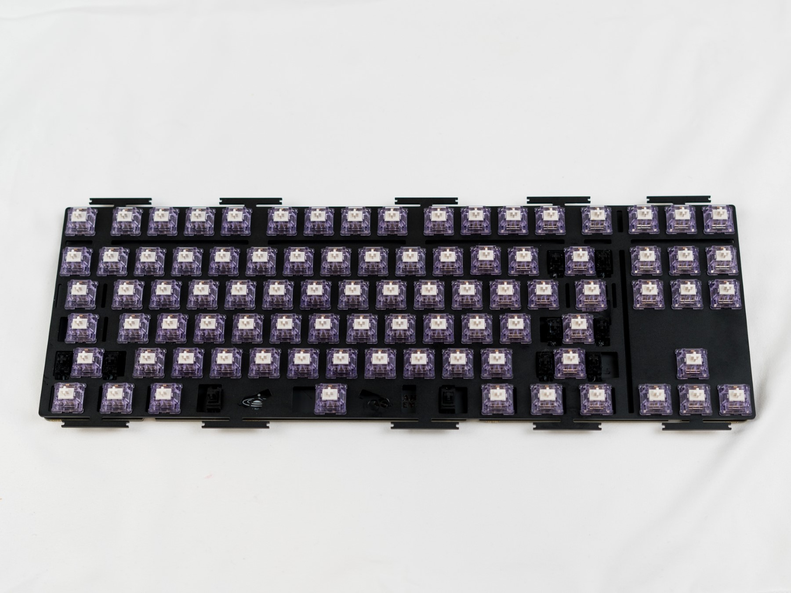

  

5. Once the switches have all been installed (and soldered in, if using a solder PCB), it is best to carefully plug the daughterboard back into the PCB and test the switches to make sure that the switches are seated properly and functioning. You can once again do this using the keytester in VIA.

  
!!! Note
    If a key is not working, carefully remove the switch to ensure that the pins are not bent. If you have bent a pin you can simply straighten the pin back out with some tweezers and re-insert the switch back into the socket. If you’re using a solder PCB, make sure both pins are soldered, and the joints are good.

  

6. Once you have confirmed the switches are working in the PCB, disconnect the PCB from the daughterboard and find the O-Rings or gaskets for the plate.

## Assembling the Mounting System

**The Ripple Mounting System Overview**
*The Ripple mounting system has two parts: Items that are attached to the plate, and items that are attached to the top case.*

  

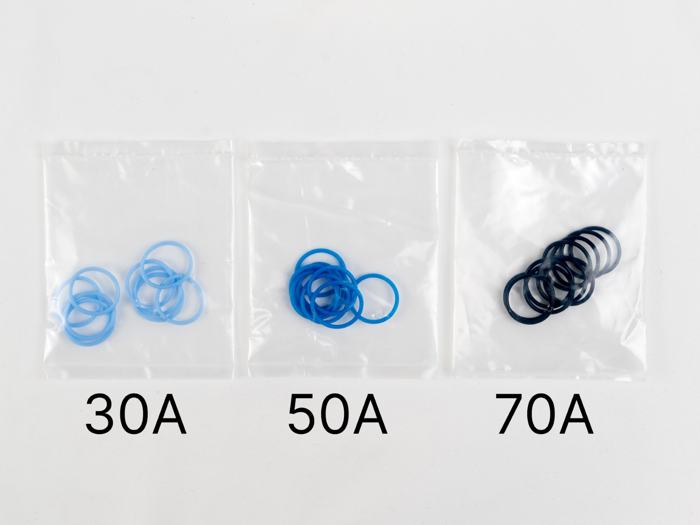

*O-rings are one of the two options you have for your plate. These wrap around each of the mounting points on the PCB.*

  

*Plate mod strips are attached to the top and bottom of your plate instead of O-rings, should you wish to use them. Top Case Mod Strips are gasket strips that get attached to the top of the case, not bottom. These all have a light adhesive to encourage trying out different combinations to figure out what you like best!*

  
!!! Note
    *For the rest of the guide, we will be using O-rings on the plate. If you wish, you can use the Plate Mod Strips attached to the top and bottom of the plate instead.*

  

## Preparing the Plate for Mounting

7. Carefully install the O-Rings around the tabs on the plate. Please ensure that the o-rings are not pulling to one side. You can ensure this by making sure the O-ring is equally taught on both sides. They should have a little bit of give on both sides.

  

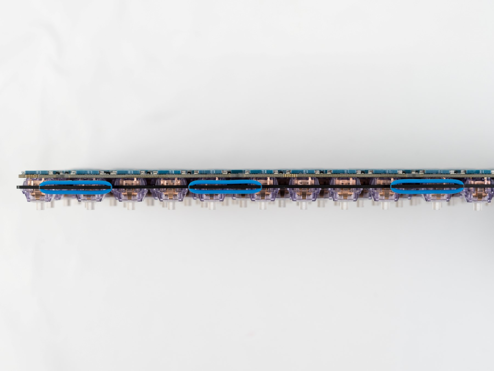

  
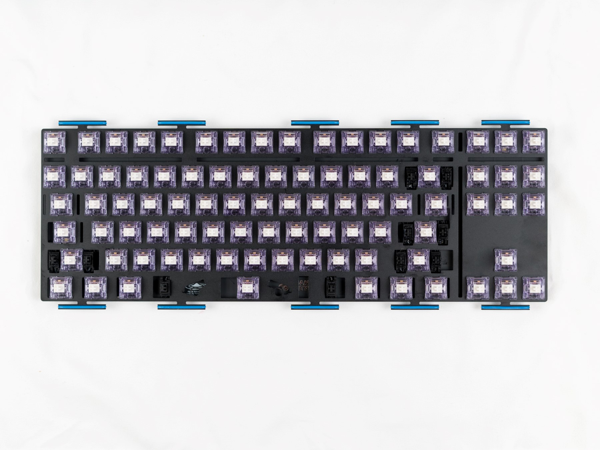

  
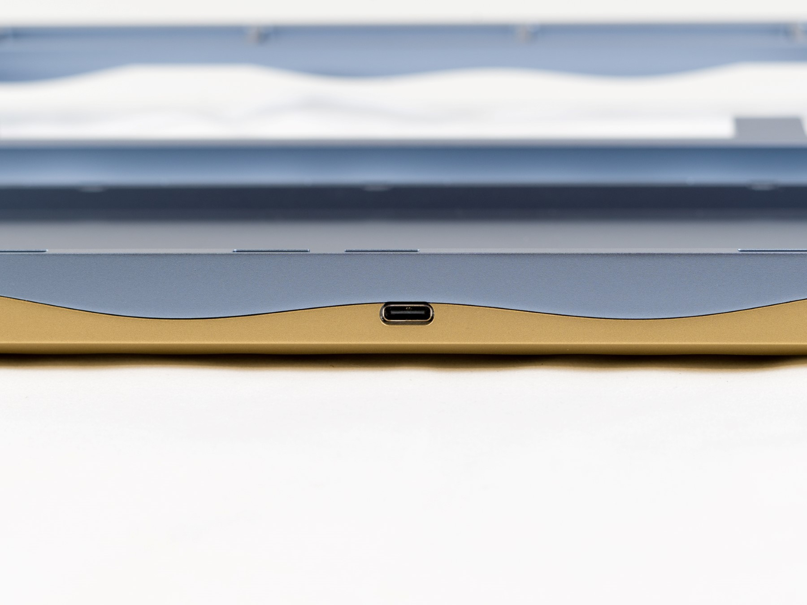

  

8. After installing the O-Rings, carefully re-insert the JST cable into PCB and place the plate in the bottom case of the board. Double check that each tab and Oring are fitting correctly and the O-rings are not pinched or bunched up.

## Preparing the Top Case for Mounting

  
9. Grab your baggie of top case mod gasket strips, and choose which one you would like to use. Then, simply install them into each pocket found in the top of the case. Try to get them into the gasket pockets as nicely as possible, but don’t worry if they are a little squiggly!  
  
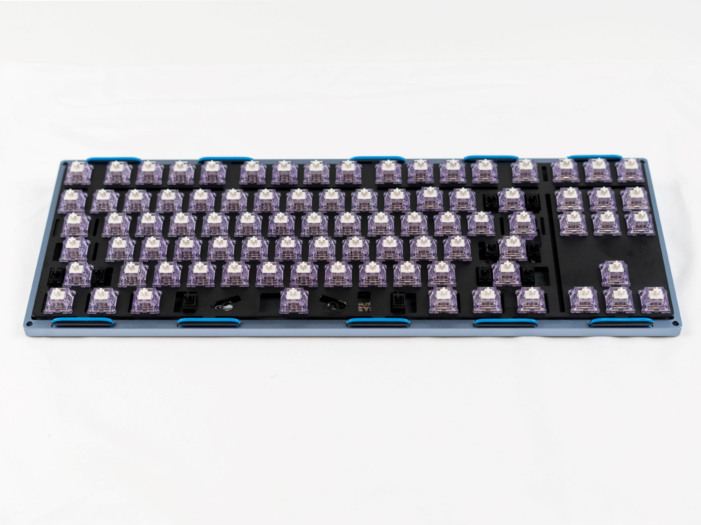  
  
10. After the plate and o-rings/gaskets are in the board, locate the badge for the top case and install this onto the case if it’s not there already. After that is installed, place the top case on the bottom case and ensure that the case is fitting with the O-Rings and that the O-Rings are not bunching up in the case.  
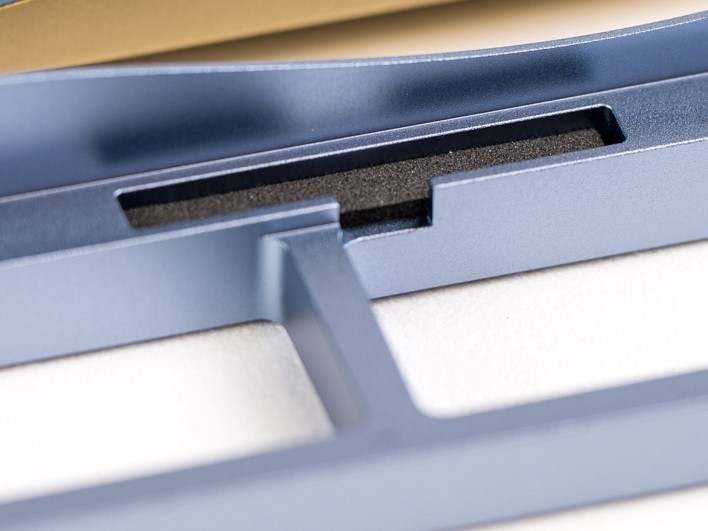  
  

## Final Assembly

  

11. Carefully flip the board over and install the case screws into the back of the case. It is best to screw in opposite corners first, to help ensure even fitment. You might need to apply pressure to the case to compress the o-ring and/or gaskets to get the screws to catch.

  
!!! Note
    *It is **vital** to not overtighten the keyboard. As soon as you start to feel resistance when screwing in, it’s best to stop. Overtightening can cause the board to sound less than ideal, and can put too much stress on the keyboard.*

  

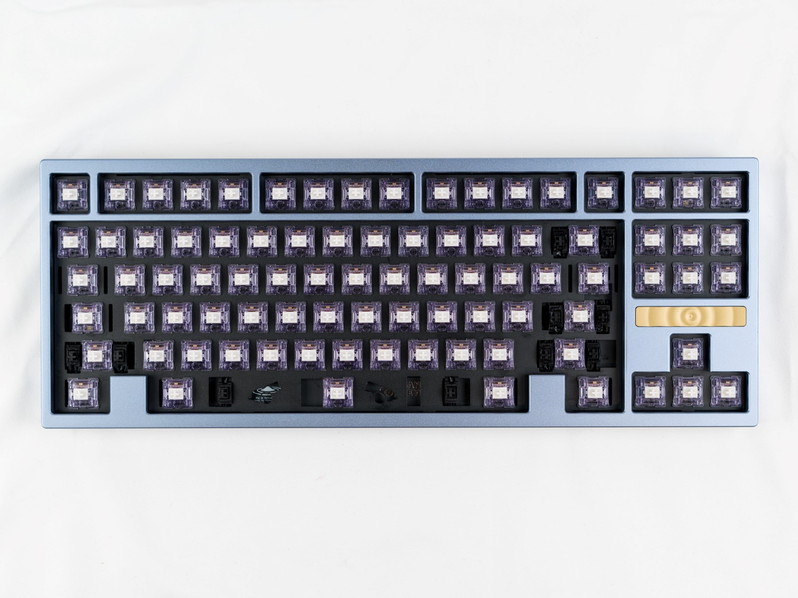

  

12. After installing the screws, Flip the board back over and you can install your keycaps. The best part!  
  
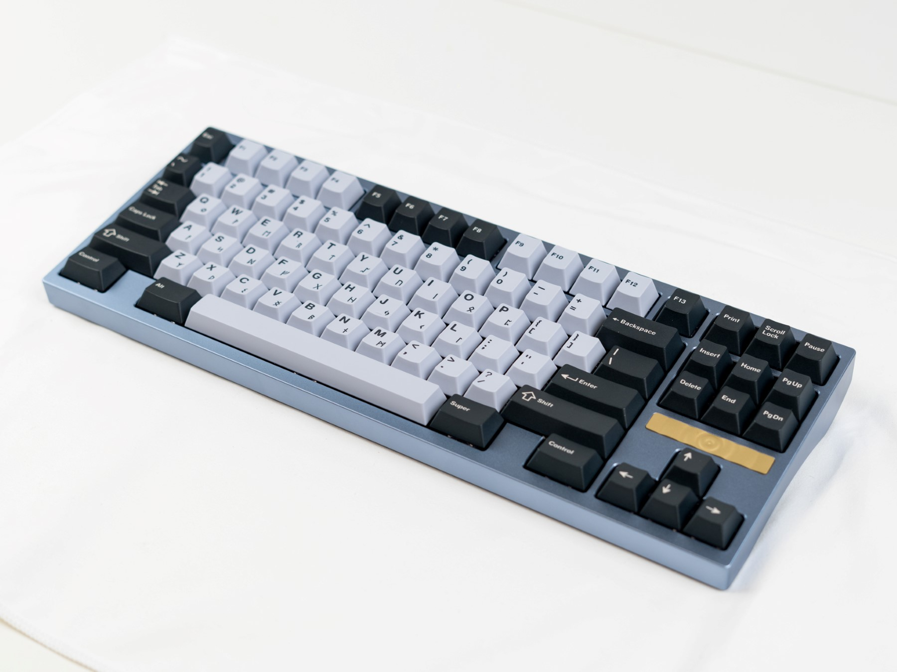

  

## Post Build

One of the best things about Ripple (outside of that stunning weight!), is the different mounting options you have. We included two options for the plate, and four options for the top case. That’s a lot- and we encourage you to try out different combinations to see what you like. Upas, the designer of this board, prefers O-rings on the plate, and poron on the top case! Let us know what your favorite ends up being in our [Discord](https://discord.gg/Fc39rpjMAv)!

  

Ripple is QMK and Via compatible, making customizing easy. Here is the link to [VIA’s website](https://www.caniusevia.com/).

  

Finally, if you have any questions, please don’t hesitate to reach out to our CS team via the widget on our [Contact Us](https://cannonkeys.com/pages/contact-us) page or chat with our community in our [Discord](https://discord.gg/Fc39rpjMAv) server.
