# Satisfaction75 Build Guide

Congrats on your Satisfaction75 purchase! This is a guide to building your Satisfaction75.

!!! Note
    Before starting this build, you should [flash and test](flashing.md) your Satisfaction75 PCB. The stock firmware works, but does not have OLED support!

## Parts

* Satisfaction75 Case
* Satisfaction75 PCB
* Nylon spacers + screws
* ALPS Encoder
* O rings
* OLED Screen
* Black screws w/ Hex Key
* Bumpons

## Install the OLED

1. The first thing we have to do is to install the OLED. We're going to use the spacers to ensure the OLED ends up at the proper height. Simply drop the nylon screws in the holes circled below:
    
    

1. Flip the PCB around and install the spacers over the nylon screws:
    

1. Drop the OLED into the footprint for the OLED:
    

1. Solder the OLED pins into place, being careful to keep it level and even with the spacer height:
    

## Case Disassembly

1. We have to get our brass plate out of our case. We'll disassemble the case. We'll need a Philips head screwdriver to remove the stock hardware (feel free to throw the stock hardware away). When we reassemble it, we'll use the nicer included hardware. Unscrew the screws from the following 8 points:
    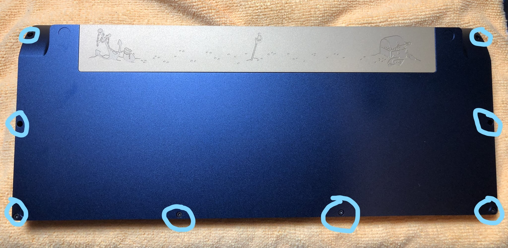

1. Once the screws are out, the bottom will easily come loose from the top, exposing the plate. Remove the 12 screws holding the plate to the top of the case:
    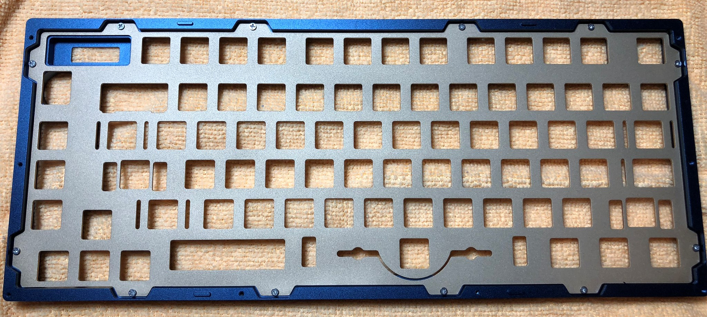

## Stabilizer and Switch Installation

!!! Note
    We highly recommend [clipping and lubing](https://www.youtube.com/watch?v=cD5Zj-ZgMLA) your stabilizers prior to this step, for optimal feel!

1. Install your stabilizers in the PCB:
    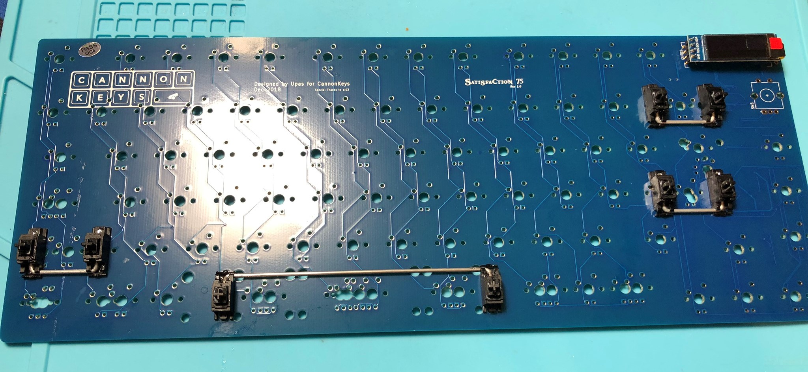

1. Slide your plate over the stabilizers. It might feel tight, but the plate WILL fit! I made this test build with retooled GMK stabilizers:
    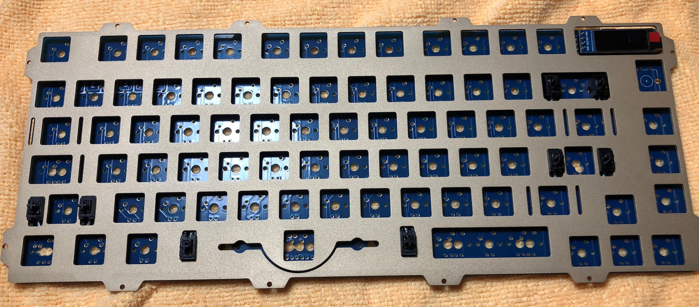

1. Insert your switches into the plate and PCB, and solder the switch legs into the switch holes. Be sure none of the switch pins are bent, and that the switches are seated all the way flush with the plate:
    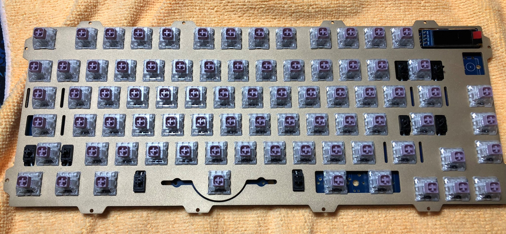

## Encoder Installation

1. Now that switches have been installed, we need to install the encoder. Put the encoder into the encoder footprint and solder it in:
    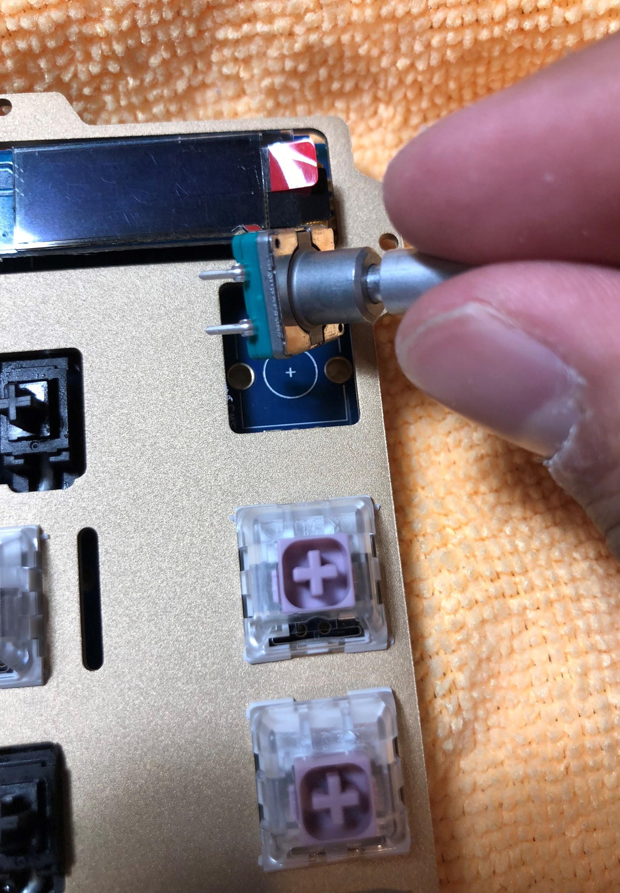
    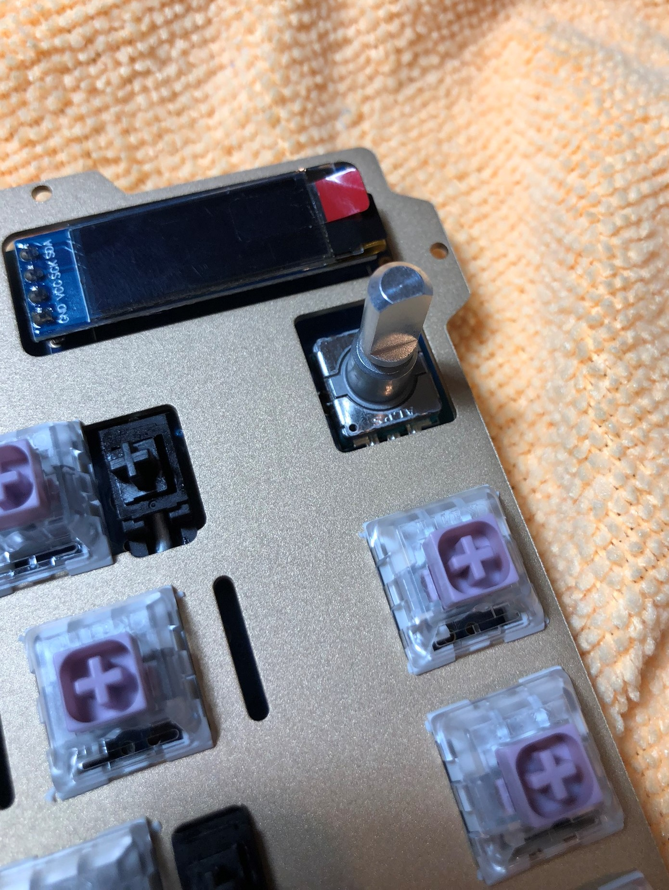

1. At this point, we can test our build again, so let's plug it in. Test each switch again. Since both our encoder and OLED are installed, we can test those too!
    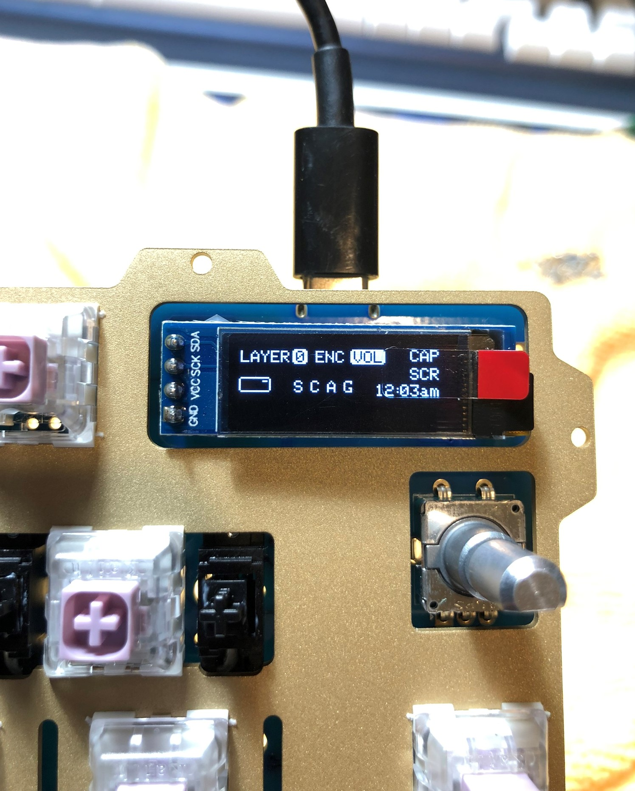

## Battery Installation (Optional)
1. The Satisfaction75 comes with a Real Time Clock, so it can keep time. But it needs a battery to power it when the keyboard powers down. As they are lithium-ion cells, they don't ship with the keyboard. You'll need to source a CR1025 battery:
    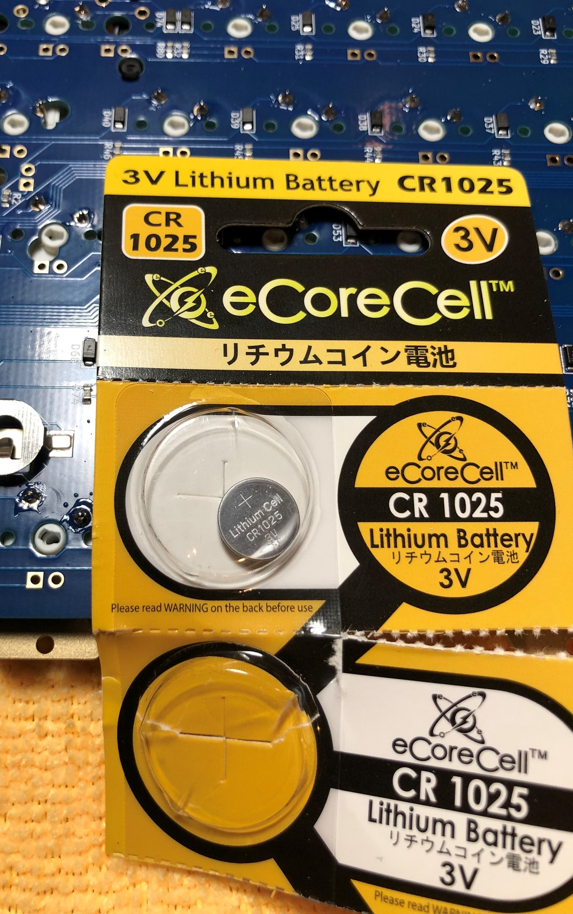

1. Slide the battery in to the battery holder, positive side up:
    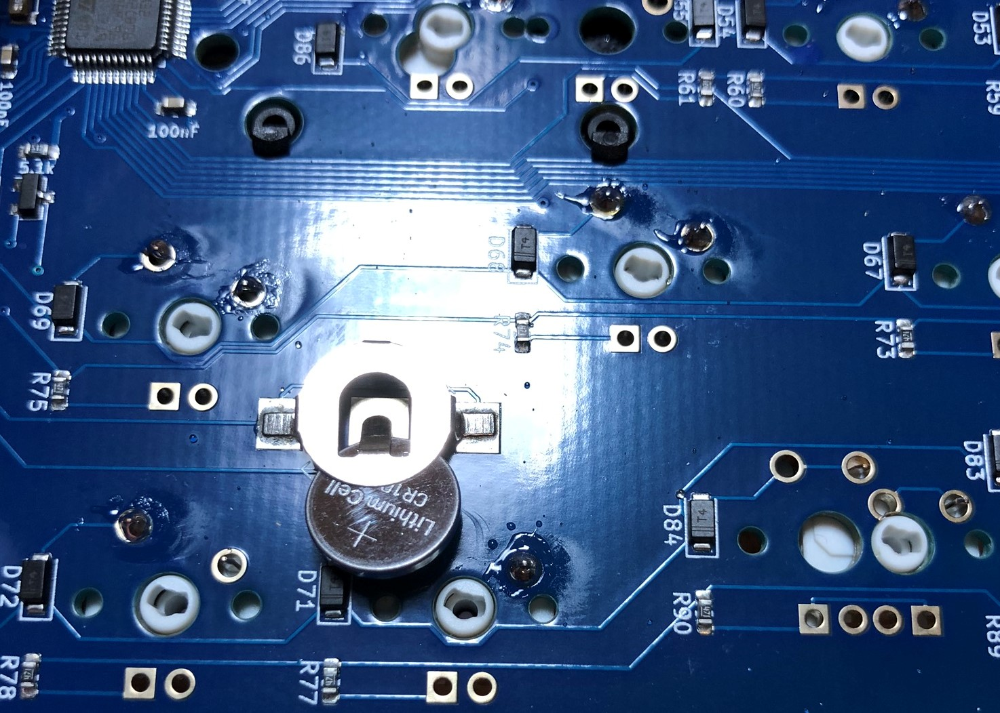
    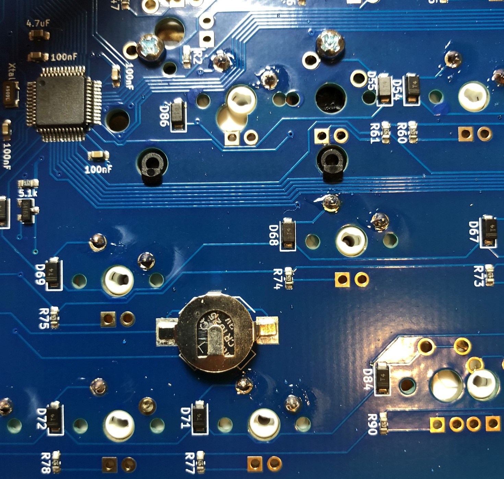

We're now ready to reassemble our case!

## Case Reassembly

1. The Satisfaction75 is meant to be used as a "burger mount" meaning there are O-rings on both sides of the plate. Slide O-rings over the M2x6mm hex screws included for the plate mounting:
    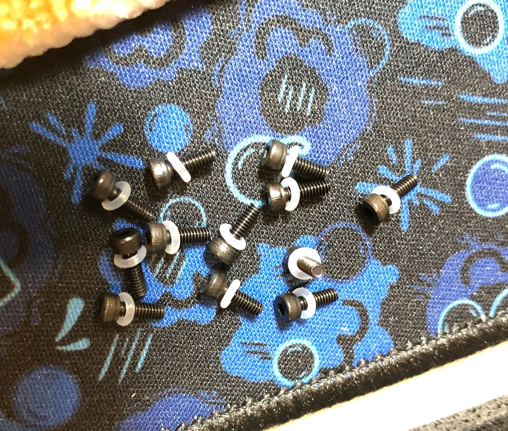

1. Place o-rings in the cutouts on the top of the board, around the plate mounting screw holes:
    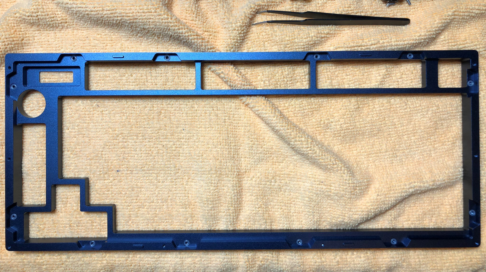

1. Screw the plate to the top case piece using the screws prepared with O-rings:
    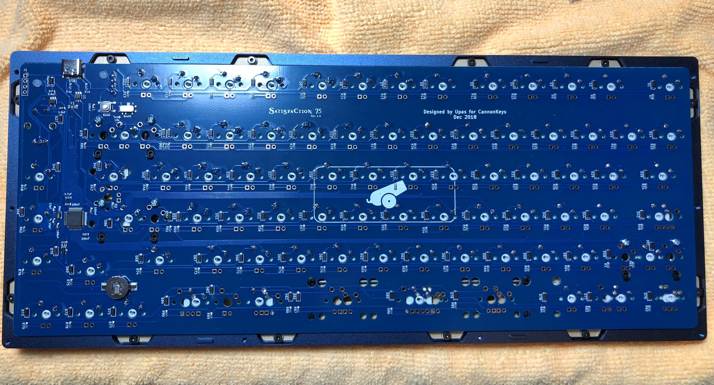

1. Align the bottom case over the top case, and put them together. Screw them together using the nice M2x10 black hex socket cap screw hardware included:
    

1. Install the Bumpons
    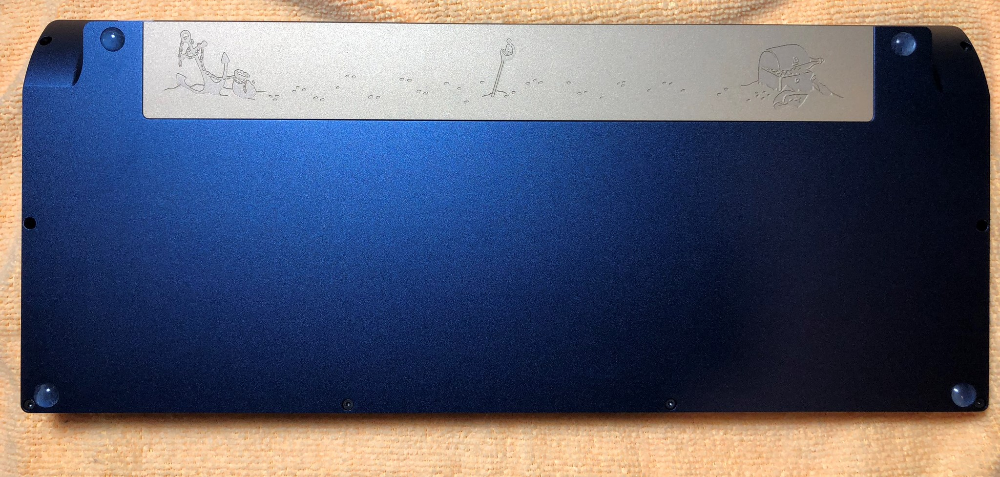

## Final Touches
1. Install your keycaps and knob, and enjoy!
    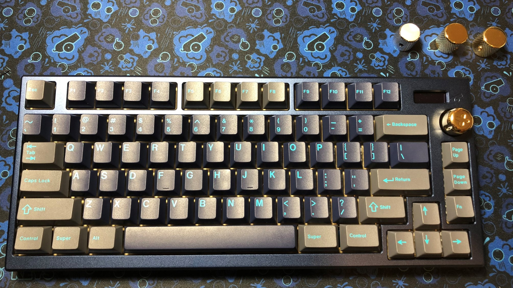

Check out the [User Guide](user_guide.md) to learn how to use some of the features of the Satisfaction75!