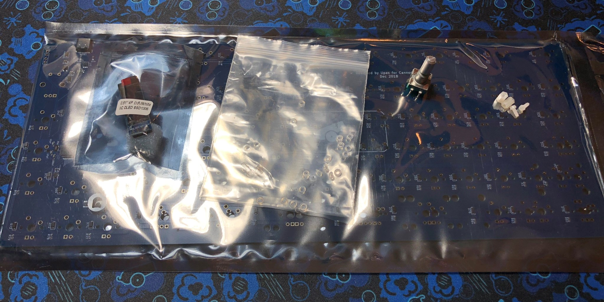
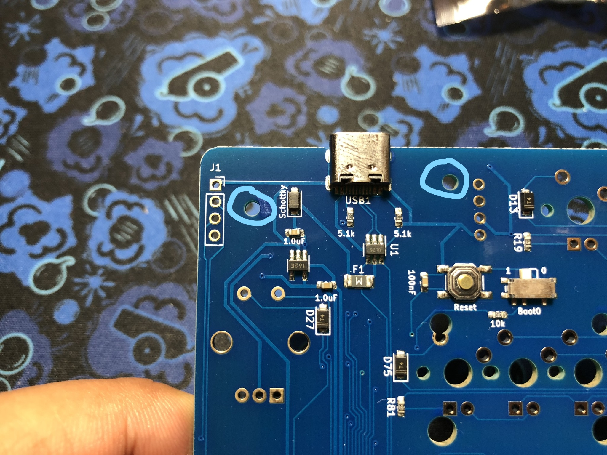
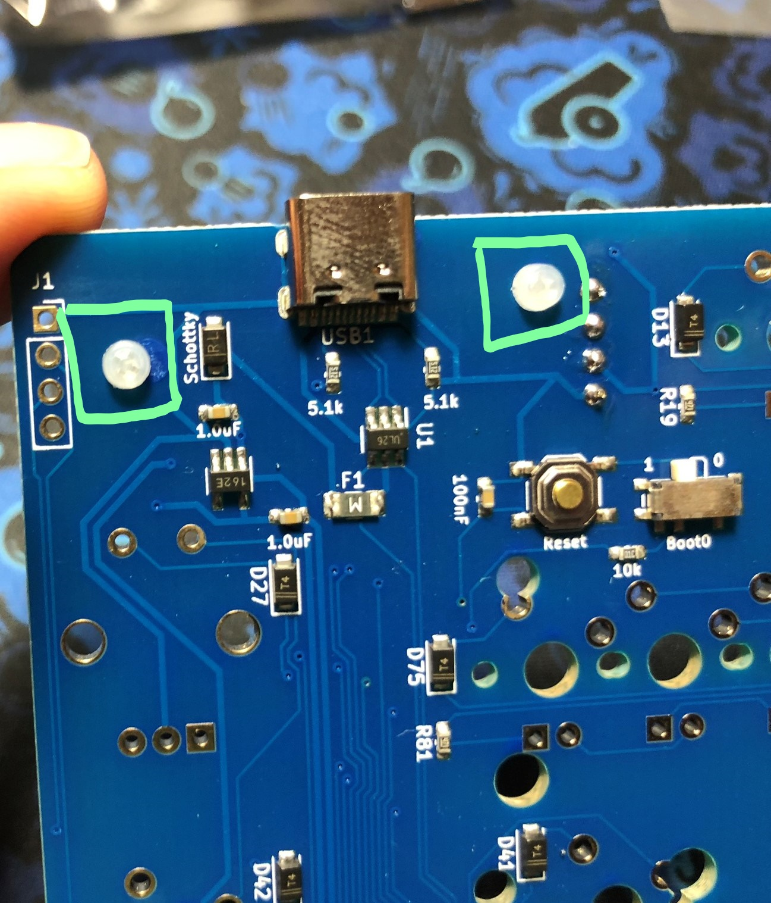
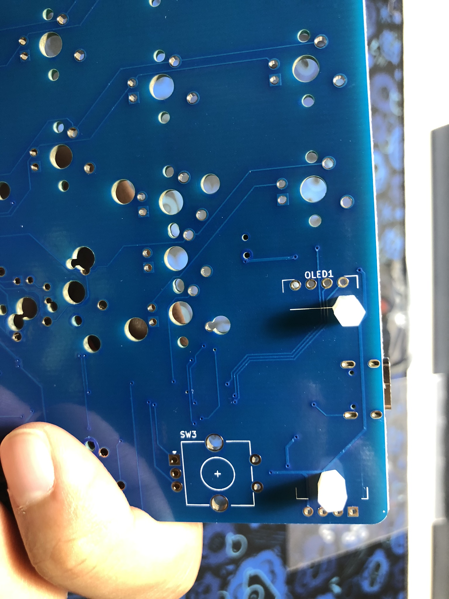
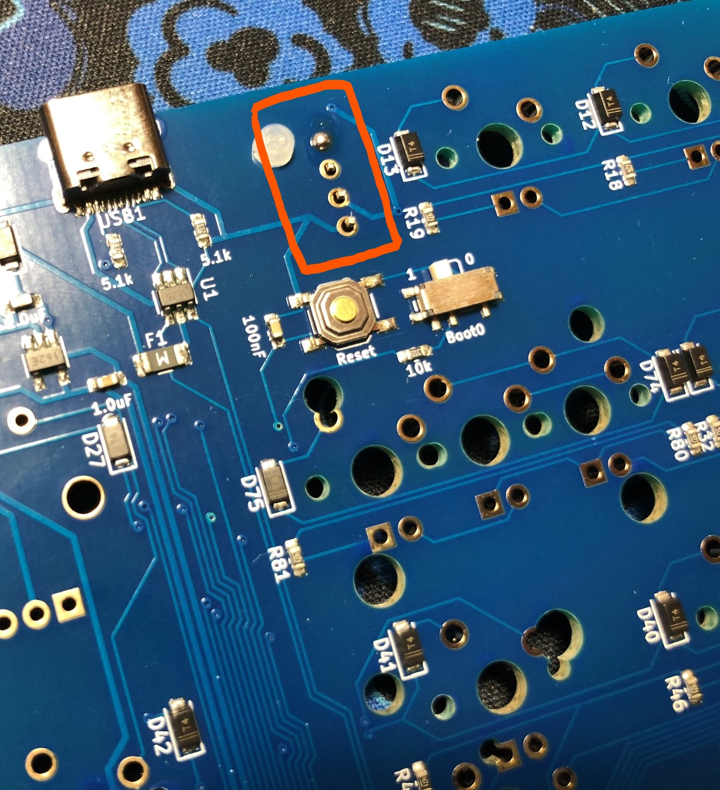

# Satisfaction75 Build Guide

Congrats on your Satisfaction75 purchase! This is a guide to building your Satisfaction75.

!!! Note
    Before starting this build, you should [flash and test](flashing.md) your Satisfaction75 PCB. The stock firmware works, but does not have OLED support!

## Parts

* Satisfaction75 Case
* Satisfaction75 PCB
* Nylon spacers + screws
* ALPS Encoder
* O rings
* OLED Screen
* Black screws w/ Hex Key
* Bumpons

## Install the OLED

1. The first thing we have to do is to install the OLED. We're going to use the spacers to ensure the OLED ends up at the proper height. Simply drop the nylon screws in the holes circled below:
    
    

1. Flip the PCB around and install the spacers over the nylon screws:
    

1. Drop the OLED into the footprint for the OLED:
    

1. Solder the OLED pins into place, being careful to keep it level, and even with the spacer height:
    

Testing 123