# Testing and Flashing Your PCB

Due to a limitation of QMK, if you add OLED support to a PCB without the OLED being installed, the firmware doesn't work. 

To allow every recipient of the Satisfaction75 to first test their PCB, the stock firmware does not have OLED support. You need to flash it following these steps to enable the OLED.

But before we do that, we should test our PCB!

!!! Note
    If you're already comfortable with testing and flashing PCBs, the firmware is available here! [Satisfaction75 Firmware](../assets/cannonkeys_satisfaction75_rev1_via.bin)

## Testing the PCB
To test the PCB, we basically need to verify that every switch works. In order to do this we'll open up [keyboard tester](https://www.keyboardtester.com/).

Plug in the PCB to your computer. Make sure the boot switch is set to "0". It should be recognized as a Satisfaction75 keyboard.
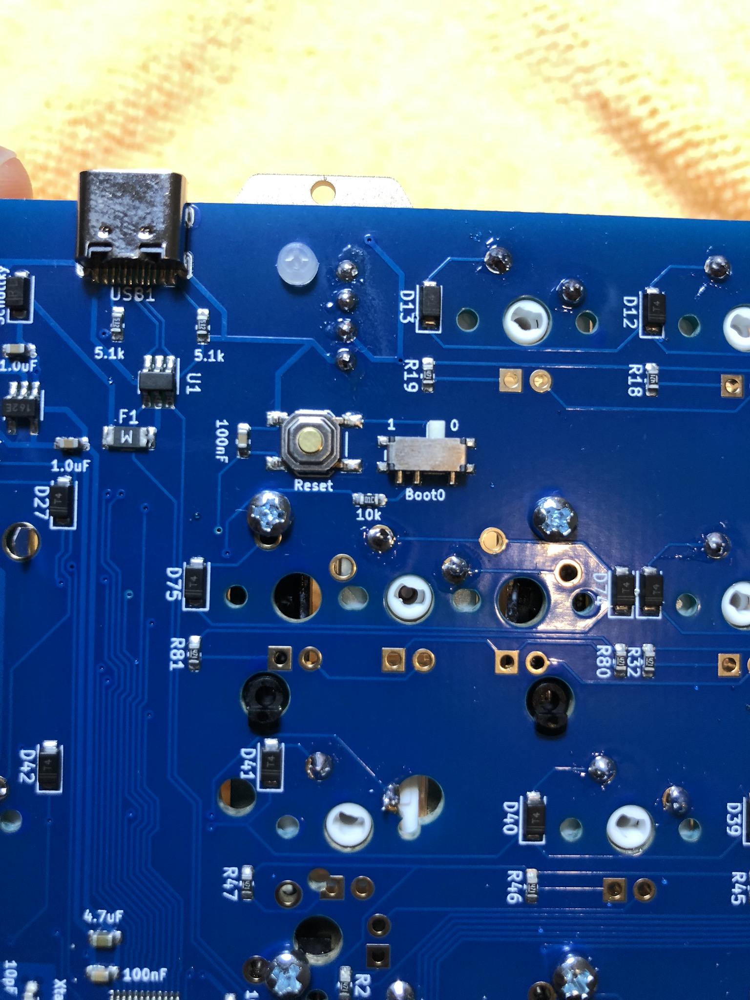

Touch a conductive piece of material to each pair of switch holes (examples circled in red). Ensure that a keypress is registered on the tester.
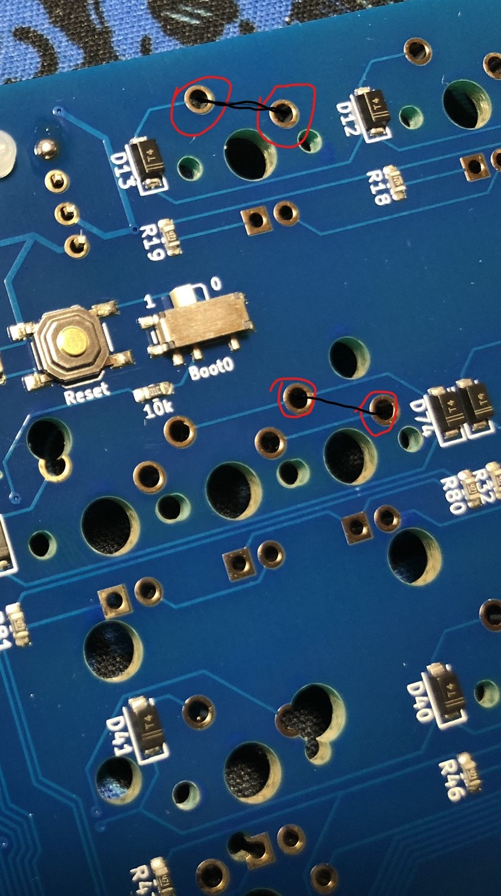

!!! Note
    The 2nd switch spot to the right of the spacebar is mapped to "Layer 1" or "Function" so it will not register a keypress. This is expected.

## Flashing the PCB

### One Time Setup 
1. Install the newest release of Zadig from [https://zadig.akeo.ie/](https://zadig.akeo.ie/).
1. Download the newest release of QMK Toolbox from [https://github.com/qmk/qmk_toolbox/releases](https://github.com/qmk/qmk_toolbox/releases)
1. Change the switch to "1" on the PCB
    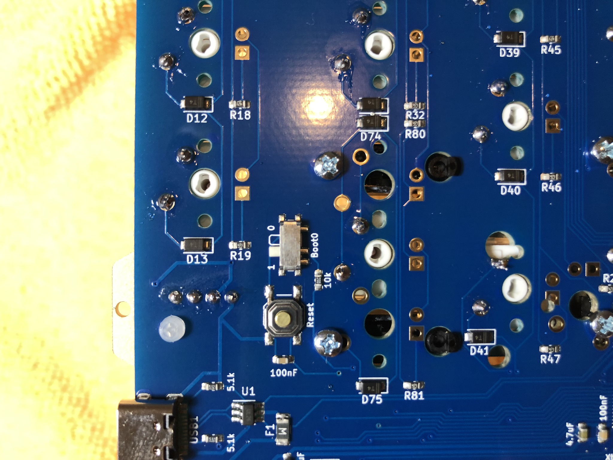
1. Plug the PCB in
    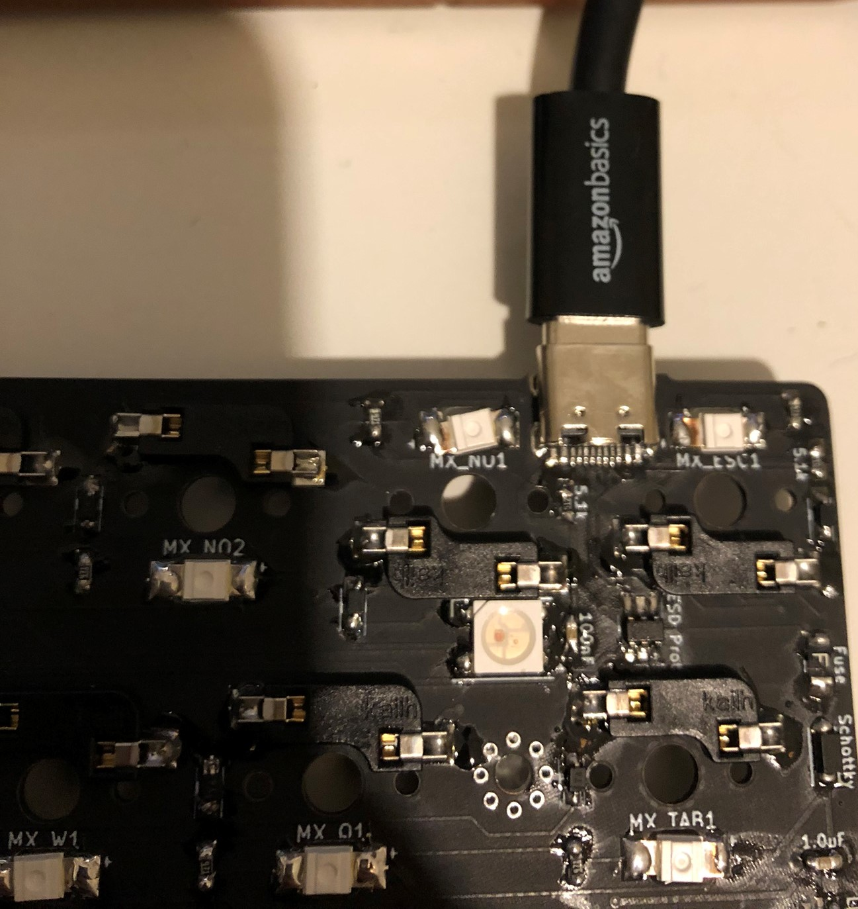

1. Open Zadig
    
1. Click "List all Devices" in the Options menu
    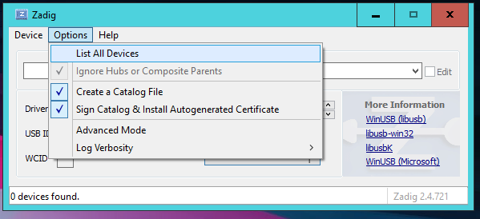
1. Select "STM32 BOOTLOADER" from the device dropdown
    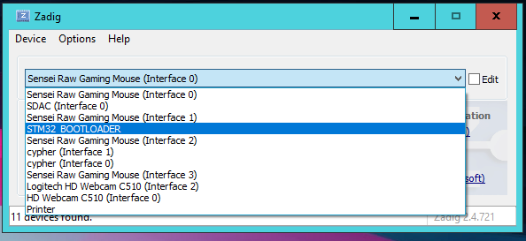
1. Select WinUSB from the Driver dropdown
    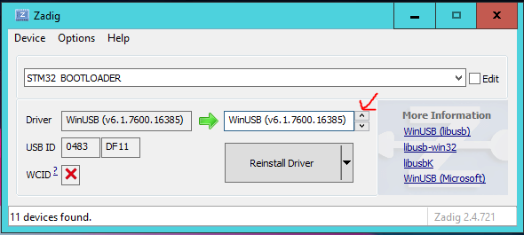
1. Click the 'Replace Driver' Button
    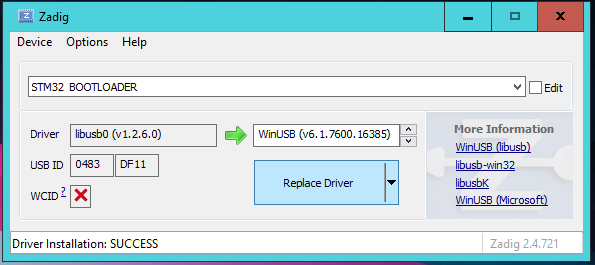
1. You should see a "Installing Driver" progress bar appear
    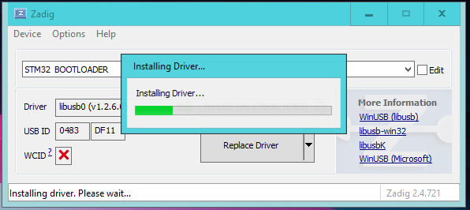

### Actual Flashing
1. Download the [Satisfaction75 Firmware](../assets/cannonkeys_satisfaction75_rev1_via.bin)
1. Start QMK Toolbox, and click the "Open" buttom
    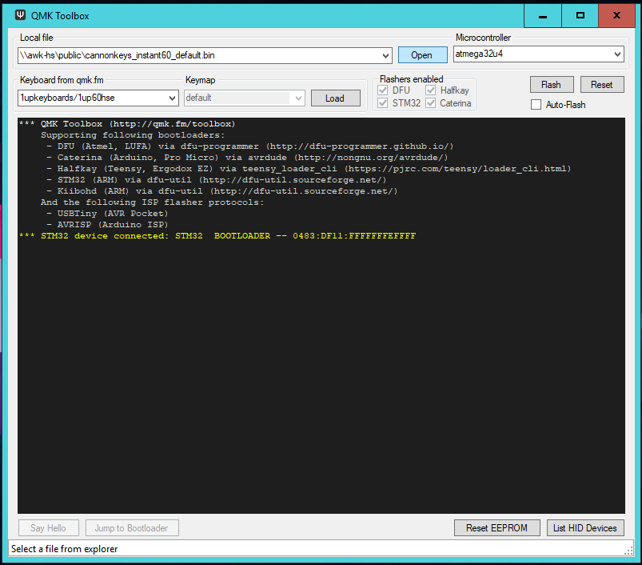
1. Change the filetype dropdown to ".bin" and select the proper firmware
    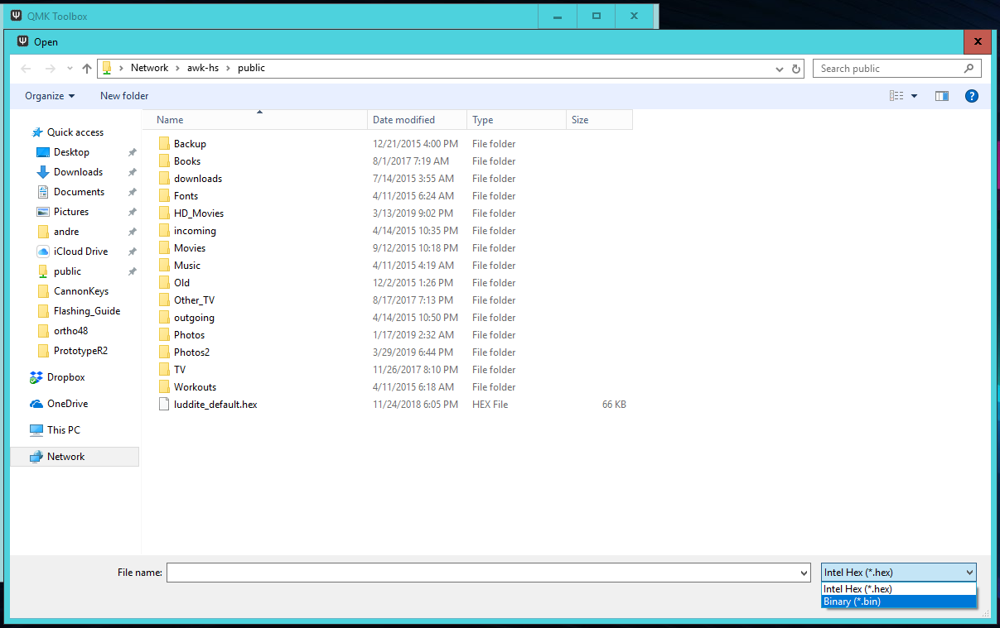
1. Hit the "Flash" Button
    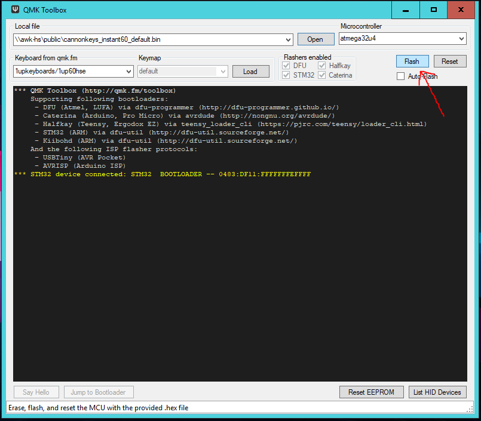
1. At the end, you should see "File downloaded successfully"
1. Change the switch back to "0" and hit the reset button. Note - your firmware won't work unless your OLED is installed!
    

Now you can go back to the [Build Guide](build_guide.md)!