# Stacked Build Guide

First make sure we have all the items we'll need.
Each Stacked case is slightly different, but in general we will have:

* A PCB
* Acrylic Layers
* M2 screws (Typically 2 sizes, large and small)
* M2 standoffs (Typically 2 sizes, large and small)

## PCB Notice
PCBs in Stacked kits come preflashed with VIA compatible firmware. But make sure the switch on the back is set to "0". If it is set to "1", your PCB will be stuck in the failsafe flashing mode.

## Building a Stacked Kit
1. Starting Kit:
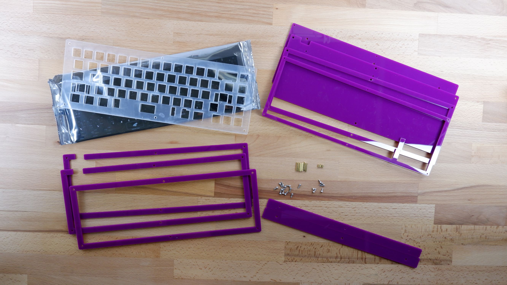

### Preparing the PCB/Plate Assembly
1. First, we have to add stabilizers to our PCB. We highly recommend lubing stabs.
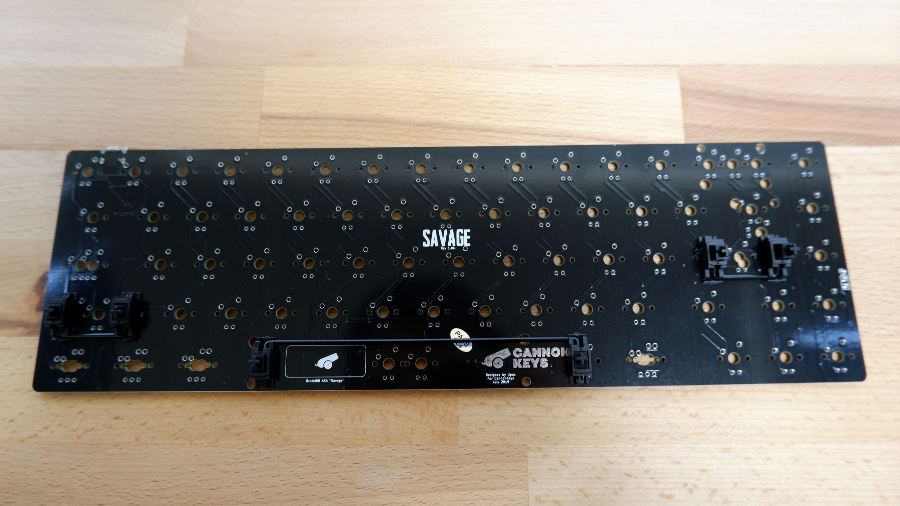
1. Put your plate on top of your PCB and start adding switches.
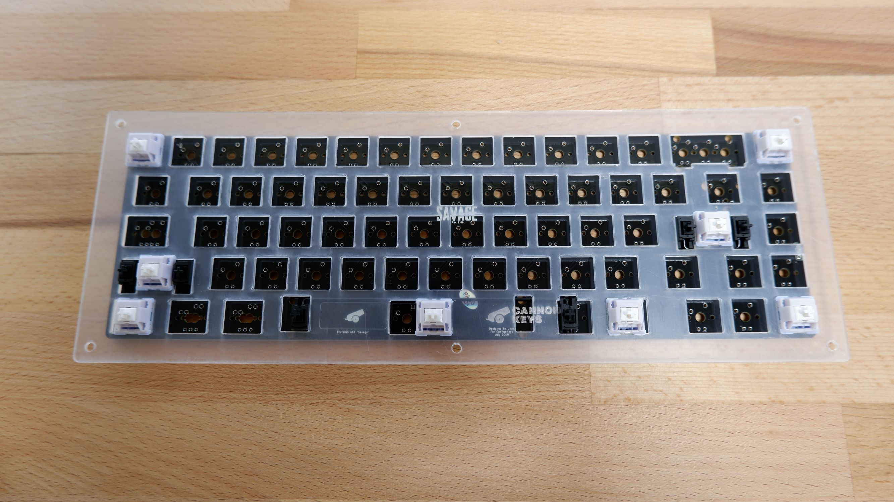
1. Finish adding all switches to the PCB and solder each pin to the PCB.
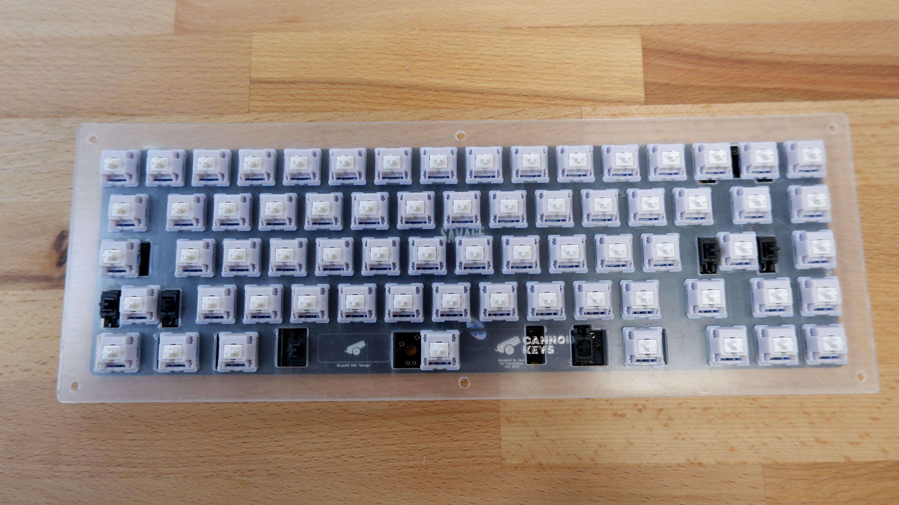

### Assembling the Acrylic Case
1. We'll start off by adding the foot mounting hardware to the board. Start with these layers. You will need a 1.5mm Hex head screwdriver.
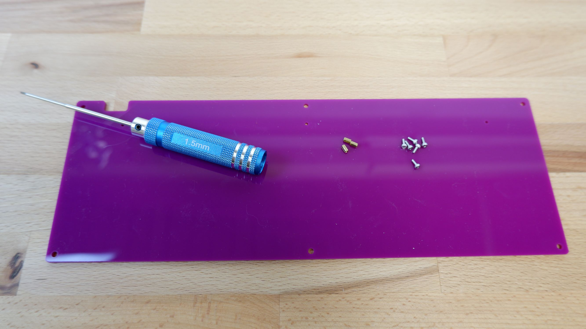
1. Install the small screw and small standoff in each foot mounting hole as shown. The next layer we'll use is also shown here.
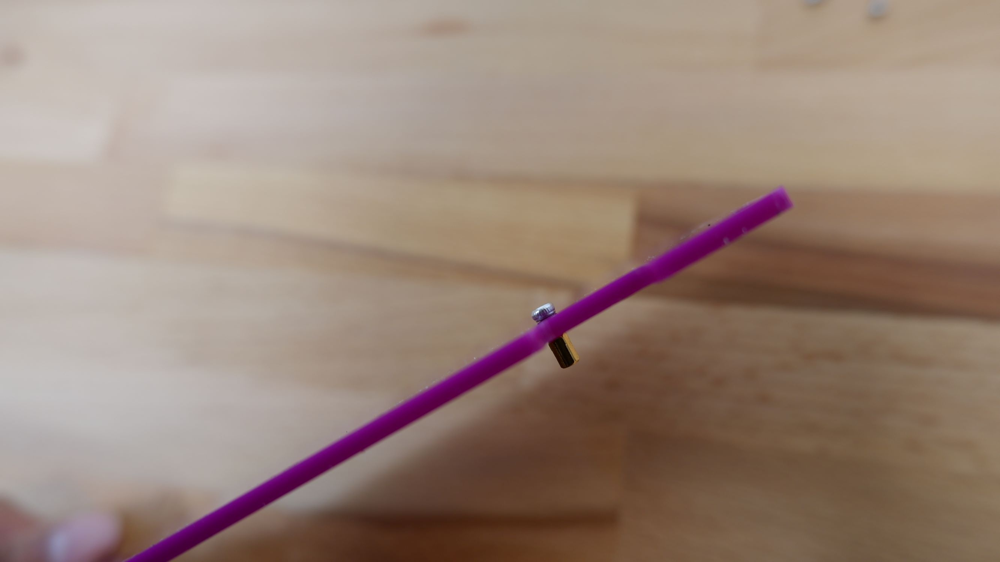
1. When you're done, it should look like this:
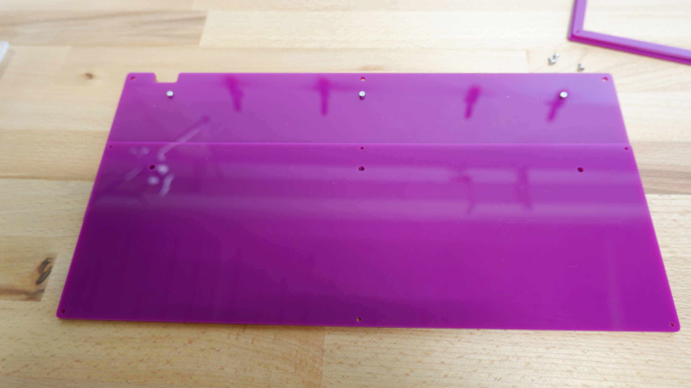
1. Repeat the process using the new layer and the larger screws and hardware.
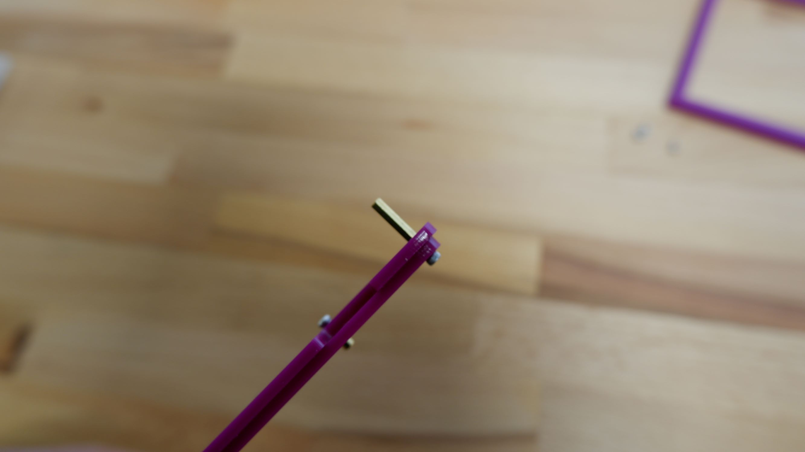
1. When you're done, it should look like this:
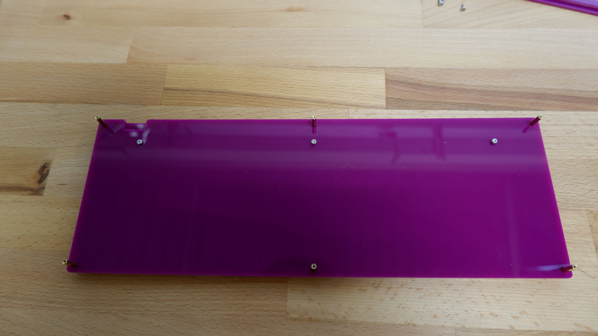
1. Add the next layers with the USB cutouts:
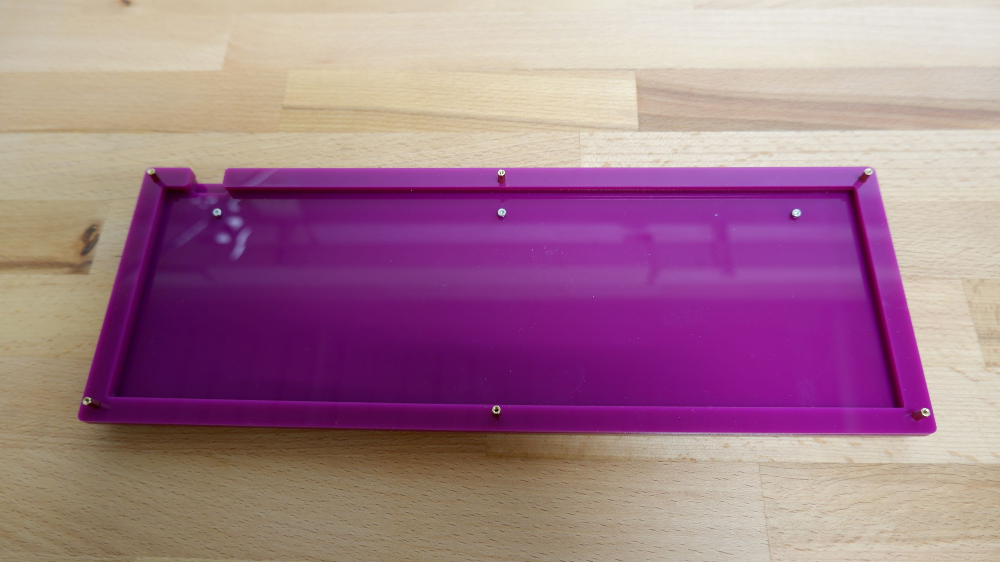
1. Add the full loop layer:
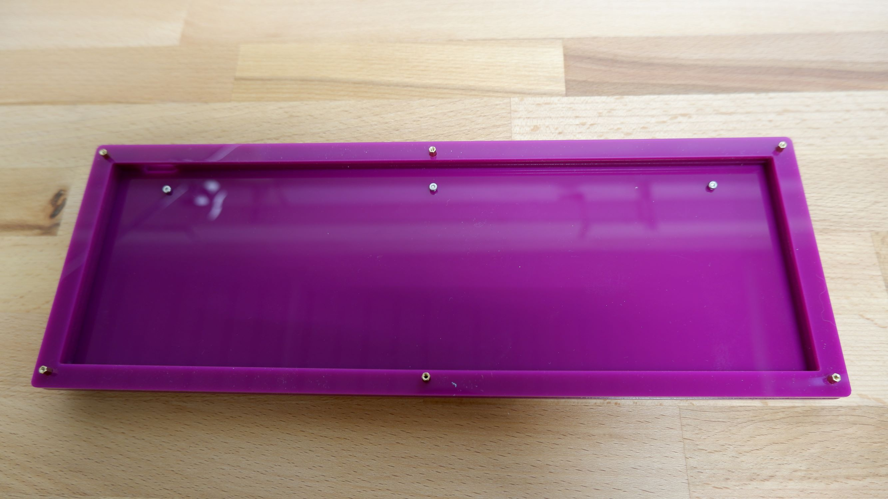
1. Add the PCB/Plate assembly. Since the USB port might interfere with the previous layer, you may need to angle the assembly in.
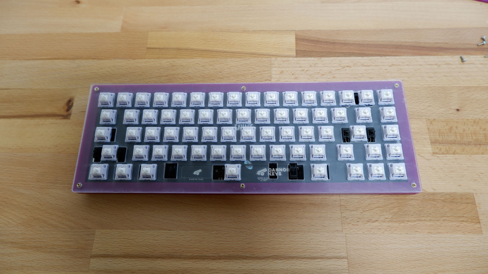
1. Add the two top layers. Note that the top layer does not go around the standoff like previous layers.

1. Finish the case using the long screws
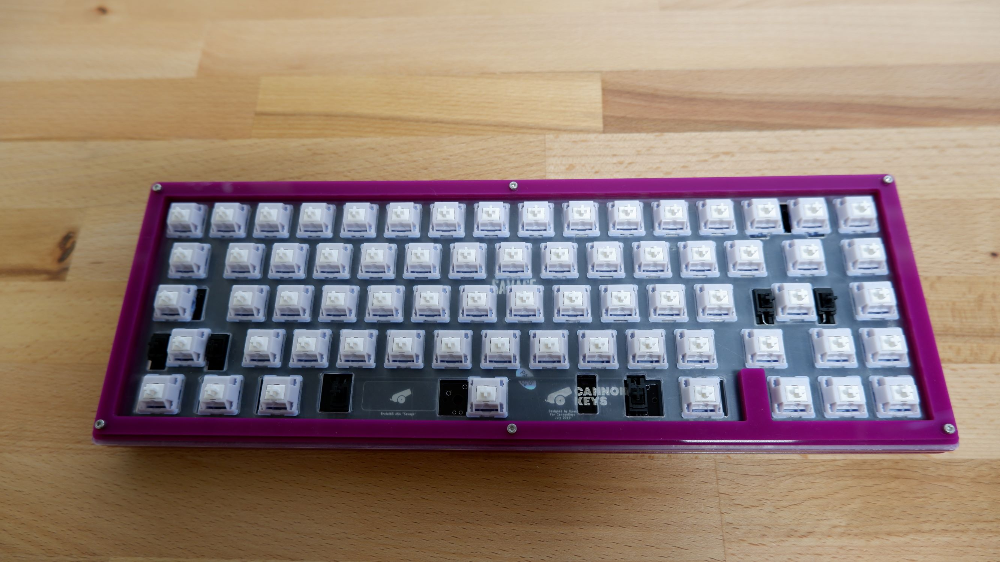

### Adding the Feet
1. Flip the keyboard around and add the two feet layers. Notice the top foot layer does not go around the standoff.
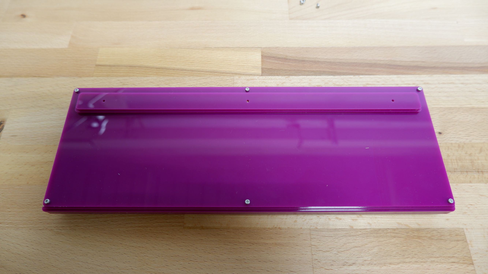
1. Install the small screws
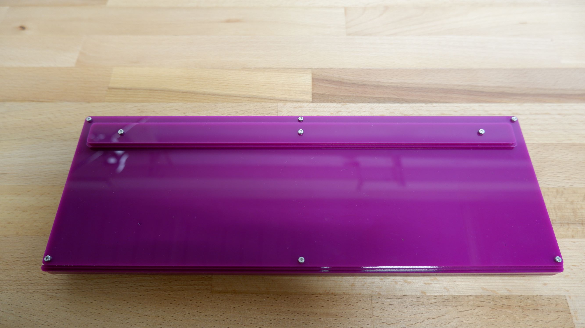

### Adding Keycaps
1. Flip your keyboard back over, and add keycaps.
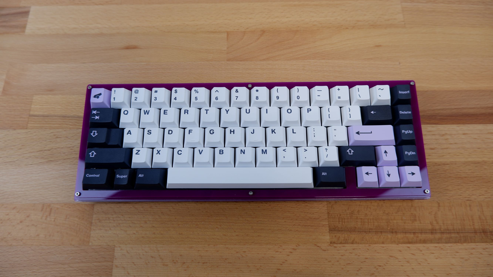
Enjoy!

## RGB Underglow
To add RGB Underglow, you will need a WS2812B LED Strip. These are easily available on Amazon. 

Then follow the instructions [here](../rgb_underglow.md)