# Stacked Build Guide

First make sure we have all the items we'll need.
Each Stacked case is slightly different, but in general you will have:

* A PCB
* Acrylic Layers (7 case layers, 4 feet layers)
* FR4 plate
* M2 screws
* M2 standoffs (2 sizes, large and small)

## PCB Notice
PCBs in Stacked kits come preflashed with VIA compatible firmware. But make sure the switch on the back is set to "0". If it is set to "1", your PCB will be stuck in the failsafe flashing mode.

## Building a Stacked Kit
1. Starting Kit:
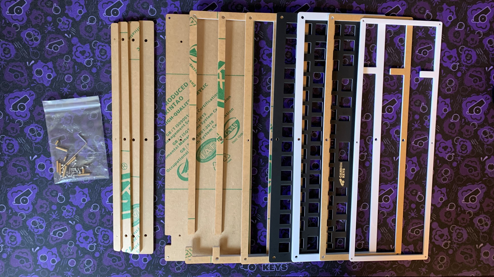

### Preparing the PCB/Plate Assembly
1. First, we have to add stabilizers to our PCB. We highly recommend lubing and clipping stabs.
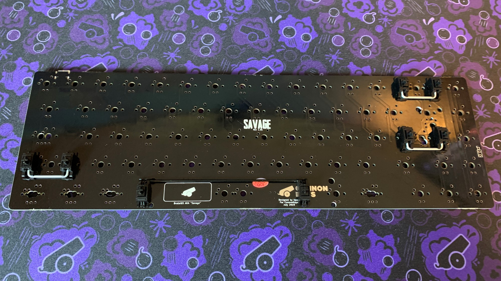
1. Clip some switches in around the outside and middle of your plate.
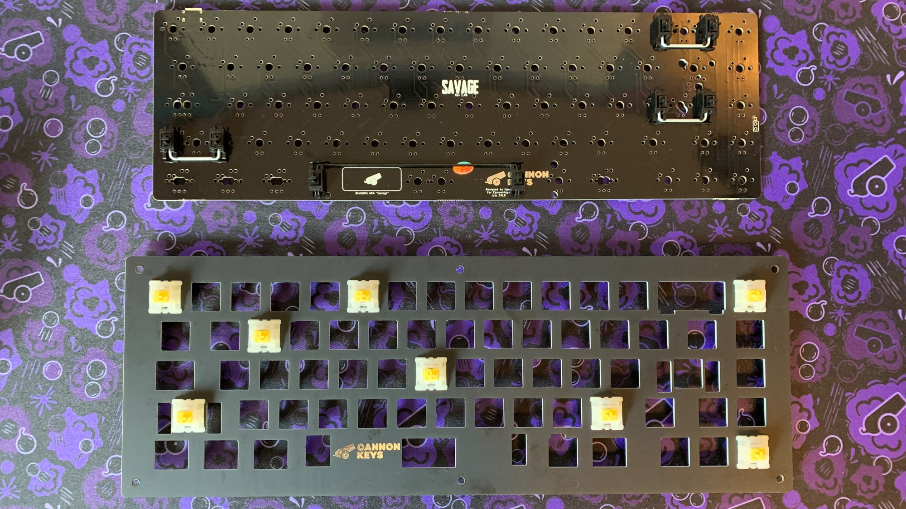
1. Put plate on top of pcb and push switches into pcb, making sure they are completely and evenly inserted. Start adding switches to plate.
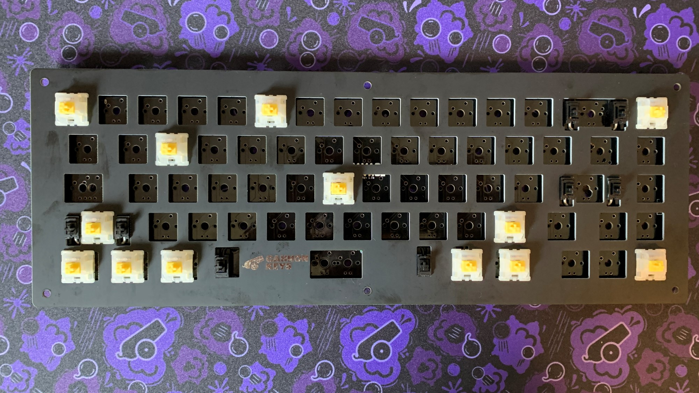
1. Finish adding all switches to the PCB and solder each pin to the PCB.
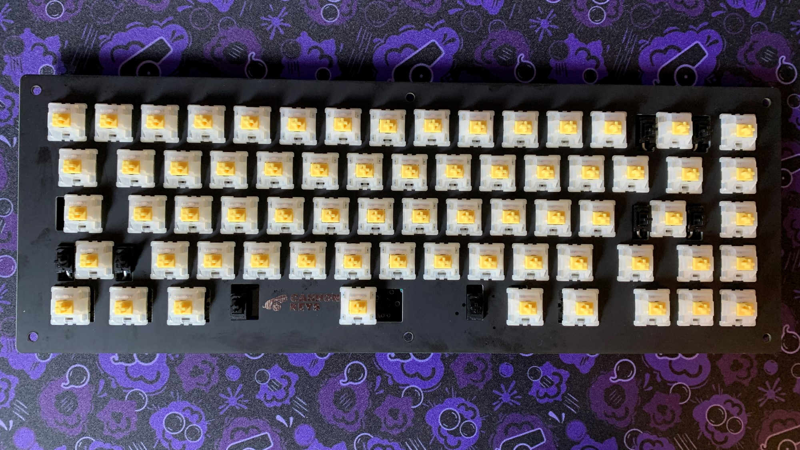

### Assembling the Feet
1. Stack the leg layers up, the largest feet layer is what attaches to the bottom layer of the case.
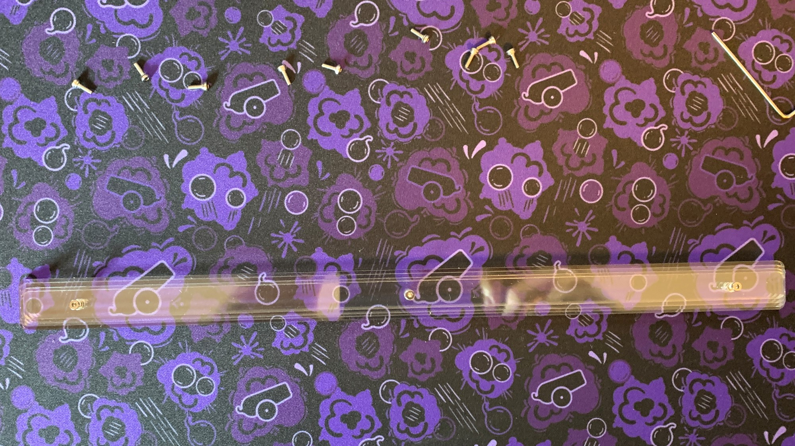
1. Insert the screw and standoff into the legs from the bottom of the leg assembly. Screw in the standoff all the way, then unscrew a few turns to extend the standoff. 
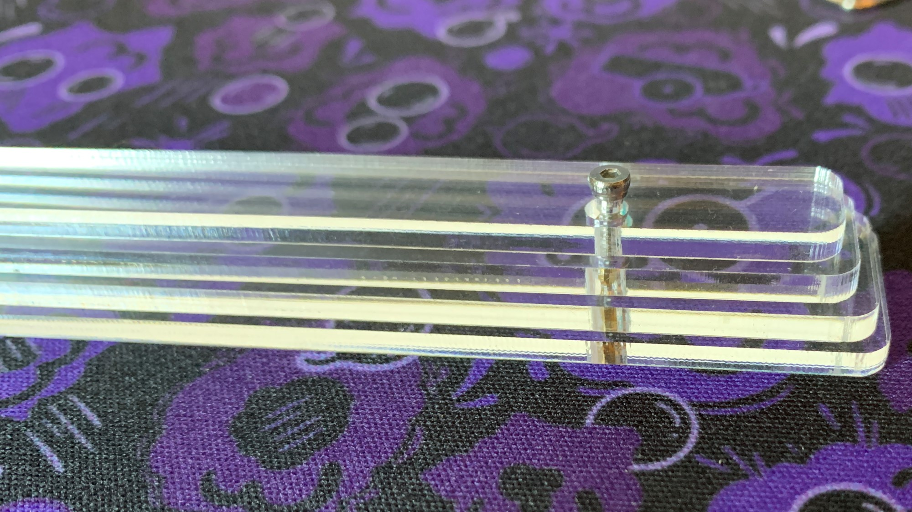
1. Place the legs with standoff installed onto your build surface and place the bottom layer of the case on top. Then put a little pressure down to keep the screw on the bottom of the leg assemble still while you screw in from the top.
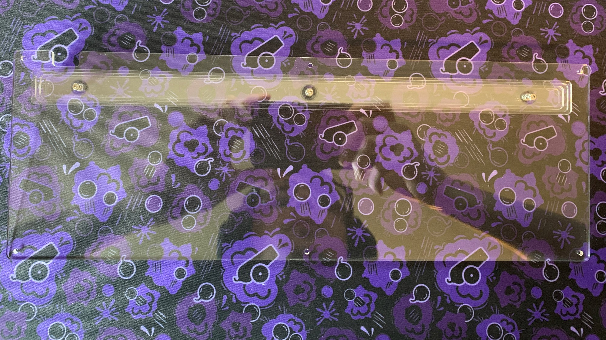
1. Your legs should now be secured to the bottom layer
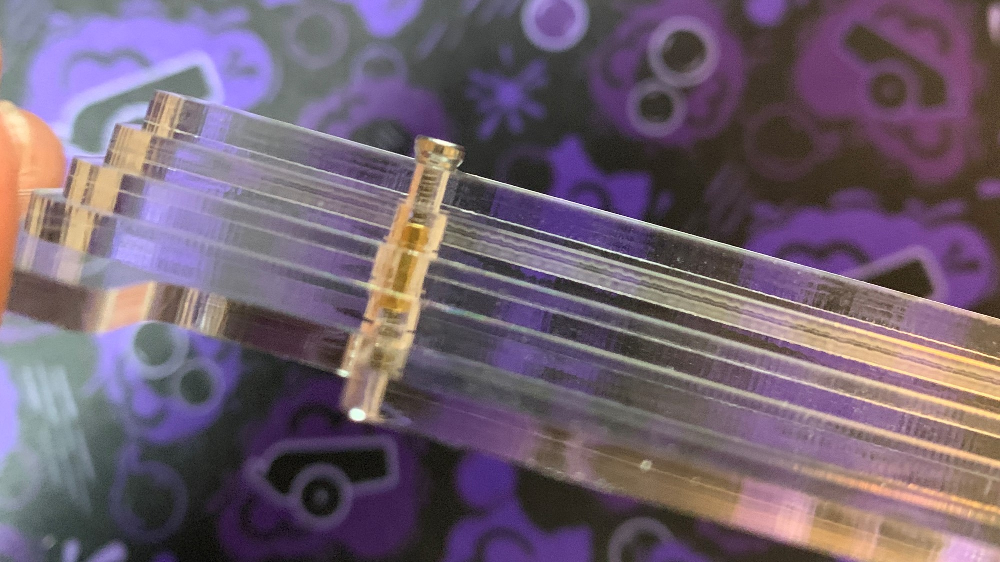

### Assembling the Acrylic Case
1. Install the bottom standoffs pointing up (away from leg), and stack your first layer (a ring with a usb cutout in the back).
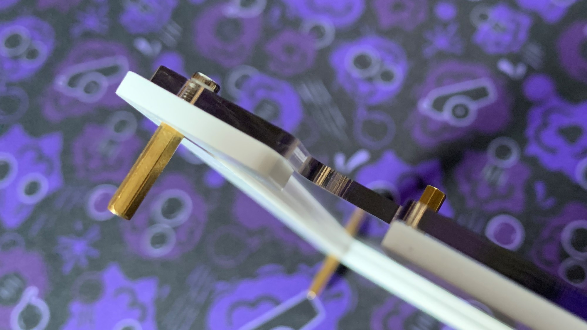

!!! Note
    Images from this point forward will not have legs assembled. Your stacked should have the legs assembled and attached to the bottom layer already.
    
1. Stack the next layer that is a ring with a usb cutout. It will look like this:
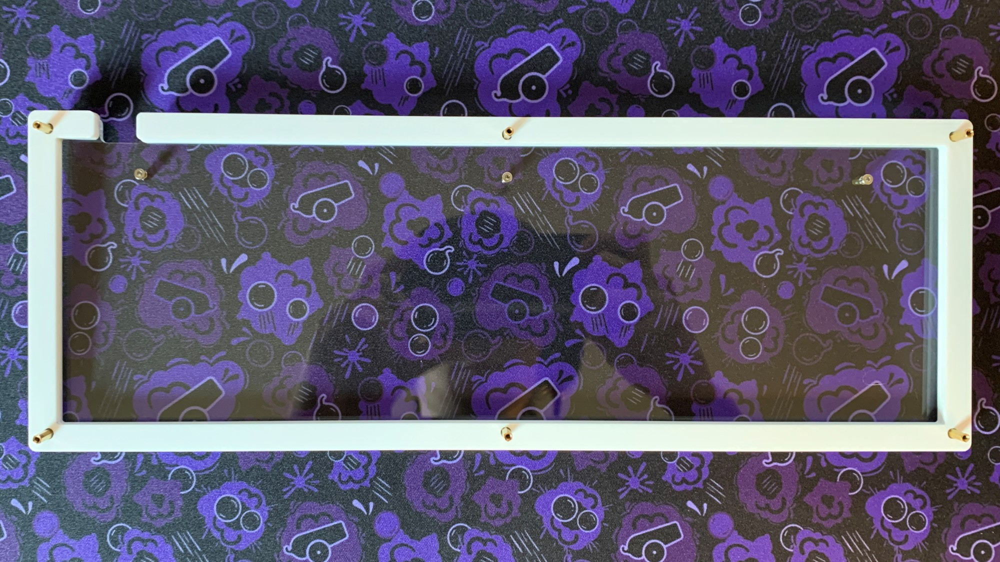
1. Stack the full ring layer next. It will look like this:
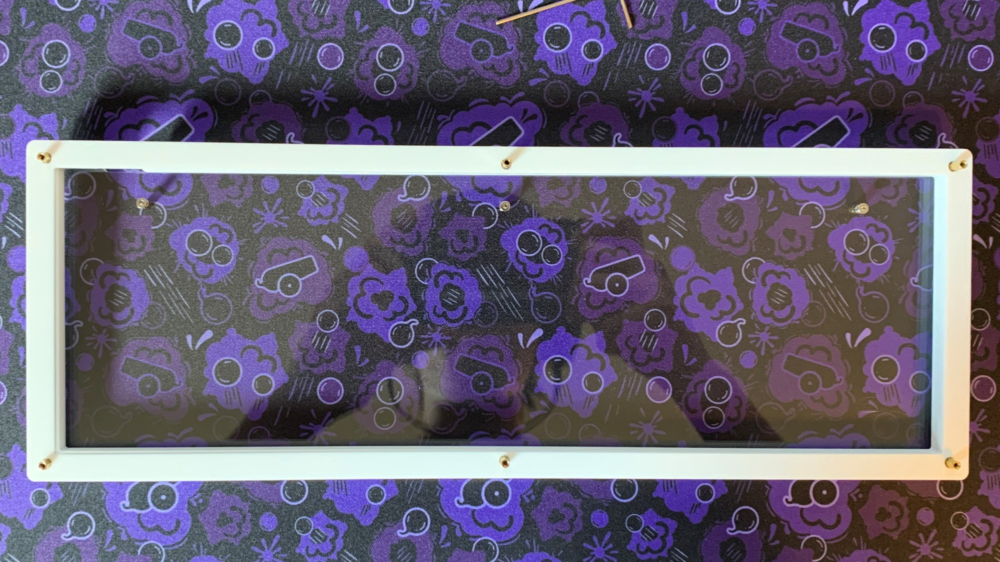
1. Next, stack your assembled and soldered plate+PCB assembly.
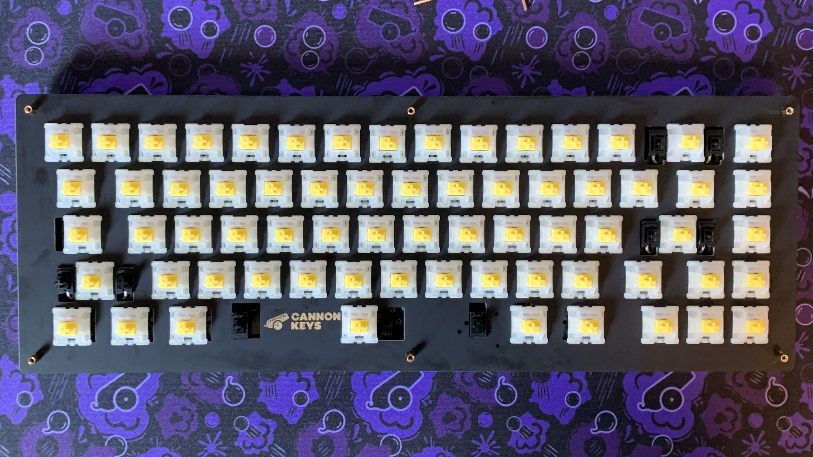

!!! Note
    Be careful inserting the plate+PCB assembly as the usb port can get caught. We recommend gently inserting the usb side first at an angle.
1. Add the three top layers. The smallest of the three top layers goes on top.
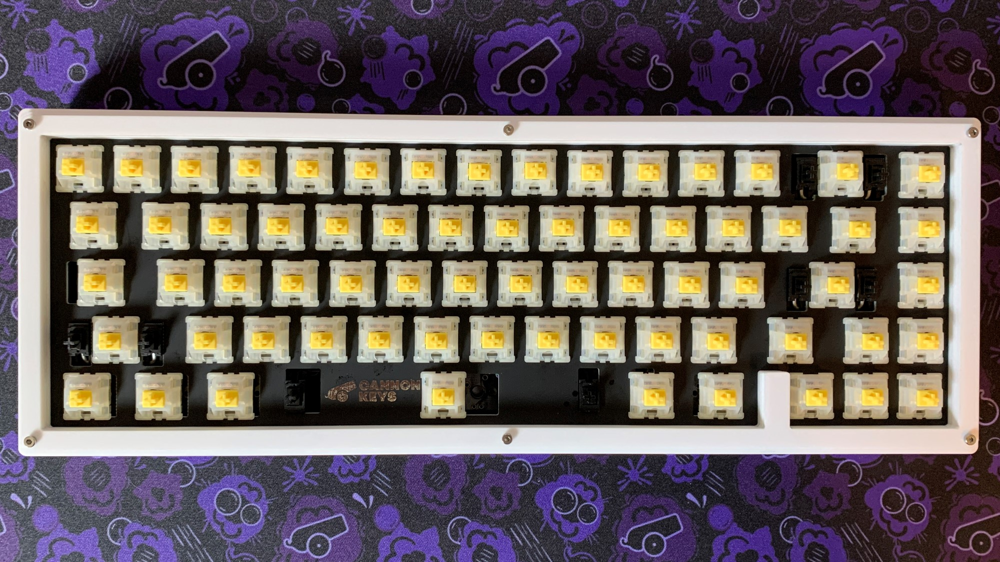
1. Screw in the top layers, making sure to keep it aligned. The side will look like this once done:
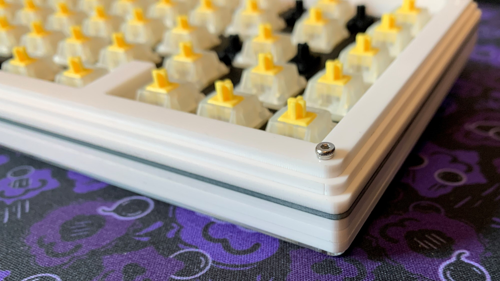
1. Almost done!
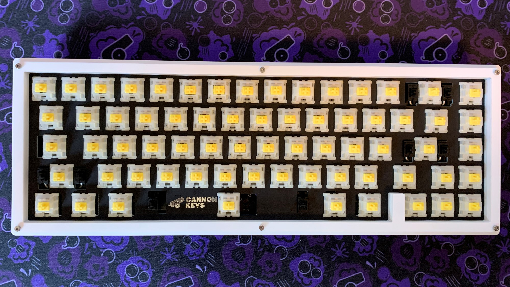

### Adding Keycaps
1. Add keycaps, and you're finished!
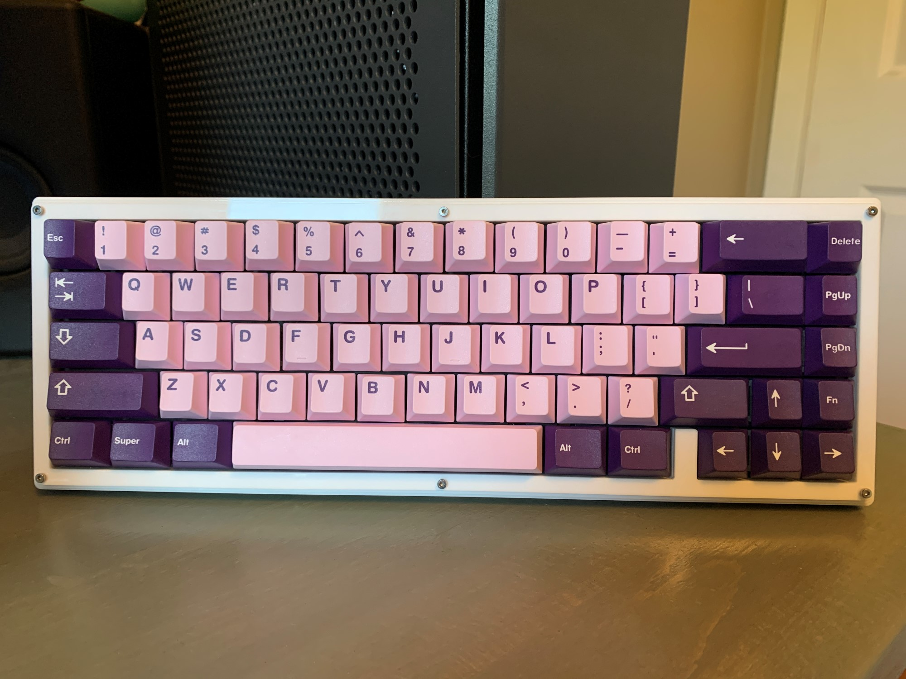
Enjoy!

## RGB Underglow
To add RGB Underglow, you will need a WS2812B LED Strip. These are easily available on Amazon. 

Then follow the instructions [here](../rgb_underglow.md)
