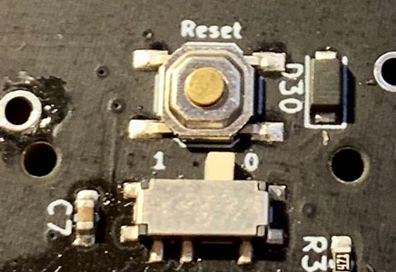
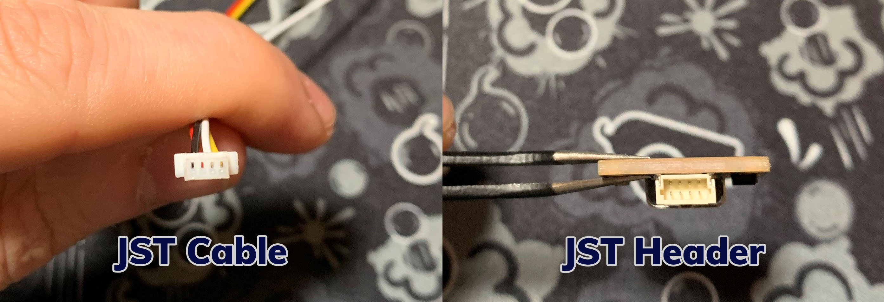
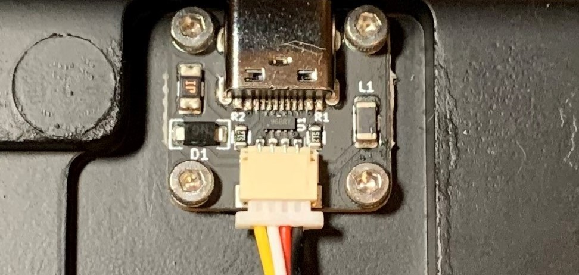
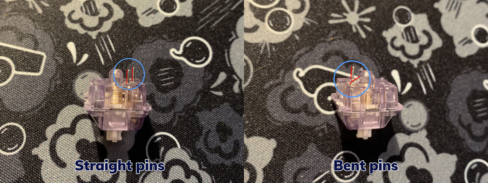
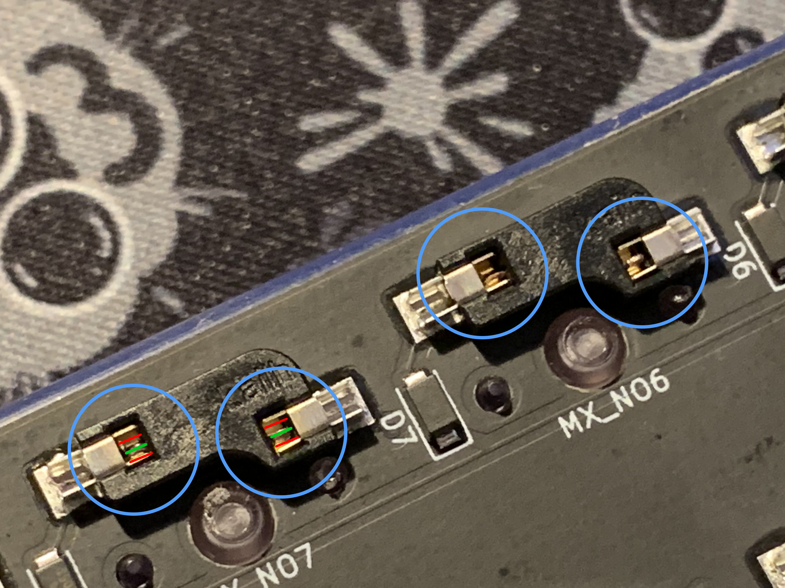
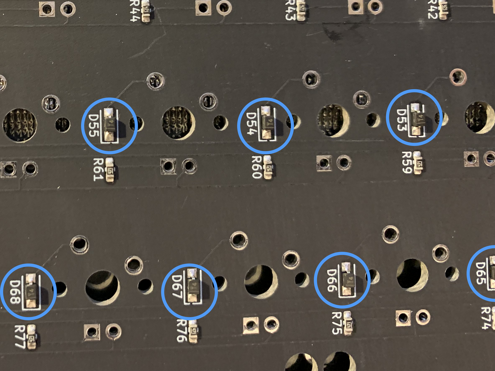
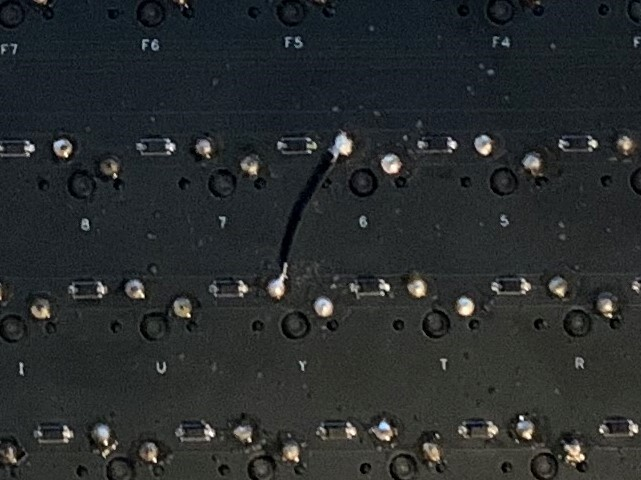
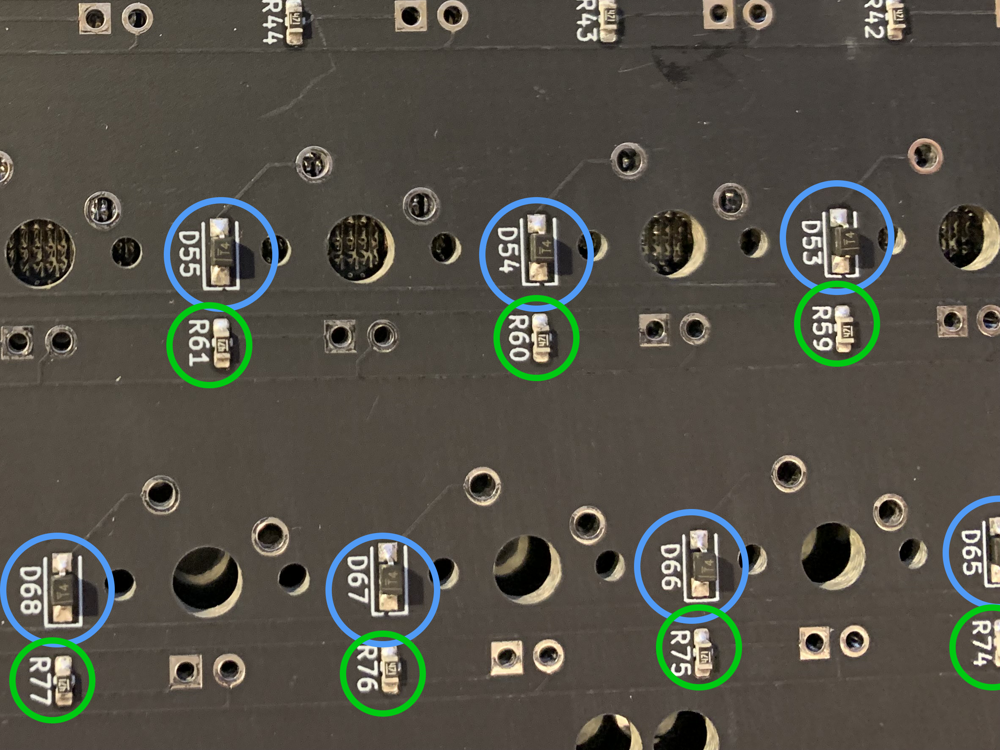

## PCB Troubleshooting

  

### Table of contents

-   PCB not recognized/disconnects in use
    
-   Switch not registering
-   Hotswap specific    
-   Hotswap and solderable    
-   LED Issues
	-  LEDs won’t turn on, or keyboard disconnects when LEDs turned on
	-   Underglow/LED does not change until keyboard is reset
	-   Only some of the LEDs are working
 
   ---
   
### Issue: PCB not recognized by Windows or disconnects in use

#### Suggested test order

- Test USB cable/port
- Check PCB switch (0/1)
- Check loose connections (JST/USB)

#### Cause 1: PCB not getting enough power from the connection.

#### Solution: Try a different cable, and a different USB port on the computer, not  a  USB hub.

Grab a new basic cable (ie: not a custom coiled cable/artisan cable), and try plugging it into a different USB port on the computer itself. Not on a USB hub. It’s important you try using a basic cable, as the issue sometimes is the amount of power going to your keyboard. Some coiled/artisan cables are too long, and won’t give you the power that you need. This is more common on keyboards that have LEDs of any kind.

  ----
  

#### Cause 2: PCB is in bootloader/DFU mode.

#### Solution: Unplug keyboard, and if the keyboard has a switch on the back make sure it is on the 0 position. Plug back in once the switch is on the 0 position.

-   0 = use keyboard
    
-   1 = boot/dfu mode (cannot use)
    

  
!!! Note
    All brutalist series PCBs, Instant60/65, AN-C v2, DB60 (bakeneko PCB), Satisfaction75, Chimera65, and most if not all CK designed PCBs will have this switch on them.

  

Occasionally, the switch on the back of the PCB gets switched on accident, or it is on 1 by default. Turn over the PCB and make sure it’s in the correct position, which in most cases will be 0. If it’s in the wrong position, you might need to unplug/plug back in your keyboard once you have switched positions.

  

*Above image shows an example of a PCB switch in the 0 position for use.*

---  
  

#### Cause 3: Loose/improper connection on USB port, JST cable, or JST header.

#### Solutions:

-   USB port: Make sure the usb cable is properly seated, and try a different USB cable and USB port. If the cable wiggles, it may also cause seemingly random disconnections.
    
-   JST cable: Make sure there are no kinks/bends on the cable. Also make sure the JST cable male ends have no bent pins, or anything else that might interfere.
    
-   JST port: Make sure there are no bent pins inside of the female JST port.
    
-   JST connection: Make sure the JST cable is properly seated, and all the pins on the JST female ports are soldered in place.
    

!!! Note
    When inserting the JST cable into the connector, support the JST female header by holding it while they plug in the JST cable. The ports can be delicate, and while they can sometimes be reattached, that is not an ideal situation to be in.
    

*Left image: Male JST end with no issues. Each end of the JST cable will have one of these connectors. Color of wires may vary.
Right image: JST header (female), where the JST cable plugs into. The daughterboard will have one of these, as well as the PCB.*

  

*Above image shows a properly seated JST cable inserted into the female port of a daughterboard. Note how far the cable is inserted, as well as how it is evenly inserted.* 

----
 
### Issue: Specific key/keys are not registering.

- #### Before attempting any of these steps, test the connection by bridging the pads with tweezers. If the PCB is hotswap, remove the switch before bridging.
	-   Solderable PCB - If the key triggers when bridging, but not when pressing the switch, it can be concluded the switch is the issue, not the PCB.
	   -   Hotswap PCB - If the key triggers when bridging, but not when pressing the switch, try a different switch. If you try 2 more switches and the problem persists, it is most likely an issue with the hotswap socket.
    

  

#### Suggested test order (Hotswap)

- Check for bent switch pin
- Check for loose hotswap socket
- Check leaf contact

!!! Note
    If none of the above, continue into solderable PCB flow
    

#### Suggested test order (Solderable)

- Check for key binding issue
- Check for missing diode  
- Check for poor solder joint
- Check for pulled pad
    

 --- 
  
  

### Hotswap PCB specific

  

#### Cause 1: The Switch has a bent pin.

#### Solution: Remove the switch, and bend the pin back gently until it is straight.

  

Pins can bend when inserting a switch into a socket, and when removed you will be able to clearly see one of the pins bent. Straighten it with pliers gently, and then put back into the socket.

*Left image: A lavender switch with straight pins.
Right image: A lavender switch with a bent pin.*

#### Cause 2: Loose hotswap socket.

#### Solution:

-   If the socket is loose, but the pad is not pulled, you can solder the socket down.
	   -   You will need a soldering iron to do this. Alternative methods such as tape or glue are **not** recommended.
    

-   If the socket is loose, but pad is pulled, the you can bridge
	   -   Bridging a hotswap socket is the same process as a normal solderable PCB. The only difference is that you connect the wire to the whichever side of the hotswap socket is loose.
    
----
#### Cause 3: The leaf/leaves within the hotswap socket are not making proper contact with the switch within the socket.

#### Solution: Using tweezers, have them manipulate the leaf within the socket gently until it makes contact with the switch pin.

  To see if this is the issue, take a known working switch, and insert it into the socket causing an issue. If the switch that is known to work in the problem socket does not work, then this is most likely the issue.  
With the switch still in the socket, look closely at the hotswap socket, and manipulate the switches using tweezers until the switch works. This is very hard to show via an image, but given this workflow, this is most likely the issue.

  

*In the above image, each switch socket is circled in blue. The goal is to manipulate the leaves (red lines) to make contact with the switch pin (green).*

  ---

### Solderable and Hotswap PCB

  

#### Cause 1: The key is bound to an unusable key, or a key that does not show up on a key tester.

#### Solution: Go into VIA or QMK configurator and rebind the key to a key that is known to show up, like ‘a’ for instance.

  

It is very easy to accidentally bind a key to a transparent key, or another key that won’t properly register in a keytester. Also, in some instances the windows key is disabled accidentally within windows. This will cause the windows key to not function, or show up in a key tester potentially. Here is a short list of keys that might not show up in keytesters.

-   Transparent key (▽)
    -   Means nothing is bound to that key, instead it presses a key in a different layer in the same position.
    

-   Fn, MO(X), TO(X), etc
    -   In these keys, X will be a number. These are layer keys, used to access a separate layer of the keyboard. Pressing these keys alone does nothing, and will not register a keystroke in testers.
    

-   Left or Right Windows/GUI
    -   Also seen as LWin/RWin. As stated above, sometimes windows key is disabled within the operating system, so it’s best to have the user rebind the key to a normal key, like ‘a’ to make sure that is not the issue. This issue specifically is more common than people think.
    

-   Blank key
    -   Nothing is bound to a blank key. This will not show up in a key tester.
    

  

*Above image shows different keymapings that will not be seen in common keytesters, and will potentially cause issues. From left to right: blank key (no binding), transparent, layer key.*

  ---
  

#### Cause 2: There is a diode missing.

#### Solution: Reattach the diode to the pads.

Put simply, diodes are needed for keypresses to register. Every single switch needs a diode to properly input. Fixing this requires a soldering iron and solder. The orientation of diodes is specific, they will only work in one direction.

-   If there is still solder on the pads, they can use tweezers to hold the diode in place while heating up the pads with the soldering iron tip.
    
-   If there is no solder on the pads, solder will need to be applied to the pads manually before attempting the above fix.
    
-   If one or both of the pads connecting the diode to the PCB were pulled, then replacing the diode will not fix this. You can, however, bridge the connection.
    
*Helpful video that shows the attachment of a diode: [Video Link.](https://drive.google.com/file/d/1hLbzG7kHaN4DGFpHPc6eHSwGfqTXESQM/view?usp=sharing)*
  

*Above image shows a PCB with diodes circled in blue.*
  
---
#### Cause 3: Solder joint is not properly joined.

#### Solution: Reflow the solder joints on both switch pins, add solder if necessary.

  

Reflowing a joint is very simple. This requires a soldering iron. You will also require solder if the joint is starved and requires more solder to be added. In order to reflow the joint, use these steps.

1.  Heat up soldering iron
    
2.  Press tip of iron to the joint
    
3.  Once the solder is liquified, hold for one second
    
4.  Once the second passes, remove the iron gently/slowly
	- Repeat steps 2-4 for the other pin

*Helpful video that shows the reflowing of a switch pin: [Video Link.](https://drive.google.com/file/d/17Idpdh21L0SJZ0zG96Gbf036uL5Gspzt/view?usp=sharing)*
    

If the joint is lacking solder, you will need to add solder to the joint. To add solder, do the same as above, except instead of just holding the iron and removing it, feed a tiny bit of solder first.

  ---

#### Cause 4: Pad is pulled.

#### Solution: Bridge the pad to another switch pin.

  

A bridge is when you take a wire, and connect one pin to another pin. This bridges the connection, allowing the current to flow, despite a missing pad. A pad is the silver ring on the pcb that surrounds each switch pin. If that ring is gone, the pad is pulled. The switch you need to bridge is different for each keyboard. It is recommended to test all adjacent keys in each direction (North, south, east, and west), until you get the switch to trigger.

  

*Above image shows an example of a switch bridge.
Helpful YouTube video: [Video Link.](https://youtu.be/N5IivDkrp6U)*

 ---

### LED Related Issues

### Issue: LED underglow will not turn on/keyboard disconnects with RGB on.

#### Cause 1: PCB not getting enough power from the connection.
#### Solution: Change cable and/or USB port.

 
RGB takes a considerable amount of power to run when compared to powering a standard keyboard. If the keyboard is plugged into a USB hub, is using a custom coiled cable, or a combination of both, the keyboard might not be getting enough power to properly function.

Symptoms of this include device not powering on when plugged in, or the device disconnecting when RGB is turned on.

  ---

### Issue: Underglow color does not change until the keyboard is reset.

  

#### Cause 1: Firmware is not working as intended.

#### Solution: Download and flash the relevant firmware. [Link.](https://www.dropbox.com/sh/sxv7h36hbq2qkmu/AABp7AveLqB1CQwK7rWSTewYa?dl=0)

***This bug has been fixed, and applied to the current QMK Master. You can now compile firmware on the latest QMK build and your problem should be fixed.***

---

### Issue: Only some of the LEDs are working on the keyboard.

  

#### Cause 1: The cause will vary.

#### Solution: The solution will vary.

  
Per-key LEDs/single LEDs are wired individually, and rely on the resistors to function correctly. If a resistor is missing, that is most likely the cause for the malfunctioning LED.

LED strips as well as certain LED underglow are generally wired in a series, which means if there are four LEDs in a row, and the second LED in the line doesn’t work, the third and fourth LED will also not work. This means that all it takes is one malfunctioning LED to take out all the ones behind it. 

Here are some things to try:

-   The firmware fix from above.
    
-   Check for poor solder joints
    
-   Check for a missing resistor
    

  

*Above image shows diodes (circled in blue), and resistors (circled in green. The square and circle through holes south of switch cutouts are for single color LEDs.* 

---

*If you have suggestions or corrections for this guide, please feel free to reach out in the [CannonKeys Discord](https://discord.gg/Jm3sN7N6SN) and let us know in the suggestion channel*
